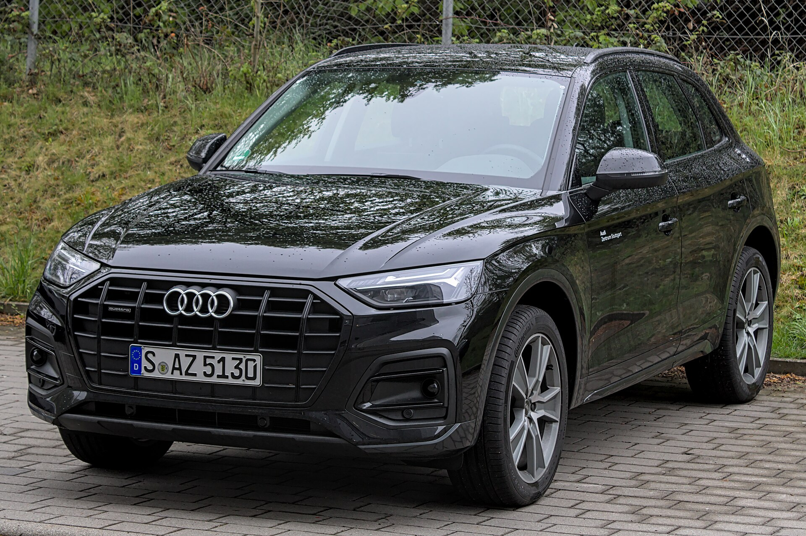
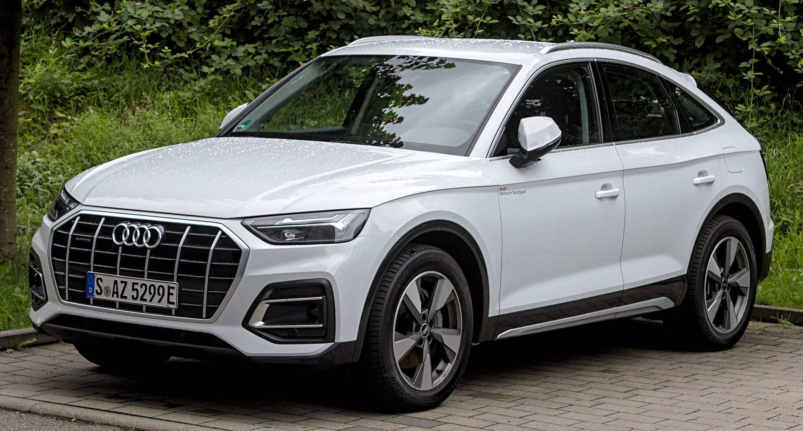
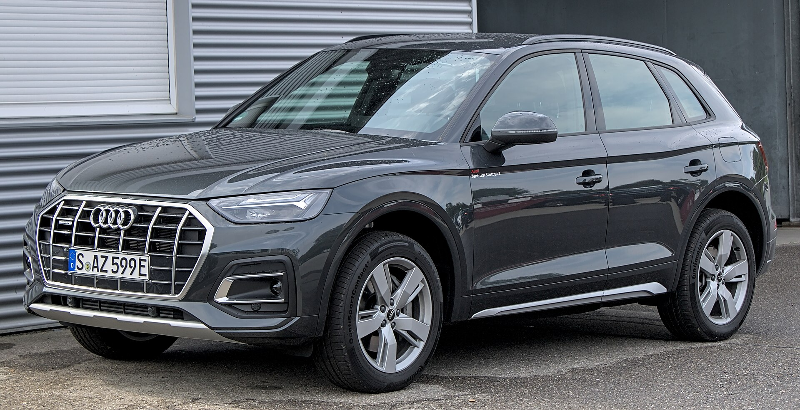
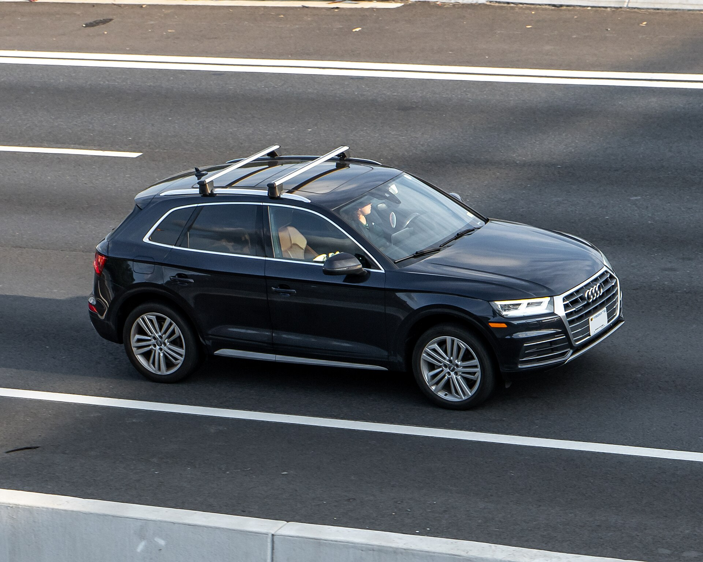
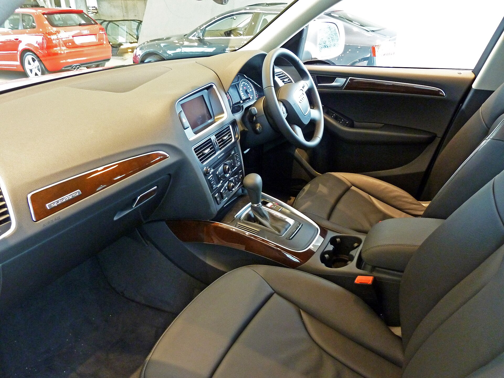
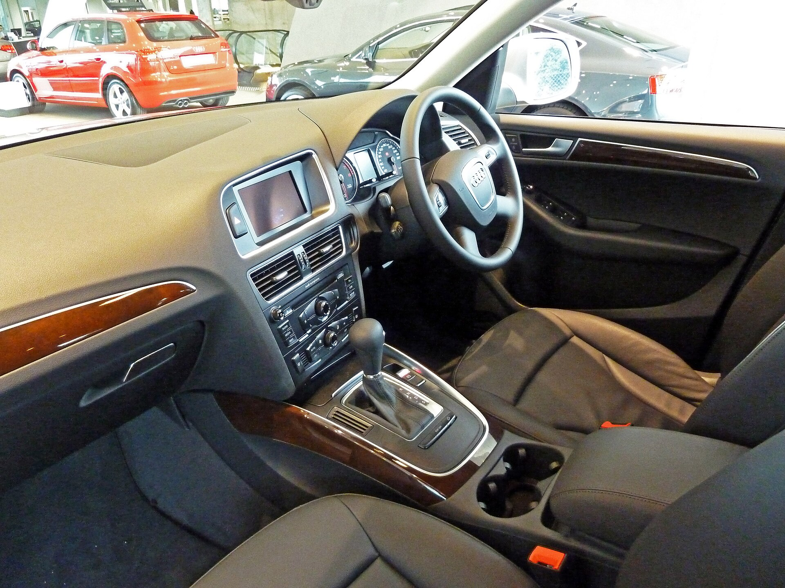
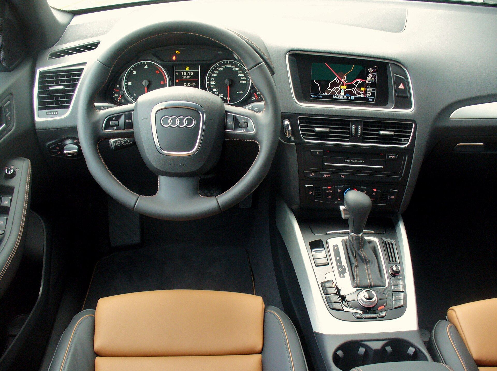

# Audi Q5 2025

*Compact luxury SUV | 5-door compact luxury SUV; Sportback coupe-SUV variant | FY (second generation, 2018-2024 in US; Sportback body available)*

**Price range (new, MSRP):** $45,400 - $74,000  
**Typical used:** $36,000 at 2-3 years, $27,000 at 5 years  
**Built in:** Germany / Mexico (San Jose Chiapa, Puebla)

## Photos

### Exterior

### Interior

Photo sources and licenses: [`photo-credits.json`](photo-credits.json)

## Why a buyer picks this car

- quattro all-wheel drive is standard on every trim - no upcharge for winter capability
- Audi virtual cockpit puts full-screen Google Earth navigation directly in the gauge cluster
- Sliding and reclining rear bench lets you trade legroom for cargo on the fly
- Interior build quality and switchgear feel are the benchmark in the compact luxury SUV class
- 55 TFSI e plug-in covers a 23-mile commute on electricity with quattro still standard
- 4,400 lb tow rating is higher than most compact luxury SUVs
- Restrained, timeless styling ages well and supports resale

## Where it falls short

- 10.1 in center screen is smaller than newer rivals and the MMI interface is starting to show its age
- Dual-clutch S tronic can feel hesitant from a standstill in traffic
- Rear cargo volume trails the Mercedes GLC and BMW X3 slightly
- Premium fuel recommended across the range
- Base Premium trim lacks features rivals include - option packages are effectively mandatory

**Ideal buyer:** Professional or small family in a snow-belt state who wants luxury, all-weather traction and understated styling.

**Good fit for:** Year-round AWD commuting, Small family SUV, Light towing up to 4,400 lb, PHEV commuting with weekend range, Ski and mountain travel

## Powertrains

### 45 TFSI

| Field | Value |
|---|---|
| Engine | 2.0L turbocharged inline-4 with 12V mild hybrid |
| Displacement l | 2.0 |
| Hp | 261 |
| Torque lb ft | 273 |
| Transmission | 7-speed S tronic dual-clutch |
| Drivetrain | quattro AWD |
| Fuel | Premium recommended |
| Epa mpg | City: 23, Highway: 29, Combined: 25 |
| Zero to 60 s | 5.7 |

### 55 TFSI e plug-in hybrid

| Field | Value |
|---|---|
| Engine | 2.0L turbo inline-4 + electric motor, 17.9 kWh battery |
| Displacement l | 2.0 |
| Hp | 362 |
| Torque lb ft | 369 |
| Transmission | 7-speed S tronic |
| Drivetrain | quattro AWD |
| Fuel | Plug-in hybrid, premium |
| Epa mpg | City: 23, Highway: 27, Combined: 25 |
| Epa mpge combined | 65 |
| Electric range mi | 23 |
| Zero to 60 s | 5.0 |

### SQ5

| Field | Value |
|---|---|
| Engine | 3.0L turbocharged V6 |
| Displacement l | 3.0 |
| Hp | 349 |
| Torque lb ft | 369 |
| Transmission | 8-speed Tiptronic automatic |
| Drivetrain | quattro AWD |
| Fuel | Premium required |
| Epa mpg | City: 19, Highway: 24, Combined: 21 |
| Zero to 60 s | 4.7 |

## Dimensions

| Field | Value |
|---|---|
| Length in | 184.3 |
| Width in | 74.5 |
| Height in | 65.5 |
| Wheelbase in | 111.0 |
| Curb weight lb | 4079 |
| Ground clearance in | 8.2 |
| Seating | 5 |

## Capacity

| Field | Value |
|---|---|
| Cargo cu ft | 25.8 |
| Max cargo cu ft | 54.0 |
| Towing lb | 4400 |
| Fuel tank gal | 18.5 |
| Range mi combined | 460 |

## Safety

- **NHTSA overall:** 5
- **IIHS:** Top Safety Pick+ (recent model years)
- **Driver assistance:**
  - Audi pre sense front with pedestrian detection
  - Audi side assist blind spot
  - Rear cross traffic assist
  - Lane departure warning
  - Available adaptive cruise assist with lane centering
  - 360-degree top view camera (Prestige)

## Warranty

| Field | Value |
|---|---|
| Basic | 4 yr / 50,000 mi |
| Powertrain | 4 yr / 50,000 mi |
| Hybrid ev | 8 yr / 100,000 mi PHEV battery |
| Roadside | 4 yr / unlimited mi |
| Maintenance | Audi Care prepaid plans available; not included |

## Technology and comfort

| Field | Value |
|---|---|
| Infotainment in | 10.1 |
| Digital cluster in | 12.3 |
| Audio | Available 19-speaker Bang and Olufsen 3D |
| Connectivity | MMI touch response with haptic feedback, Wireless Apple CarPlay and Android Auto, myAudi remote app, Available head-up display, Wi-Fi hotspot |

**Notable features:**

- Audi virtual cockpit plus digital instrument display
- Available adaptive air suspension
- Sliding and reclining rear bench
- Power tailgate with kick sensor
- Quattro ultra AWD with on-demand rear axle
- Available Matrix-design LED headlights

## Trims

Premium, Premium Plus, Prestige, 45 TFSI, 55 TFSI e plug-in hybrid, SQ5

## Colors and materials

**Exterior:** Glacier White Metallic, Mythos Black Metallic, Daytona Gray Pearl, Navarra Blue Metallic, District Green Metallic, Chronos Gray Metallic, Florett Silver

**Interior:** Leatherette standard, Milano leather, Fine Nappa leather with diamond stitching (Prestige/SQ5), Aluminum or open-pore wood inlays

## Ownership costs

| Field | Value |
|---|---|
| Service interval mi | 10000 |
| Typical insurance usd yr | 2200 |
| 5yr cost note | Quote Audi Care prepaid maintenance up front; it usually beats pay-as-you-go by a meaningful margin. |
| Reliability note | Watch for carbon buildup on direct-injection engines past 70,000 miles and keep up with DSG fluid service on the S tronic. |

## Cross-shopped against

BMW X3, Mercedes-Benz GLC, Volvo XC60, Lexus NX, Genesis GV70, Acura RDX

## Handling objections

**"The screen is smaller than the competition."**

> It is, but look where Audi put the resolution: the 12.3 in virtual cockpit gives you full-width navigation right behind the wheel, where your eyes already are. Screen size on the console matters less than where the information sits.

**"It is built in Mexico, not Germany."**

> San Jose Chiapa was built new for the Q5 and it feeds the global market, not just North America - the same plant supplies Europe. Audi's own quality audits treat it identically to Ingolstadt.

**"German SUVs are unreliable."**

> The honest answer is that they need their maintenance done on schedule - miss services and costs spike. That is why I want to quote Audi Care into your payment, so the first 50,000 miles are handled.

**"The X3 drives better."**

> The X3 is the sportier chassis - I will not argue it. The Q5 is the better daily companion: quieter, more comfortable, and quattro is standard where BMW charges for xDrive on some trims. Drive both on the same route.

## Notes for the salesperson

- Lead with standard quattro - it removes an entire upcharge conversation rivals have to have.
- Demonstrate the virtual cockpit with Google Earth navigation; it is the strongest in-car wow moment in this class.
- Slide the rear bench during the walkaround to show the cargo/legroom trade for families with strollers.

## Sample payment

| Field | Value |
|---|---|
| Msrp usd | 52000 |
| Down usd | 6000 |
| Apr pct | 6.9 |
| Term months | 60 |
| Approx monthly usd | 910 |

*Illustrative only - not a quote.*

---

*Figures are approximate US-market values for demo purposes. Verify against the manufacturer window sticker before quoting a customer.*
