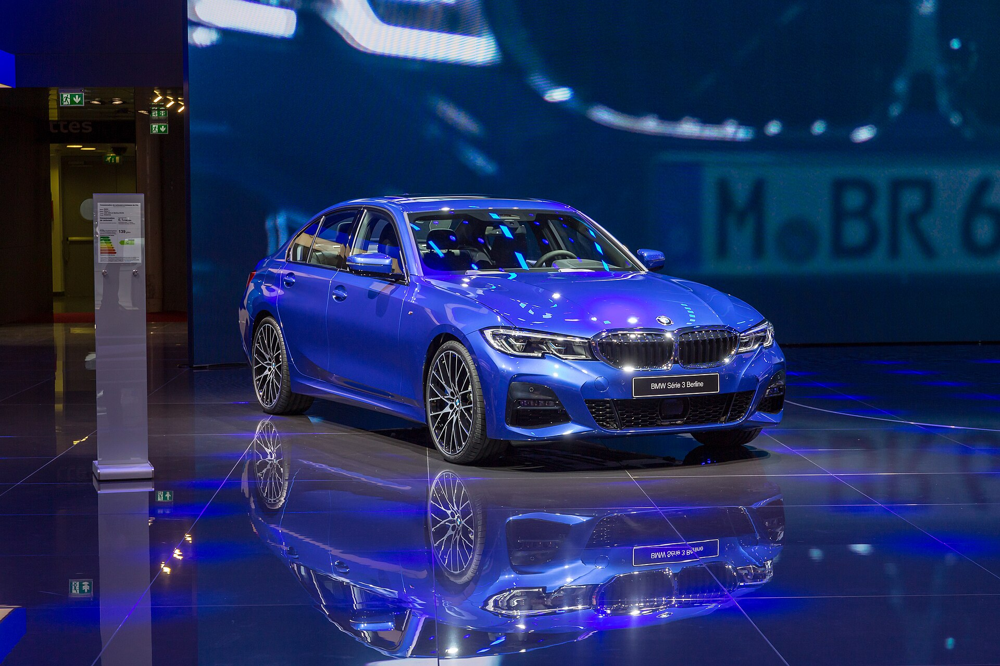
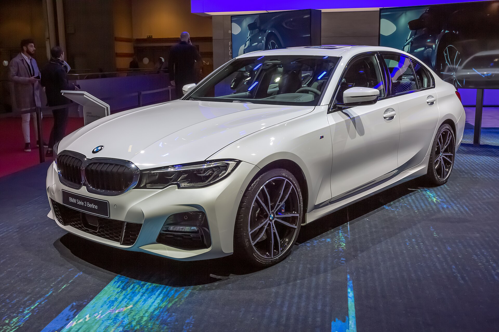
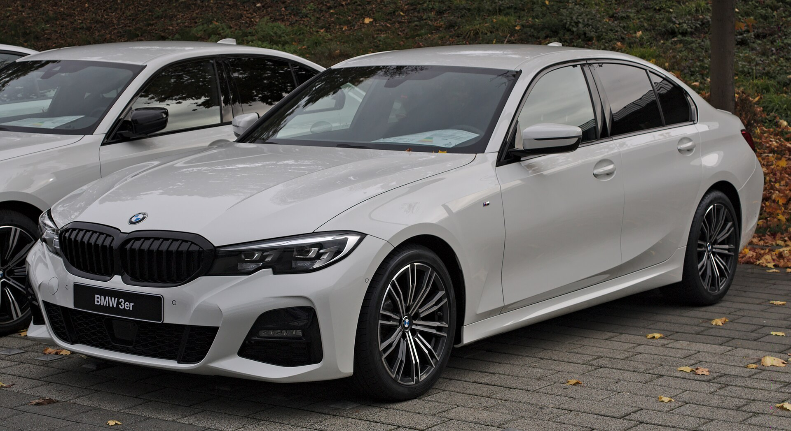
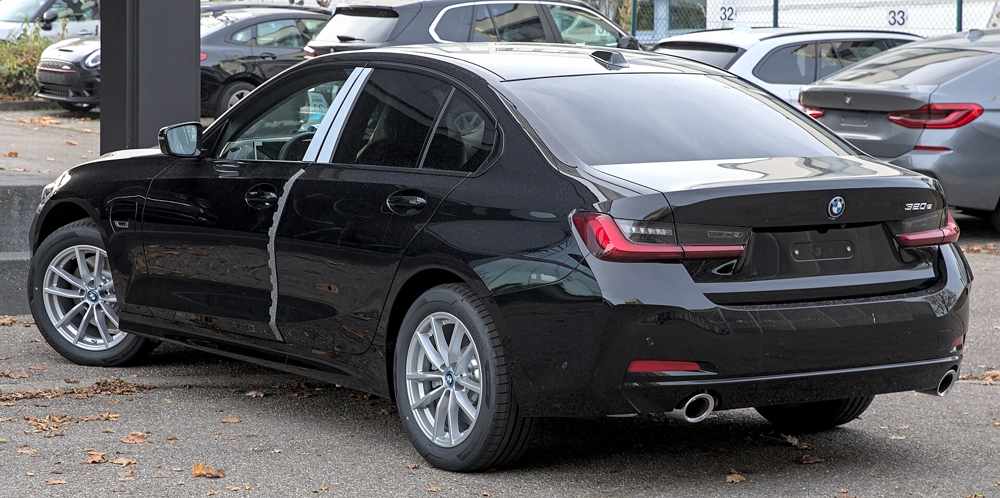
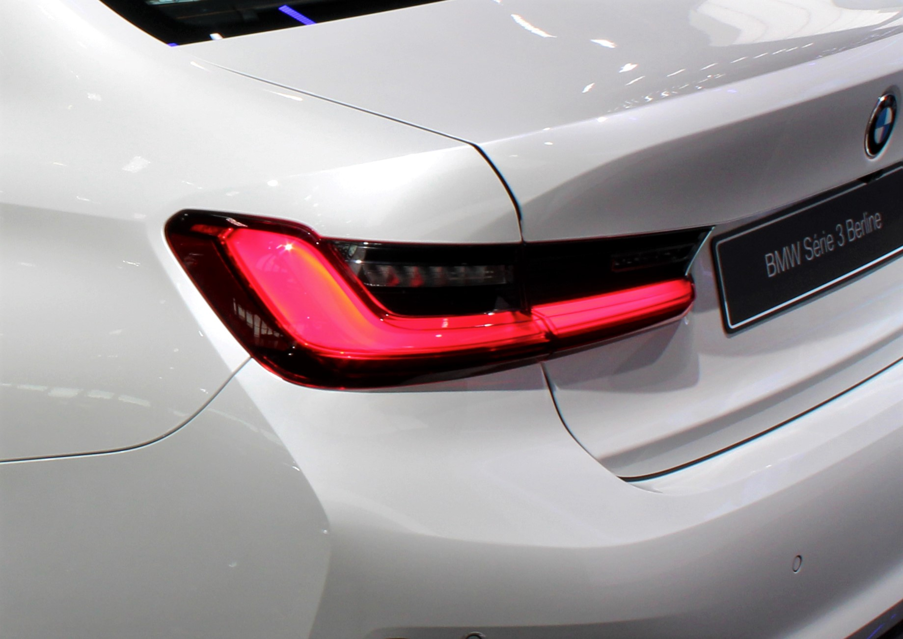
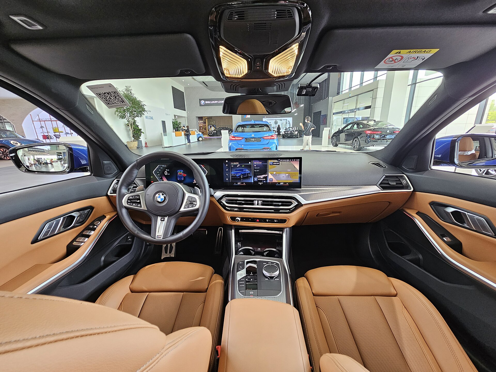
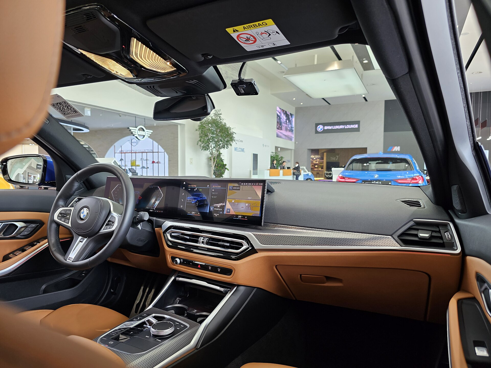

# BMW 3 Series 2025

*Compact executive / luxury sport sedan | 4-door sedan (Touring wagon in Europe) | G20 (seventh generation, 2019-present, LCI facelift 2023)*

**Price range (new, MSRP):** $46,000 - $78,000  
**Typical used:** $36,000 at 2-3 years, $26,000 at 5 years  
**Built in:** Germany (Munich; also Mexico and China)

## Photos

### Exterior

### Interior

Photo sources and licenses: [`photo-credits.json`](photo-credits.json)

## Why a buyer picks this car

- Still the driving benchmark in the segment - 50/50 weight distribution, rear-biased AWD, best-in-class steering feel
- B58 inline-six in the M340i is one of the great modern engines: 386 hp, 0-60 in 4.1 s, and it is smooth at idle
- 8-speed ZF automatic shifts faster and smoother than almost any dual-clutch rival
- 3 yr / 36,000 mi scheduled maintenance included - a real cost offset versus Audi and Mercedes
- iDrive 8.5 keeps a rotary controller alongside the touchscreen, unlike touch-only rivals
- 330e plug-in does 23 electric miles - most commutes run on the battery with no range anxiety
- Enormous enthusiast following supports strong used demand for M340i and M3

## Where it falls short

- Premium fuel required across the entire range
- Out-of-warranty repair costs are high: cooling system, gaskets and electronics are the usual culprits
- Rear seat and 17 cu ft trunk are tighter than a Camry or Accord
- Option pricing escalates quickly - a 'base' 330i can option past $60,000
- iDrive 8.5 moved climate controls into the screen, a step back for usability

**Ideal buyer:** Driving enthusiast or professional who wants a compact luxury sedan that is genuinely rewarding on a back road and credible in a client parking lot.

**Good fit for:** Executive daily driver, Spirited weekend driving, PHEV commuting with weekend range, Track day (M3), Lease-cycle luxury buyer

## Powertrains

### 330i B48

| Field | Value |
|---|---|
| Engine | 2.0L turbocharged inline-4 with 48V mild hybrid |
| Displacement l | 2.0 |
| Hp | 255 |
| Torque lb ft | 295 |
| Transmission | 8-speed ZF automatic |
| Drivetrain | RWD or xDrive AWD |
| Fuel | Premium required |
| Epa mpg | City: 26, Highway: 36, Combined: 30 |
| Zero to 60 s | 5.6 |

### 330e PHEV

| Field | Value |
|---|---|
| Engine | 2.0L turbo inline-4 + electric motor, 12 kWh battery |
| Displacement l | 2.0 |
| Hp | 288 |
| Torque lb ft | 310 |
| Transmission | 8-speed automatic |
| Drivetrain | RWD or xDrive |
| Fuel | Plug-in hybrid, premium |
| Epa mpg | City: 25, Highway: 32, Combined: 28 |
| Epa mpge combined | 67 |
| Electric range mi | 23 |
| Zero to 60 s | 5.7 |

### M340i B58

| Field | Value |
|---|---|
| Engine | 3.0L turbocharged inline-6 with 48V mild hybrid |
| Displacement l | 3.0 |
| Hp | 386 |
| Torque lb ft | 369 |
| Transmission | 8-speed ZF automatic |
| Drivetrain | xDrive AWD |
| Fuel | Premium required |
| Epa mpg | City: 22, Highway: 30, Combined: 25 |
| Zero to 60 s | 4.1 |

### M3 Competition S58

| Field | Value |
|---|---|
| Engine | 3.0L twin-turbo inline-6 |
| Displacement l | 3.0 |
| Hp | 523 |
| Torque lb ft | 479 |
| Transmission | 8-speed M Steptronic (6-speed manual on base M3) |
| Drivetrain | RWD or M xDrive |
| Fuel | Premium required |
| Epa mpg | City: 16, Highway: 23, Combined: 19 |
| Zero to 60 s | 3.4 |

## Dimensions

| Field | Value |
|---|---|
| Length in | 185.7 |
| Width in | 71.9 |
| Height in | 56.8 |
| Wheelbase in | 112.2 |
| Curb weight lb | 3600 |
| Ground clearance in | 5.4 |
| Seating | 5 |

## Capacity

| Field | Value |
|---|---|
| Cargo cu ft | 17.0 |
| Cargo phev cu ft | 13.2 |
| Towing lb | 0 |
| Fuel tank gal | 15.6 |
| Range mi combined | 470 |

## Safety

- **NHTSA overall:** 5
- **IIHS:** Top Safety Pick (2024)
- **Driver assistance:**
  - Active Driving Assistant with frontal collision warning
  - Blind Spot Detection
  - Lane Departure Warning
  - Available Driving Assistance Professional with Highway Assistant hands-free
  - Parking Assistant Plus with 360-degree view
  - Active Park Distance Control

## Warranty

| Field | Value |
|---|---|
| Basic | 4 yr / 50,000 mi |
| Powertrain | 4 yr / 50,000 mi |
| Hybrid ev | 8 yr / 80,000 mi PHEV battery |
| Roadside | 4 yr / unlimited mi |
| Maintenance | BMW Ultimate Care 3 yr / 36,000 mi included |

## Technology and comfort

| Field | Value |
|---|---|
| Infotainment in | 14.9 |
| Digital cluster in | 12.3 |
| Audio | Available 16-speaker Harman Kardon surround |
| Connectivity | iDrive 8.5 curved display, Wireless CarPlay and Android Auto, BMW Digital Key Plus (ultra-wideband phone key), Over-the-air updates, Augmented-reality navigation video |

**Notable features:**

- Adaptive M suspension available
- Variable sport steering
- Head-up display
- Heated steering wheel and seats
- M Sport differential (M340i/M3)
- Launch control

## Trims

330i, 330i xDrive, 330e plug-in hybrid, M340i xDrive, M3 / M3 Competition

## Colors and materials

**Exterior:** Alpine White, Black Sapphire Metallic, Mineral White Metallic, Portimao Blue Metallic, Skyscraper Grey Metallic, Melbourne Red Metallic, Tanzanite Blue II

**Interior:** SensaTec synthetic leather standard, Vernasca leather, Merino leather (M3), Aluminum, open-pore wood or carbon fiber trim

## Ownership costs

| Field | Value |
|---|---|
| Service interval mi | 10000 |
| Typical insurance usd yr | 2300 |
| 5yr cost note | First 3 years are cheap thanks to included maintenance; years 4-7 are where German ownership cost shows up. Recommend an extended warranty for keepers. |
| Reliability note | The B58 six is notably robust. Watch cooling system components and oil filter housing gaskets past 60,000 miles on the B48. |

## Cross-shopped against

Mercedes-Benz C-Class, Audi A4 / A5, Genesis G70, Lexus IS, Alfa Romeo Giulia

## Handling objections

**"BMWs are expensive to maintain."**

> The first three years and 36,000 miles of scheduled maintenance are included - that is oil, filters, brake fluid. Where the reputation comes from is years 5 through 10, which is exactly why we offer an extended service contract; let me price it alongside the car.

**"A loaded Camry costs half as much."**

> It does, and it is a fine car. Drive them back to back on a curving road. What you are paying for is the chassis, the steering and the inline-six - if you do not feel it in ten minutes, buy the Camry and I will shake your hand.

**"Premium fuel adds up."**

> About $350 a year over regular at 12,000 miles. Weigh that against a car you look forward to driving every morning - and the 330e runs most commutes on electricity at a third of the cost.

**"I want a Mercedes for the badge."**

> Then drive both. The C-Class is the better lounge; the 3 Series is the better car to drive. Buyers who pick the Mercedes usually tell me it was about the interior, and that is a legitimate reason.

## Notes for the salesperson

- Route the test drive over a road with real corners - the product sells itself there and nowhere else.
- Lead luxury cross-shoppers with the included maintenance, it neutralizes the cost-of-ownership objection early.
- For commuters, run the 330e electric-mile math against their actual daily distance.

## Sample payment

| Field | Value |
|---|---|
| Msrp usd | 50000 |
| Down usd | 6000 |
| Apr pct | 6.9 |
| Term months | 60 |
| Approx monthly usd | 870 |

*Illustrative only - not a quote.*

---

*Figures are approximate US-market values for demo purposes. Verify against the manufacturer window sticker before quoting a customer.*
