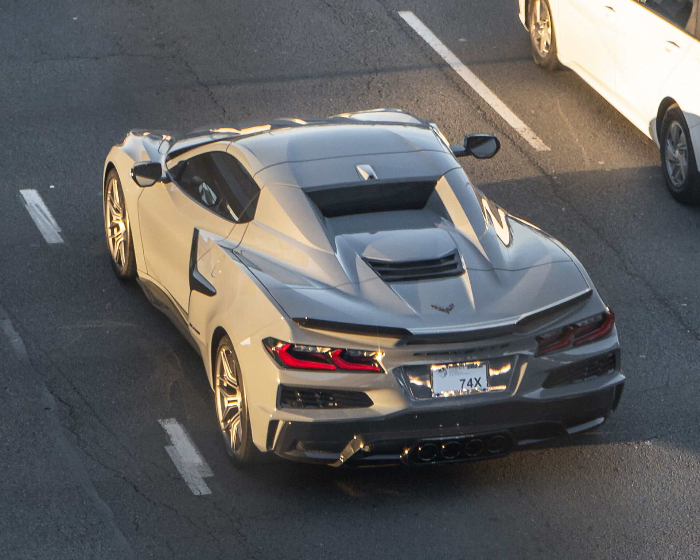
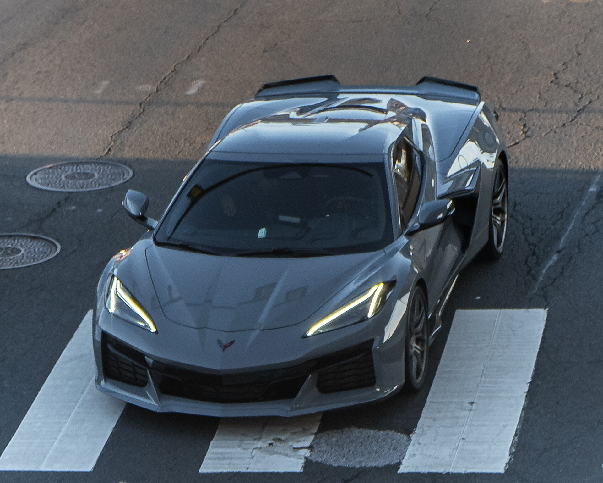
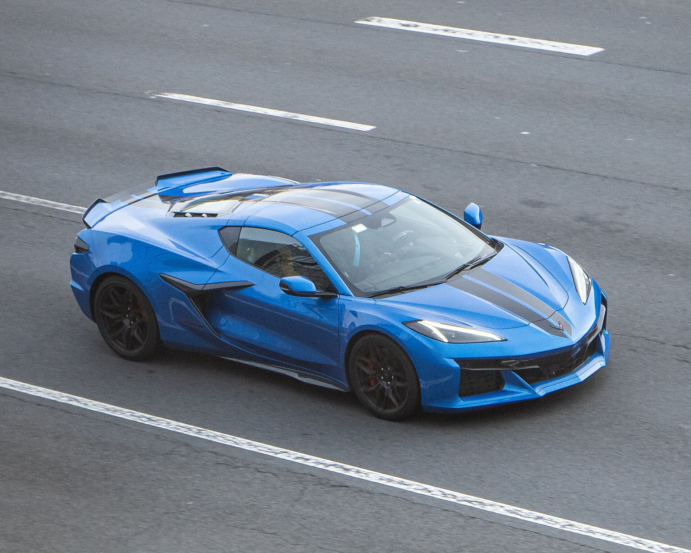
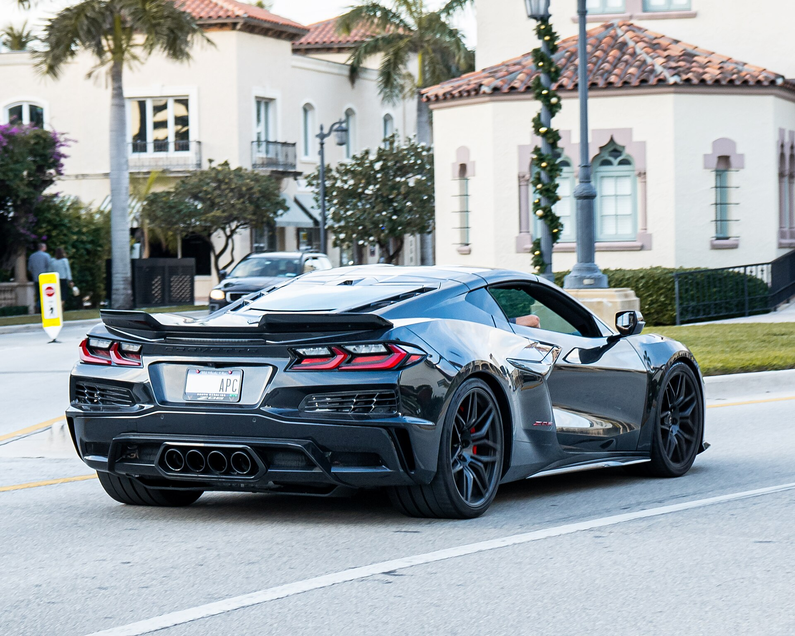
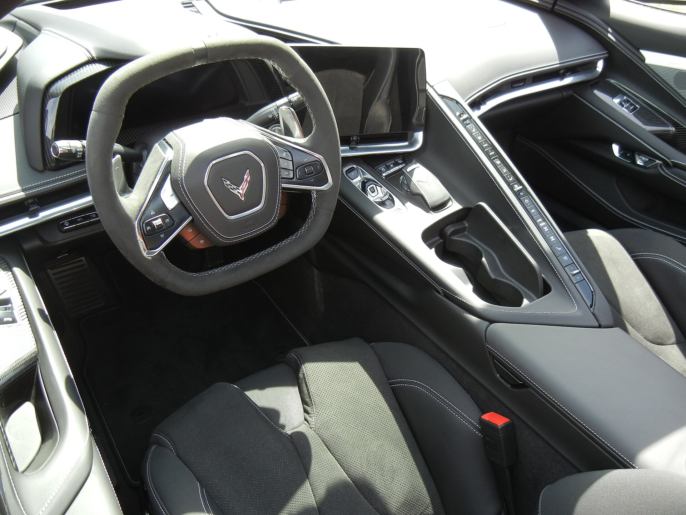
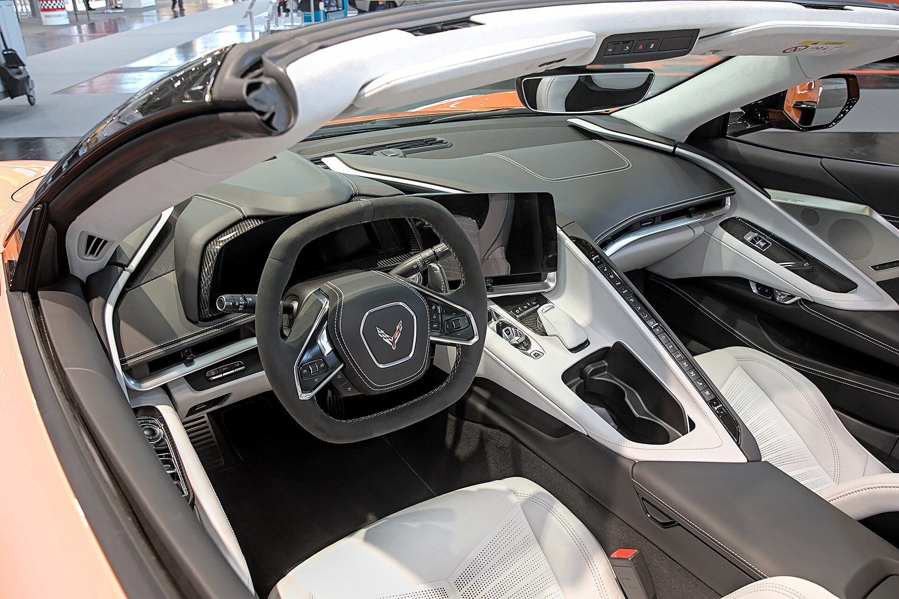
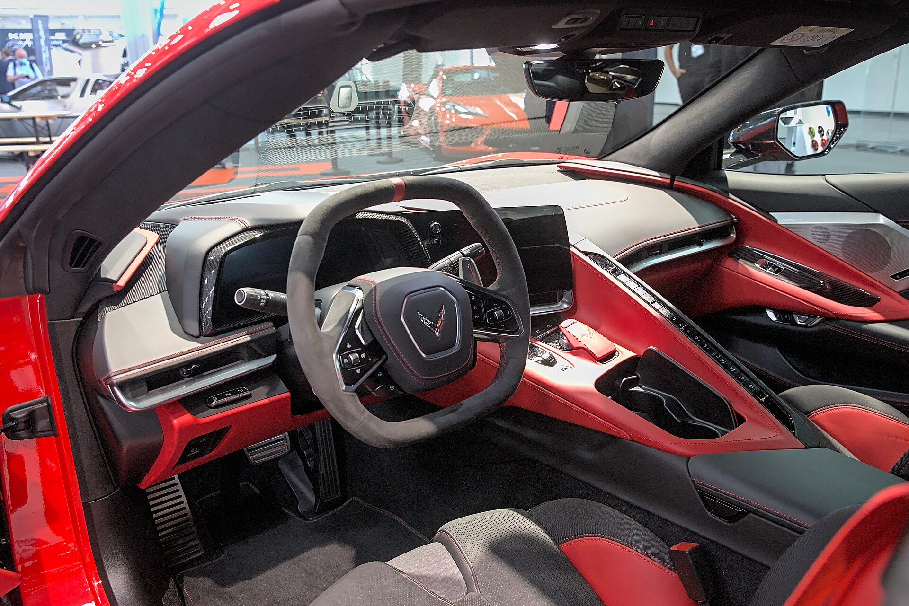

# Chevrolet Corvette (C8) 2025

*Sports car / supercar | 2-door mid-engine coupe with removable roof panel; convertible with retractable hardtop | C8 (eighth generation, 2020-present) - first mid-engine Corvette*

**Price range (new, MSRP):** $69,000 - $180,000  
**Typical used:** $68,000 at 2-3 years, $58,000 at 5 years  
**Built in:** United States (Bowling Green, Kentucky)

## Photos

### Exterior

### Interior

Photo sources and licenses: [`photo-credits.json`](photo-credits.json)

## Why a buyer picks this car

- 2.9 seconds to 60 mph for $69,000 - no other new vehicle delivers that value, period
- Mid-engine layout gives supercar balance and traction with a genuinely usable cabin
- Two trunks totaling 14.4 cu ft: it fits two golf bags or a weekend's luggage with the roof panel stowed
- Front lift with GPS memory raises the nose automatically at driveways you have saved - eliminates the everyday supercar headache
- Magnetic Ride Control makes it comfortable enough to commute in, unusual for this performance level
- Serviceable at any Chevrolet dealer nationwide, unlike European exotics
- ZR1 makes 1,064 hp, making it the most powerful production car ever built in America

## Where it falls short

- Two seats only, with no practical way to carry a third person
- 8 in infotainment screen is small and dated for the price bracket
- The angled center console button wall divides opinion sharply - sit in it before you buy
- Premium fuel required and 15-19 mpg combined depending on trim
- Z06 and ZR1 allocations are limited and frequently carry market adjustments
- 5.0 in ground clearance means the front lift is effectively mandatory

**Ideal buyer:** Performance buyer who wants supercar acceleration with a domestic service network and a price that leaves money for tires and track days.

**Good fit for:** Weekend performance driving, Track days and HPDE events, Grand touring for two, Collector purchase (Z06, ZR1), Warm-weather daily driving

## Powertrains

### Stingray LT2

| Field | Value |
|---|---|
| Engine | 6.2L naturally aspirated V8, mid-mounted |
| Displacement l | 6.2 |
| Hp | 495 |
| Torque lb ft | 470 |
| Transmission | 8-speed dual-clutch |
| Drivetrain | RWD |
| Fuel | Premium required |
| Epa mpg | City: 16, Highway: 24, Combined: 19 |
| Zero to 60 s | 2.9 |

### E-Ray

| Field | Value |
|---|---|
| Engine | 6.2L V8 + 160 hp front electric motor, 1.9 kWh battery |
| Displacement l | 6.2 |
| Hp | 655 |
| Torque lb ft | 595 |
| Transmission | 8-speed dual-clutch |
| Drivetrain | eAWD |
| Fuel | Premium required, hybrid assist |
| Epa mpg | City: 16, Highway: 24, Combined: 19 |
| Zero to 60 s | 2.5 |

### Z06 LT6

| Field | Value |
|---|---|
| Engine | 5.5L naturally aspirated flat-plane-crank V8, 8,600 rpm redline |
| Displacement l | 5.5 |
| Hp | 670 |
| Torque lb ft | 460 |
| Transmission | 8-speed dual-clutch |
| Drivetrain | RWD |
| Fuel | Premium required |
| Epa mpg | City: 12, Highway: 21, Combined: 15 |
| Zero to 60 s | 2.6 |

### ZR1 LT7

| Field | Value |
|---|---|
| Engine | 5.5L twin-turbo flat-plane-crank V8 |
| Displacement l | 5.5 |
| Hp | 1064 |
| Torque lb ft | 828 |
| Transmission | 8-speed dual-clutch |
| Drivetrain | RWD |
| Fuel | Premium required |
| Epa mpg | City: 12, Highway: 19, Combined: 14 |
| Zero to 60 s | 2.3 |

## Dimensions

| Field | Value |
|---|---|
| Length in | 182.3 |
| Width in | 76.1 |
| Height in | 48.6 |
| Wheelbase in | 107.2 |
| Curb weight lb | 3647 |
| Ground clearance in | 5.0 |
| Seating | 2 |

## Capacity

| Field | Value |
|---|---|
| Frunk cu ft | 1.8 |
| Rear trunk cu ft | 12.6 |
| Total cargo cu ft | 14.4 |
| Towing lb | 0 |
| Fuel tank gal | 18.5 |
| Range mi combined | 350 |

## Safety

- **NHTSA overall:** not rated
- **IIHS:** Not rated - low volume sports car
- **Driver assistance:**
  - Forward Collision Alert
  - Front Pedestrian Braking
  - Lane Change Alert with Side Blind Zone Alert
  - Rear Cross Traffic Alert
  - Available Performance Data Recorder with video and telemetry
  - Front lift with GPS memory for up to 1,000 locations

## Warranty

| Field | Value |
|---|---|
| Basic | 3 yr / 36,000 mi |
| Powertrain | 5 yr / 60,000 mi |
| Roadside | 5 yr / 60,000 mi |
| Maintenance | 1 included maintenance visit |

## Technology and comfort

| Field | Value |
|---|---|
| Infotainment in | 8 |
| Digital cluster in | 12 |
| Audio | Available 14-speaker Bose Performance Series |
| Connectivity | Wireless Apple CarPlay and Android Auto, myChevrolet remote, OnStar, Performance Data Recorder with lap timing and overlay telemetry |

**Notable features:**

- Magnetic Ride Control 4.0 adaptive dampers
- Z51 Performance Package with electronic limited-slip differential
- Front lift with GPS memory that raises the nose automatically at saved driveways
- Removable roof panel stows in the rear trunk
- Available carbon fiber wheels (Z06)
- Configurable drive modes including Z-Mode

## Trims

Stingray 1LT, Stingray 2LT, Stingray 3LT, E-Ray, Z06, ZR1

## Colors and materials

**Exterior:** Arctic White, Torch Red, Hypersonic Gray Metallic, Amplify Orange Tintcoat, Riptide Blue Metallic, Sea Wolf Gray Tricoat, Cacti Green

**Interior:** GT1 leather-trimmed seats, GT2 leather, Competition Sport buckets with Napa leather (3LT), Available carbon fiber and suede-wrapped trim

## Ownership costs

| Field | Value |
|---|---|
| Service interval mi | 7500 |
| Typical insurance usd yr | 2800 |
| 5yr cost note | Depreciation has been unusually mild for C8s due to sustained demand. Tires are the dominant consumable, especially with the Z51 package. |
| Reliability note | Early 2020-2021 cars had some dual-clutch and electrical service campaigns. Later builds are solid. Verify whether a used car has track history. |

## Cross-shopped against

Porsche 911, Nissan Z, Ford Mustang Dark Horse, Lotus Emira, Acura NSX (used), BMW M4

## Handling objections

**"A Porsche 911 has better build quality."**

> It does, and it holds value better. It also costs $50,000 more for similar acceleration. If the last 10% of interior finish matters most, buy the Porsche. If you want the performance and want money left for tires and track days, this is the smarter buy.

**"The button wall on the console is awkward."**

> It divides people - I will not sell you on it. Sit in the driver's seat for five minutes before the test drive and reach for the climate controls. Some buyers love the separation; others cannot live with it.

**"It is too low for my driveway."**

> That is exactly what the front lift with GPS memory solves. You save the location once and the car raises itself automatically every time you approach. Bring the car to your house on the test drive and we will program it.

**"Only two seats, I have a family."**

> Then it is a second car, not a first. But the two trunks hold 14.4 cu ft - more luggage than a 911 - so it works for a couple's weekend trip. Be honest about which role it is filling.

## Notes for the salesperson

- Lead with the value comparison: list the cars that match 2.9 seconds and their prices.
- Demonstrate the front lift and the two trunks during the walkaround - they resolve the practicality objections before they are raised.
- For track-focused buyers, show the Performance Data Recorder footage; it converts enthusiasts quickly.

## Sample payment

| Field | Value |
|---|---|
| Msrp usd | 75000 |
| Down usd | 12000 |
| Apr pct | 6.9 |
| Term months | 72 |
| Approx monthly usd | 1073 |

*Illustrative only - not a quote.*

---

*Figures are approximate US-market values for demo purposes. Verify against the manufacturer window sticker before quoting a customer.*
