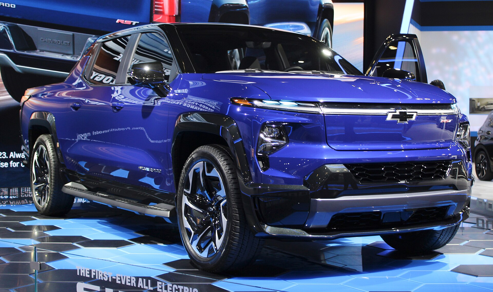
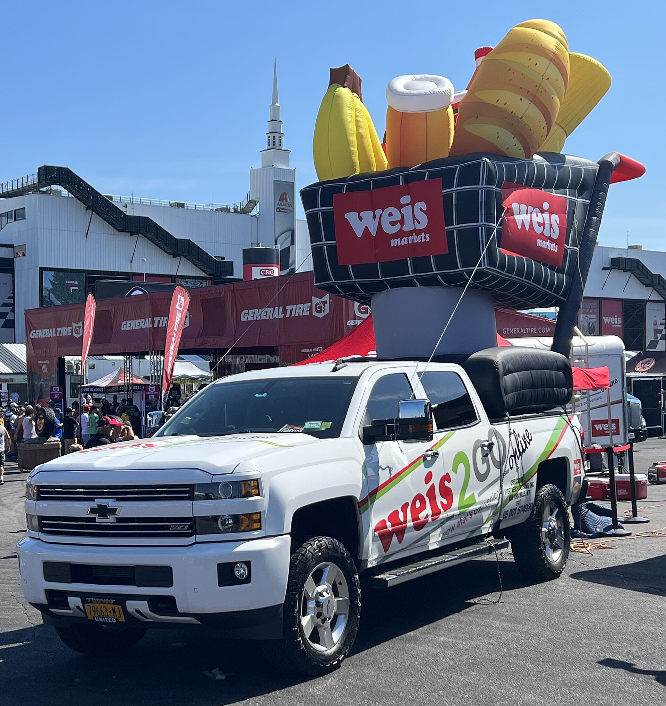
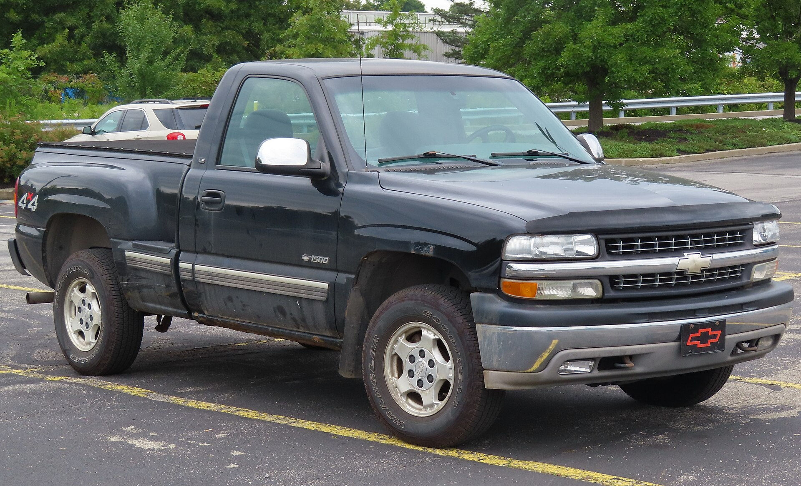
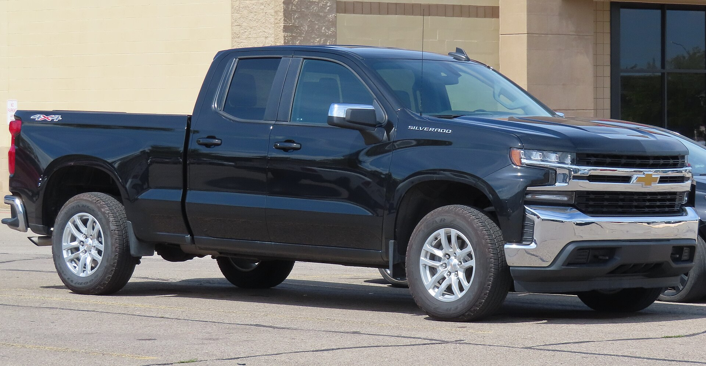
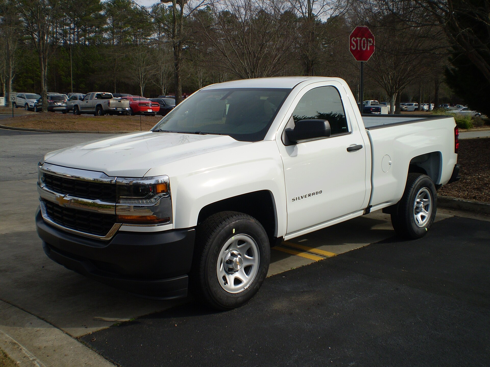
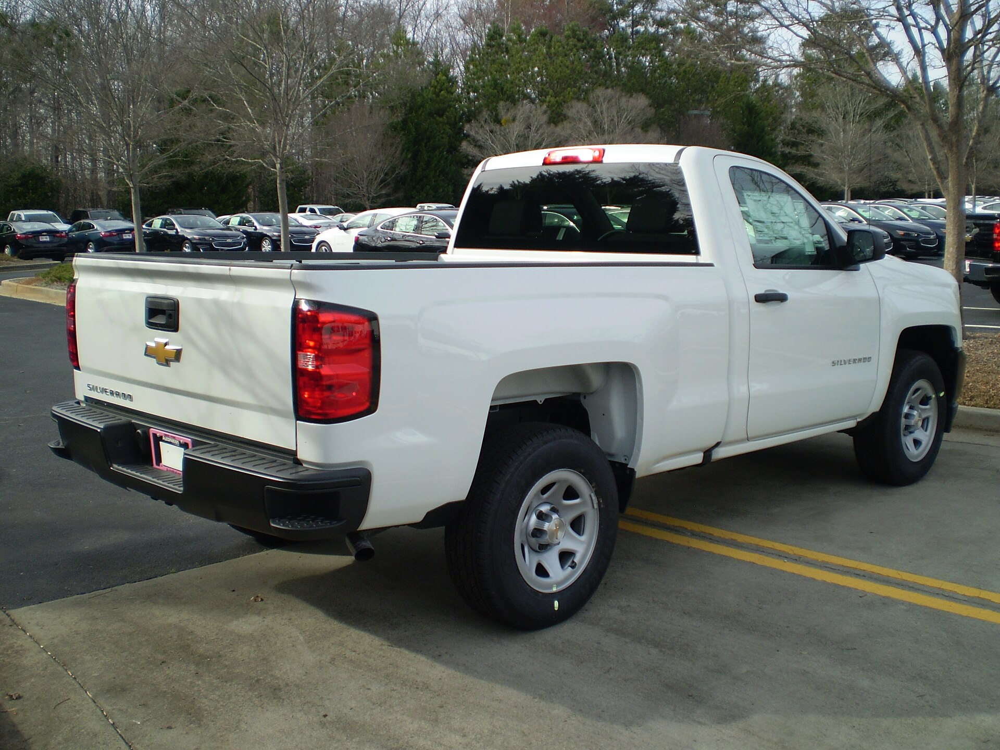
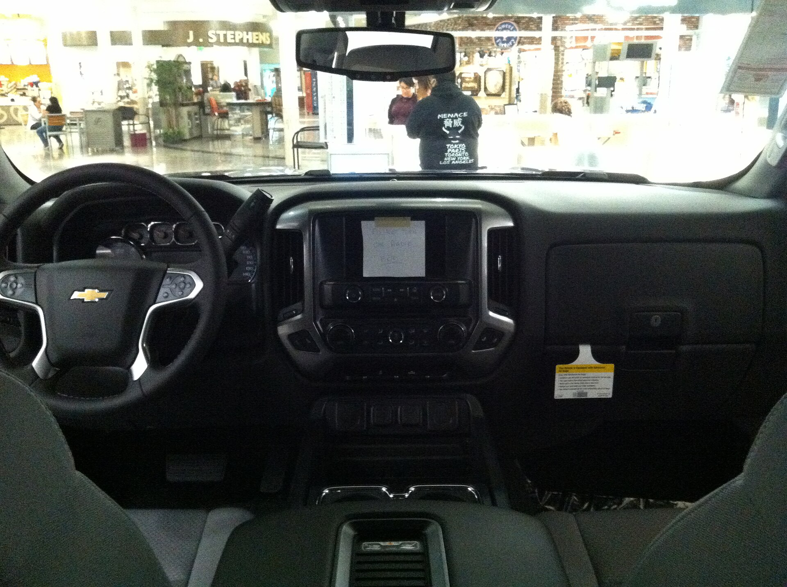

# Chevrolet Silverado 1500 2025

*Full-size light-duty pickup | Pickup truck - Regular Cab, Double Cab, Crew Cab; 5.75 / 6.5 / 8.0 ft beds | T1XX (2019-present, refreshed 2022 and 2024)*

**Price range (new, MSRP):** $37,700 - $75,000  
**Typical used:** $40,000 at 2-3 years, $29,500 at 5 years  
**Built in:** United States (Fort Wayne, Indiana and Silao, Mexico)

## Photos

### Exterior

### Interior

Photo sources and licenses: [`photo-credits.json`](photo-credits.json)

## Why a buyer picks this car

- 3.0L Duramax diesel returns 26 mpg combined and 29 highway - best fuel economy of any full-size gas or diesel half-ton
- Super Cruise is true hands-free driving and works while towing a trailer
- Multi-Flex tailgate with six positions including a standing workstation and inner gate load stop
- Widest bed in the class at 71 in between the wheel wells - a 4x8 sheet lies flat
- 13.4 in screen with Google built-in: native Maps and Assistant without a phone
- Four distinct engines including a torque-rich 2.7L four that outpulls some V8s
- Strong off-road ladder from Trail Boss up to the multimatic-equipped ZR2

## Where it falls short

- Interior plastics on WT and Custom trims lag Ram and F-150 at the same price
- Dynamic Fuel Management lifters have a documented failure history on some 5.3L/6.2L units
- No hybrid option in the lineup
- Ride quality on the base leaf-spring setup is firmer than Ram's coil-spring rear

**Ideal buyer:** Work-truck buyer or tower who wants maximum payload and bed usability, and highway drivers who want diesel economy.

**Good fit for:** Fleet and trades, Long-distance towing (diesel), Ranch and rural use, Family crew cab, Overlanding and rock crawling (ZR2)

## Powertrains

### 2.7L TurboMax

| Field | Value |
|---|---|
| Engine | 2.7L turbocharged inline-4 |
| Displacement l | 2.7 |
| Hp | 310 |
| Torque lb ft | 430 |
| Transmission | 8-speed automatic |
| Drivetrain | RWD or 4WD |
| Fuel | Regular gasoline |
| Epa mpg | City: 18, Highway: 21, Combined: 19 |
| Zero to 60 s | 6.7 |

### 5.3L EcoTec3 V8

| Field | Value |
|---|---|
| Engine | 5.3L V8 with Dynamic Fuel Management |
| Displacement l | 5.3 |
| Hp | 355 |
| Torque lb ft | 383 |
| Transmission | 8- or 10-speed automatic |
| Drivetrain | RWD or 4WD |
| Fuel | Regular gasoline |
| Epa mpg | City: 16, Highway: 21, Combined: 18 |
| Zero to 60 s | 6.5 |

### 6.2L EcoTec3 V8

| Field | Value |
|---|---|
| Engine | 6.2L V8 with Dynamic Fuel Management |
| Displacement l | 6.2 |
| Hp | 420 |
| Torque lb ft | 460 |
| Transmission | 10-speed automatic |
| Drivetrain | RWD or 4WD |
| Fuel | Premium recommended |
| Epa mpg | City: 15, Highway: 20, Combined: 17 |
| Zero to 60 s | 5.4 |

### 3.0L Duramax Turbo-Diesel

| Field | Value |
|---|---|
| Engine | 3.0L inline-6 turbo-diesel |
| Displacement l | 3.0 |
| Hp | 305 |
| Torque lb ft | 495 |
| Transmission | 10-speed automatic |
| Drivetrain | RWD or 4WD |
| Fuel | Diesel + DEF |
| Epa mpg | City: 24, Highway: 29, Combined: 26 |
| Zero to 60 s | 7.0 |

## Dimensions

| Field | Value |
|---|---|
| Length in | 231.9 |
| Width in | 81.2 |
| Height in | 75.6 |
| Wheelbase in | 147.4 |
| Curb weight lb | 4800 |
| Ground clearance in | 8.9 |
| Seating | 6 |

## Capacity

| Field | Value |
|---|---|
| Bed volume cu ft | 62.9 |
| Towing lb | 13300 |
| Payload lb | 2260 |
| Fuel tank gal | 24.0 |
| Range mi combined | 620 |

## Safety

- **NHTSA overall:** 5
- **IIHS:** Good crashworthiness; headlights vary by trim
- **Driver assistance:**
  - Automatic Emergency Braking with Pedestrian Detection
  - Forward Collision Alert
  - Lane Keep Assist with Lane Departure Warning
  - Following Distance Indicator
  - IntelliBeam
  - Available Super Cruise hands-free driving with trailering
  - Up to 14 camera views including transparent trailer

## Warranty

| Field | Value |
|---|---|
| Basic | 3 yr / 36,000 mi |
| Powertrain | 5 yr / 60,000 mi |
| Diesel | 5 yr / 100,000 mi emissions components |
| Roadside | 5 yr / 60,000 mi |
| Maintenance | 1 included maintenance visit |

## Technology and comfort

| Field | Value |
|---|---|
| Infotainment in | 13.4 |
| Digital cluster in | 12.3 |
| Audio | Available 10-speaker Bose |
| Connectivity | Google built-in with Maps and Assistant, Wireless Apple CarPlay and Android Auto, myChevrolet remote, OnStar with crash response, Over-the-air updates |

**Notable features:**

- Multi-Flex tailgate with 6 functions
- Super Cruise with trailer towing support
- Up to 14 camera views
- Power up/down tailgate
- In-bed 120V outlet
- Head-up display on High Country

## Trims

WT, Custom, Custom Trail Boss, LT, RST, LT Trail Boss, LTZ, ZR2, High Country

## Colors and materials

**Exterior:** Summit White, Black, Sterling Gray Metallic, Slate Gray Metallic, Radiant Red Tintcoat, Lakeshore Blue Metallic, Glacier Blue Metallic

**Interior:** Vinyl / cloth (WT), Cloth (Custom / LT), Leather-appointed (LTZ), Perforated leather with open-pore wood (High Country)

## Ownership costs

| Field | Value |
|---|---|
| Service interval mi | 7500 |
| Typical insurance usd yr | 2050 |
| 5yr cost note | The Duramax costs about $3,000 more up front but saves roughly $1,200/yr in fuel at 15,000 mi - breakeven near year 3. |
| Reliability note | Ask about the DFM/AFM lifter history on V8 used units; the 2.7L and 3.0L avoid that system entirely. |

## Cross-shopped against

Ford F-150, Ram 1500, GMC Sierra 1500, Toyota Tundra, Nissan Titan

## Handling objections

**"The interior is cheap compared to Ram."**

> That was the 2019-2021 truck. The 2022 refresh redid the whole dash - 13.4 in screen, 12.3 in cluster. Sit in an LT and compare it to a Ram Big Horn, not to a Limited.

**"I have heard the V8 lifters fail."**

> That is the Dynamic Fuel Management system, and it is a fair concern on high-mileage units. Two of our four engines - the 2.7L TurboMax and the 3.0L Duramax - do not use DFM at all, and the Duramax gets you 26 mpg on top of that.

**"Diesel costs more and needs DEF."**

> DEF is about $15 every 5,000 miles. At 26 mpg versus 18 for the V8, you save roughly $1,200 a year at 15,000 miles - it pays for itself and the diesel holds resale better.

**"Ford tows more."**

> By 200 lb at the absolute maximum configuration. What matters for you is bed width - we are the only half-ton where a 4x8 sheet of plywood lies flat between the wheel wells.

## Notes for the salesperson

- Demo the Multi-Flex tailgate physically - six positions is a 30-second close for anyone who loads alone.
- For highway commuters who also tow, the Duramax is the single most differentiated product in the segment.
- Show Super Cruise on a test drive route with a mapped highway - hands off the wheel sells itself.

## Sample payment

| Field | Value |
|---|---|
| Msrp usd | 52000 |
| Down usd | 5000 |
| Apr pct | 7.4 |
| Term months | 72 |
| Approx monthly usd | 810 |

*Illustrative only - not a quote.*

---

*Figures are approximate US-market values for demo purposes. Verify against the manufacturer window sticker before quoting a customer.*
