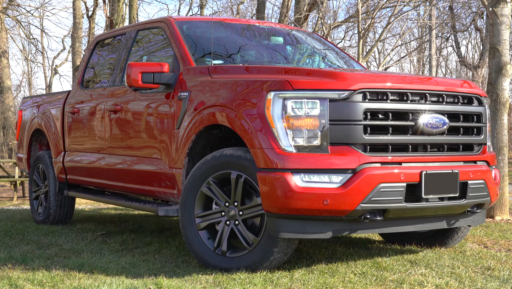
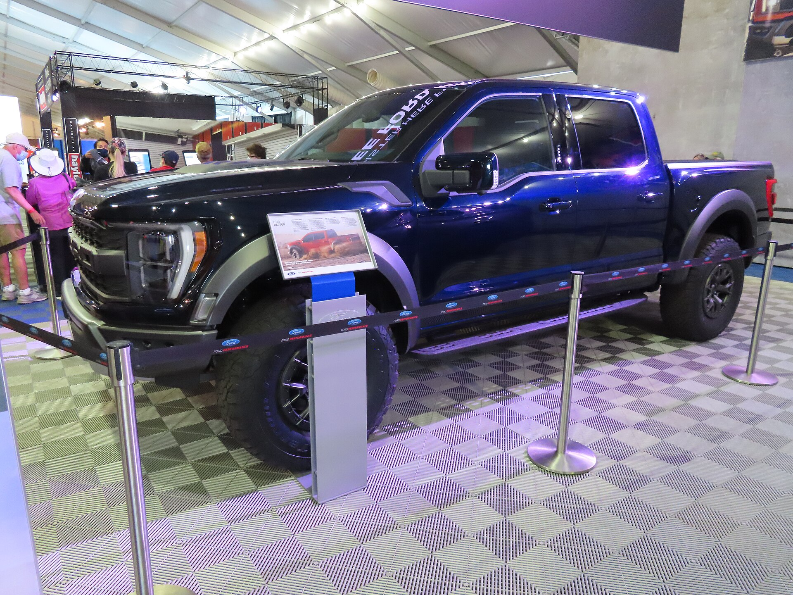
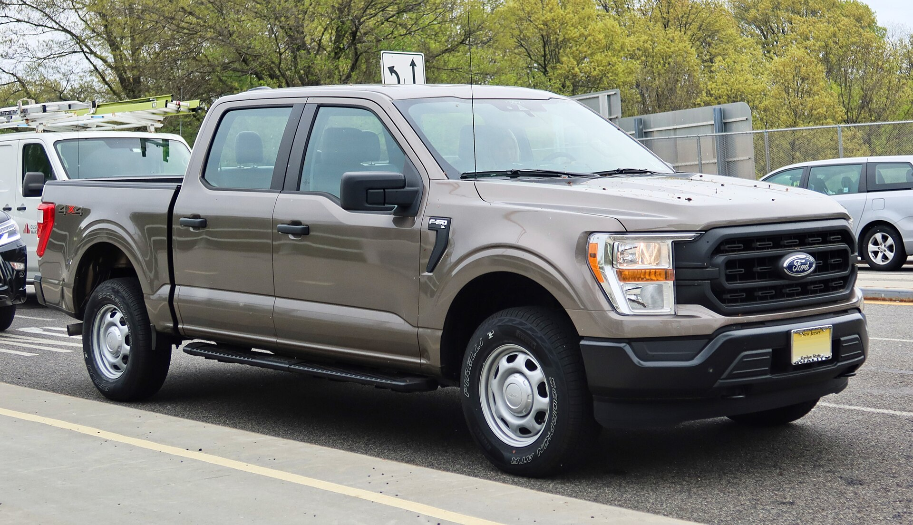
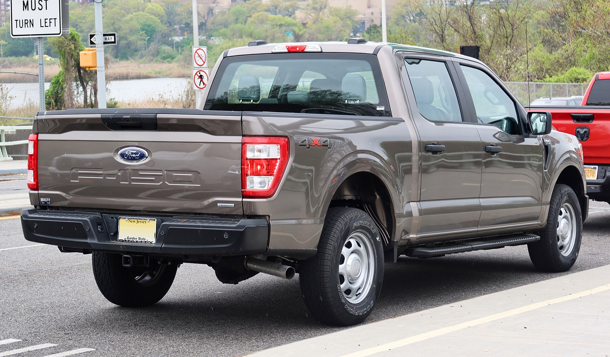
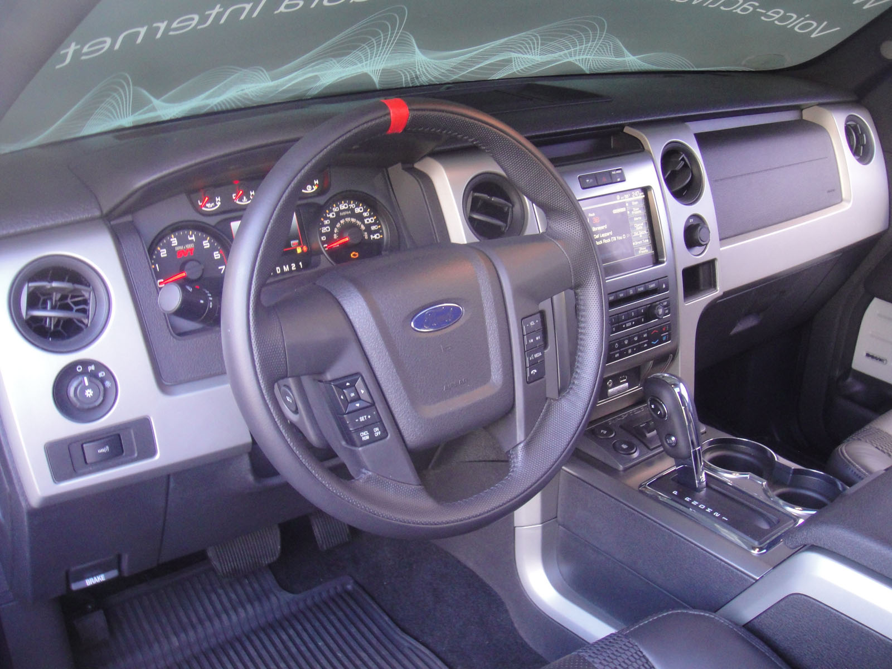
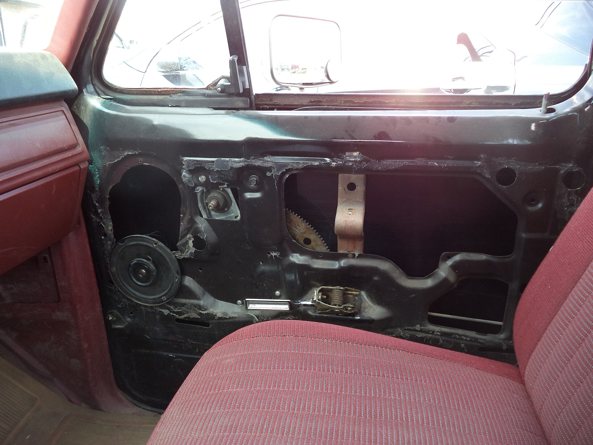
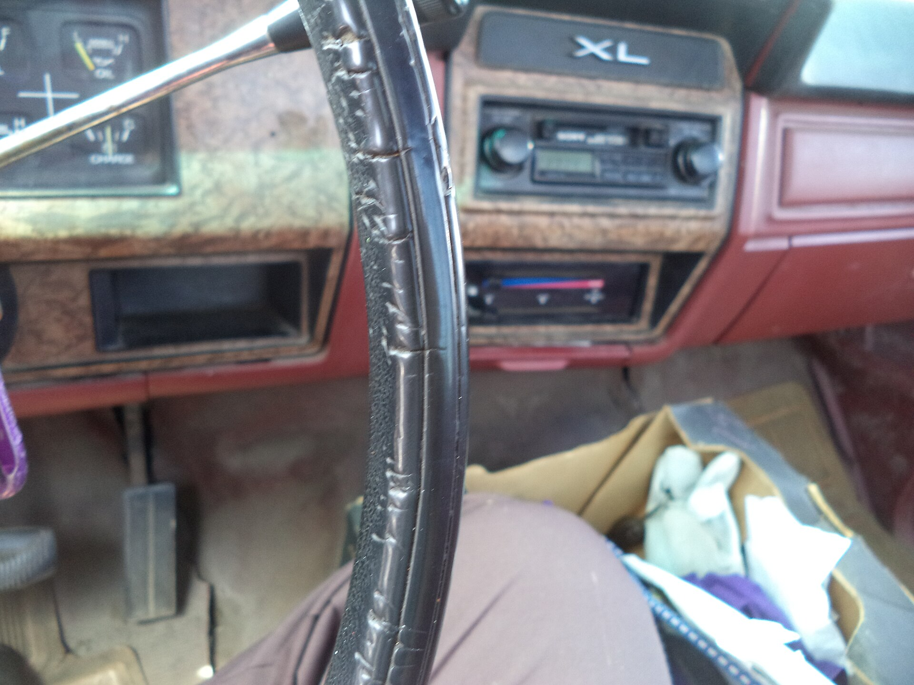

# Ford F-150 2025

*Full-size light-duty pickup | Pickup truck - Regular Cab, SuperCab, SuperCrew; 5.5 / 6.5 / 8.0 ft beds | Fourteenth generation (P702, 2021-present, refreshed 2024)*

**Price range (new, MSRP):** $38,810 - $88,000  
**Typical used:** $42,000 at 2-3 years, $32,000 at 5 years  
**Built in:** United States (Dearborn, Michigan and Claycomo, Missouri)

## Photos

### Exterior

### Interior

Photo sources and licenses: [`photo-credits.json`](photo-credits.json)

## Why a buyer picks this car

- Best-selling vehicle in America for over four decades - unbeatable parts, service and trade-in liquidity
- Pro Power Onboard turns the truck into a 7.2 kW jobsite or home-backup generator
- Five powertrains means you can match the truck to the job instead of overselling capability
- Aluminum body resists rust and cuts weight, raising payload to 2,455 lb
- Class-leading 13,500 lb max tow with onboard scales and Pro Trailer Backup Assist
- BlueCruise hands-free driving on 130,000+ miles of mapped highway
- Interior Work Surface and Max Recline seats make it a mobile office

## Where it falls short

- Configuration complexity - cab, bed, engine and package combinations overwhelm some buyers
- Top trims cross $80,000, which shocks buyers coming from a 10-year-old truck
- EcoBoost fuel economy drops sharply under load; real towing mpg can halve
- Early 10-speed transmissions had shift-quality complaints; check service history on used units

**Ideal buyer:** Contractor, tradesperson, towing family, or rural owner who needs one vehicle to work Monday and haul the boat Saturday.

**Good fit for:** Jobsite and trades work, Towing travel trailers and boats up to 13,500 lb, Mobile power for worksites or outages, Family hauling in SuperCrew, Off-road recreation (Tremor / Raptor)

## Powertrains

### 2.7L EcoBoost V6

| Field | Value |
|---|---|
| Engine | 2.7L twin-turbo V6 |
| Displacement l | 2.7 |
| Hp | 325 |
| Torque lb ft | 400 |
| Transmission | 10-speed automatic |
| Drivetrain | RWD or 4WD |
| Fuel | Regular gasoline |
| Epa mpg | City: 19, Highway: 24, Combined: 21 |
| Zero to 60 s | 6.3 |

### 5.0L Coyote V8

| Field | Value |
|---|---|
| Engine | 5.0L naturally aspirated V8 |
| Displacement l | 5.0 |
| Hp | 400 |
| Torque lb ft | 410 |
| Transmission | 10-speed automatic |
| Drivetrain | RWD or 4WD |
| Fuel | Regular gasoline |
| Epa mpg | City: 17, Highway: 24, Combined: 19 |
| Zero to 60 s | 5.9 |

### 3.5L EcoBoost V6

| Field | Value |
|---|---|
| Engine | 3.5L twin-turbo V6 |
| Displacement l | 3.5 |
| Hp | 400 |
| Torque lb ft | 500 |
| Transmission | 10-speed automatic |
| Drivetrain | RWD or 4WD |
| Fuel | Regular gasoline |
| Epa mpg | City: 18, Highway: 23, Combined: 20 |
| Zero to 60 s | 5.4 |

### 3.5L PowerBoost Hybrid

| Field | Value |
|---|---|
| Engine | 3.5L twin-turbo V6 + 35 kW electric motor |
| Displacement l | 3.5 |
| Hp | 430 |
| Torque lb ft | 570 |
| Transmission | 10-speed modular hybrid |
| Drivetrain | RWD or 4WD |
| Fuel | Regular gasoline / hybrid |
| Epa mpg | City: 22, Highway: 24, Combined: 23 |
| Zero to 60 s | 5.4 |

### 3.5L High-Output (Raptor)

| Field | Value |
|---|---|
| Engine | 3.5L twin-turbo V6, high output |
| Displacement l | 3.5 |
| Hp | 450 |
| Torque lb ft | 510 |
| Transmission | 10-speed automatic |
| Drivetrain | 4WD with Fox live-valve dampers |
| Fuel | Premium recommended |
| Epa mpg | City: 15, Highway: 18, Combined: 16 |
| Zero to 60 s | 5.3 |

## Dimensions

| Field | Value |
|---|---|
| Length in | 231.7 |
| Width in | 79.9 |
| Height in | 77.2 |
| Wheelbase in | 145.4 |
| Curb weight lb | 4700 |
| Ground clearance in | 9.4 |
| Seating | 6 |

## Capacity

| Field | Value |
|---|---|
| Bed volume cu ft | 62.3 |
| Towing lb | 13500 |
| Payload lb | 2455 |
| Fuel tank gal | 26.0 |
| Generator output kw | 7.2 |
| Range mi combined | 700 |

## Safety

- **NHTSA overall:** 5
- **IIHS:** Good in most crashworthiness tests; headlight ratings vary by trim
- **Driver assistance:**
  - Pre-Collision Assist with Automatic Emergency Braking
  - Blind Spot Information with trailer coverage
  - Lane Keeping System
  - Rear View Camera
  - Available BlueCruise hands-free highway driving
  - Pro Trailer Backup Assist
  - 360-degree camera (available)

## Warranty

| Field | Value |
|---|---|
| Basic | 3 yr / 36,000 mi |
| Powertrain | 5 yr / 60,000 mi |
| Hybrid ev | 8 yr / 100,000 mi hybrid components |
| Roadside | 5 yr / 60,000 mi |
| Maintenance | Not included |

## Technology and comfort

| Field | Value |
|---|---|
| Infotainment in | 12 |
| Digital cluster in | 12 |
| Audio | Available 18-speaker Bang and Olufsen Unleashed |
| Connectivity | SYNC 4 with wireless CarPlay and Android Auto, FordPass remote start and lock, Over-the-air updates, Wi-Fi hotspot, Ford Telematics for fleets |

**Notable features:**

- Pro Power Onboard generator up to 7.2 kW
- Interior Work Surface fold-flat shifter
- Max Recline seats
- Tailgate work surface with ruler and clamp pockets
- Zone Lighting
- Onboard scales and Smart Hitch

## Trims

XL, STX, XLT, Lariat, Tremor, King Ranch, Platinum, Raptor

## Colors and materials

**Exterior:** Oxford White, Agate Black, Iconic Silver, Carbonized Gray, Rapid Red, Avalanche, Antimatter Blue, Atlas Blue

**Interior:** Vinyl (XL work spec), Cloth (XLT), Leather (Lariat), Premium leather with real wood (King Ranch / Platinum)

## Ownership costs

| Field | Value |
|---|---|
| Service interval mi | 10000 |
| Typical insurance usd yr | 2100 |
| 5yr cost note | Fuel is the dominant cost: at 19 mpg and 15,000 mi/yr, budget about $2,800/yr. PowerBoost pays back in stop-and-go use. |
| Reliability note | Aluminum body panel repair requires a certified shop - confirm the customer's collision network. Cam phaser noise on some 5.0L units is a known service item. |

## Cross-shopped against

Chevrolet Silverado 1500, Ram 1500, Toyota Tundra, GMC Sierra 1500, Nissan Titan

## Handling objections

**"Aluminum body is not as tough as steel."**

> The bed is military-grade aluminum alloy - it does not rust, and Ford drop-tested loaded cinder blocks into it against steel beds. Repair goes through Ford's certified aluminum network, which most metro areas have several of.

**"Turbo V6 instead of a V8? I do not trust it."**

> The 3.5L EcoBoost makes 500 lb-ft - 90 more than the V8 - and it has been in F-150s since 2011 with over a million units on the road. If you still want the V8, we have it; it is the same price bracket.

**"Too expensive."**

> Let us work from the job backwards. If you never tow over 8,000 lb, an XLT with the 2.7L is around $48,000, not $80,000. Then Pro Power Onboard saves you renting a generator at $85 a day.

**"Gas mileage is terrible."**

> The PowerBoost hybrid does 23 mpg combined and 22 in the city - that is Camry territory from 20 years ago in a truck that tows 12,700 lb. It also idles on battery on a jobsite.

## Notes for the salesperson

- Qualify on max tow weight and payload first - it eliminates half the configurations in two questions.
- Demonstrate Pro Power Onboard by plugging in a real tool; it closes contractors faster than any spec sheet.
- For fleet buyers, lead with Ford Pro telematics and upfit availability, not trim levels.

## Sample payment

| Field | Value |
|---|---|
| Msrp usd | 55000 |
| Down usd | 6000 |
| Apr pct | 7.4 |
| Term months | 72 |
| Approx monthly usd | 845 |

*Illustrative only - not a quote.*

---

*Figures are approximate US-market values for demo purposes. Verify against the manufacturer window sticker before quoting a customer.*
