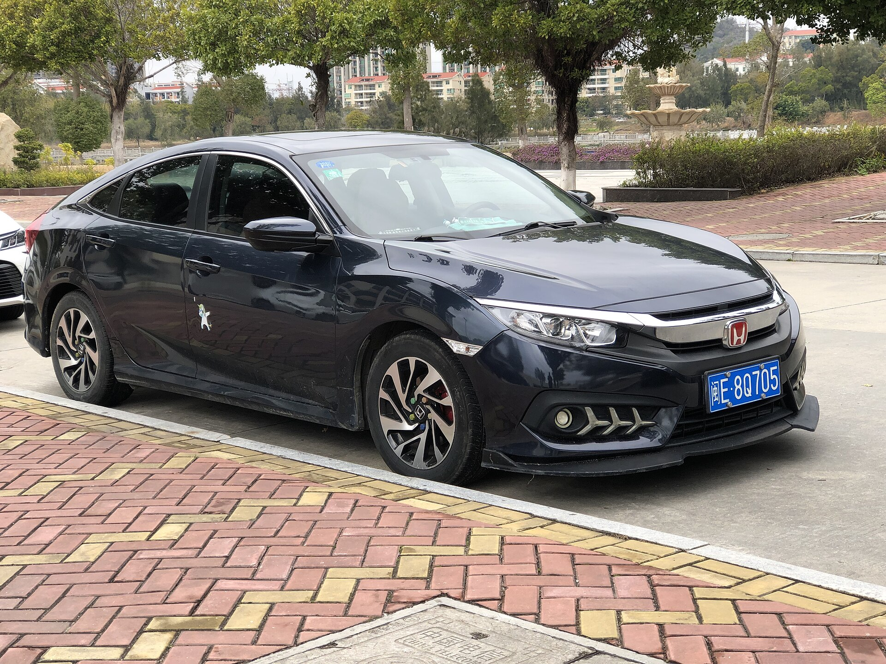
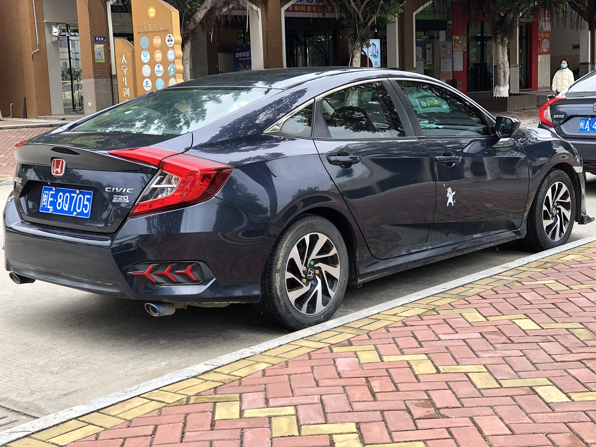
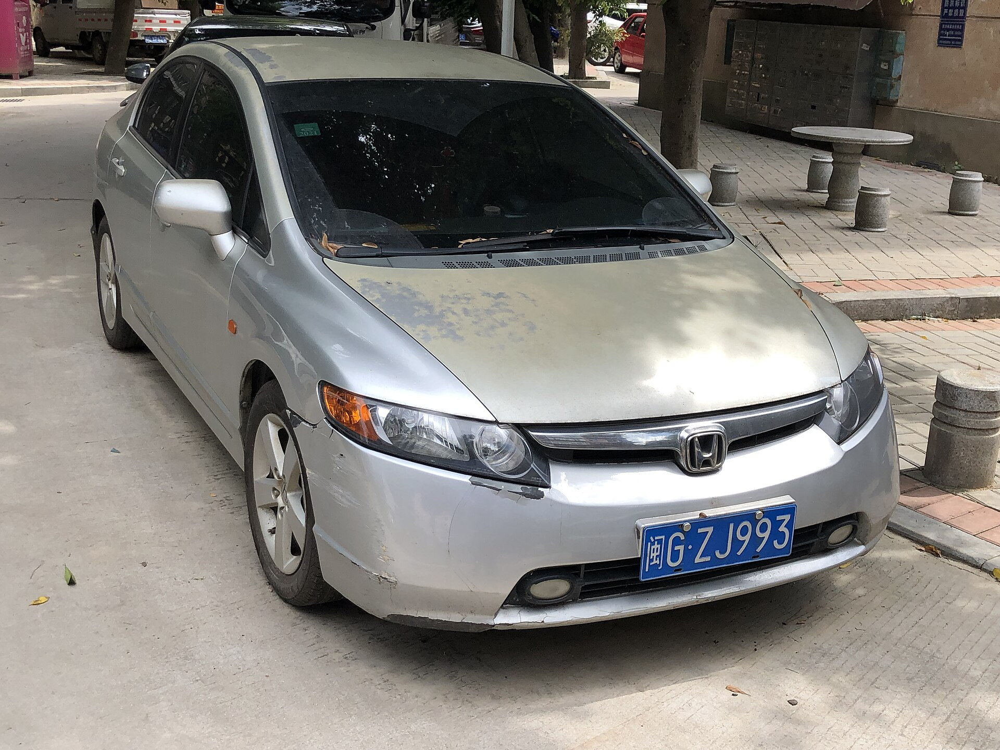
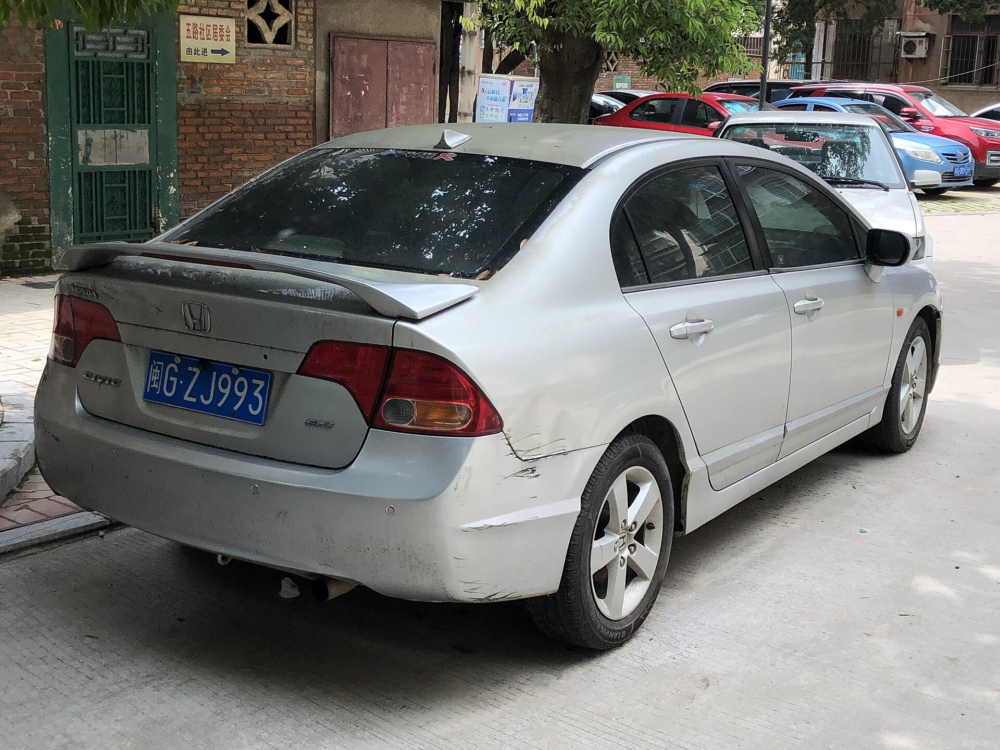
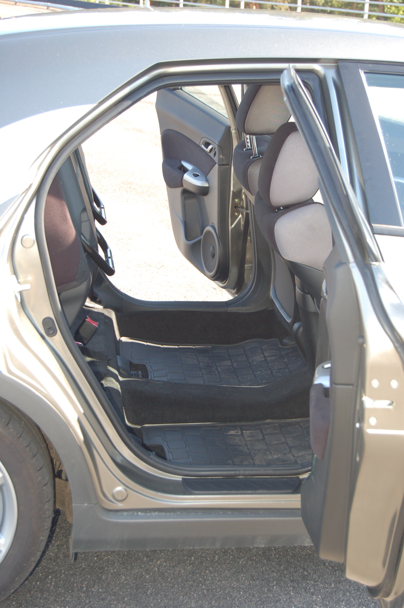
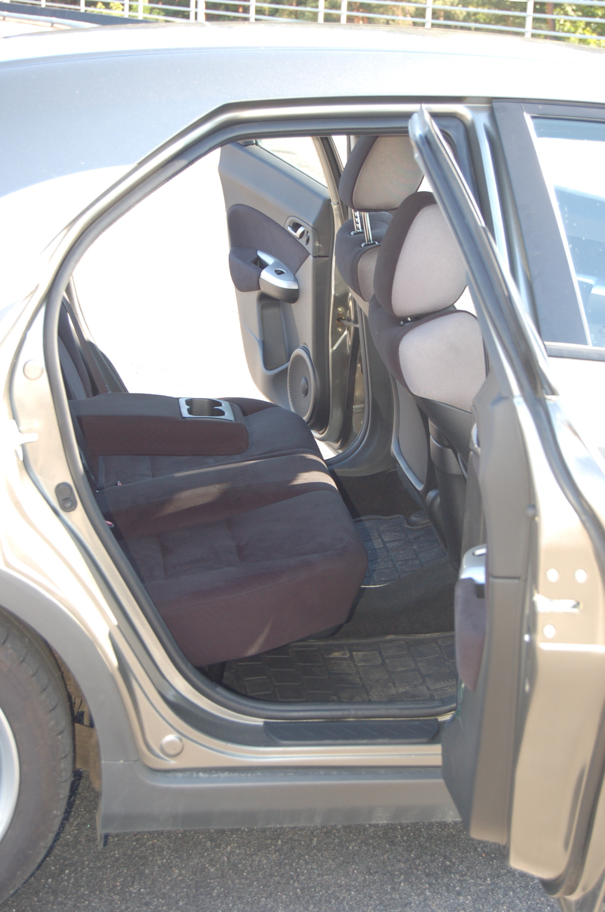
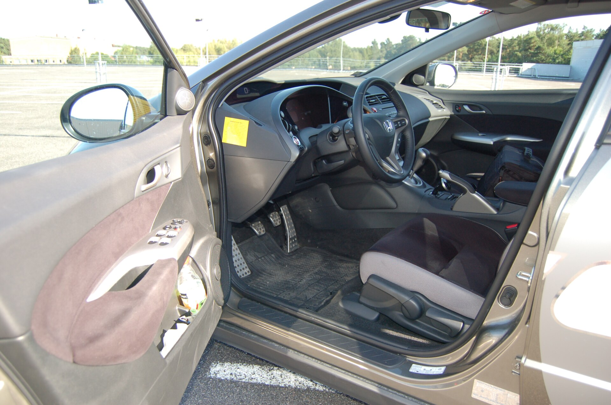

# Honda Civic 2025

*Compact car | 4-door sedan / 5-door hatchback | Eleventh generation (FE/FL, 2022-present, facelift 2025)*

**Price range (new, MSRP):** $24,250 - $33,000  
**Typical used:** $22,000 at 2-3 years, $17,500 at 5 years  
**Built in:** Japan (built in Indiana and Ontario for North America)

## Photos

### Exterior

### Interior

Photo sources and licenses: [`photo-credits.json`](photo-credits.json)

## Why a buyer picks this car

- Best chassis in the compact class - steering and body control feel a segment above the price
- Hybrid delivers 49 mpg and 232 lb-ft, quicker than the gas Civic and most rivals
- Excellent outward visibility from the low cowl and thin pillars - easy car to learn on
- Honda kept physical climate knobs and a volume knob; low driver distraction
- Hatchback body gives 54.9 cu ft of cargo with seats folded - small-SUV practicality
- Si and Type R give the dealership a real enthusiast halo and strong used demand
- Historically top-3 resale value in the compact segment

## Where it falls short

- Base LX is sparse: 7 in screen, wired CarPlay, no blind spot monitor
- 2.0L non-hybrid is merely adequate at highway merge speeds
- Road noise on coarse pavement is higher than a Corolla or Mazda3
- Type R availability is limited and often marked up

**Ideal buyer:** First-time buyer, student, commuter, or enthusiast who wants a compact that is fun to drive without giving up Honda running costs.

**Good fit for:** First car / student, Urban commuting and tight parking, Weekend canyon driving (Si/Type R), Rideshare on a budget, Downsizing from a larger sedan

## Powertrains

### 2.0L i-VTEC

| Field | Value |
|---|---|
| Engine | 2.0L naturally aspirated inline-4 |
| Displacement l | 2.0 |
| Hp | 150 |
| Torque lb ft | 133 |
| Transmission | CVT |
| Drivetrain | FWD |
| Fuel | Regular gasoline |
| Epa mpg | City: 32, Highway: 41, Combined: 36 |
| Zero to 60 s | 8.6 |

### 2.0L Hybrid (e:HEV)

| Field | Value |
|---|---|
| Engine | 2.0L Atkinson inline-4 + two-motor hybrid |
| Displacement l | 2.0 |
| Hp | 200 |
| Torque lb ft | 232 |
| Transmission | e-CVT (direct drive) |
| Drivetrain | FWD |
| Fuel | Regular gasoline / hybrid |
| Epa mpg | City: 50, Highway: 47, Combined: 49 |
| Zero to 60 s | 6.2 |

### 1.5L Turbo (Si)

| Field | Value |
|---|---|
| Engine | 1.5L turbocharged inline-4 |
| Displacement l | 1.5 |
| Hp | 200 |
| Torque lb ft | 192 |
| Transmission | 6-speed manual |
| Drivetrain | FWD |
| Fuel | Premium recommended |
| Epa mpg | City: 27, Highway: 37, Combined: 31 |
| Zero to 60 s | 6.6 |

### 2.0L Turbo (Type R)

| Field | Value |
|---|---|
| Engine | 2.0L turbocharged inline-4 K20C1 |
| Displacement l | 2.0 |
| Hp | 315 |
| Torque lb ft | 310 |
| Transmission | 6-speed manual with rev-match |
| Drivetrain | FWD with limited-slip differential |
| Fuel | Premium required |
| Epa mpg | City: 22, Highway: 28, Combined: 24 |
| Zero to 60 s | 5.0 |

## Dimensions

| Field | Value |
|---|---|
| Length in | 184.8 |
| Width in | 70.9 |
| Height in | 55.7 |
| Wheelbase in | 107.7 |
| Curb weight lb | 2935 |
| Ground clearance in | 5.6 |
| Seating | 5 |

## Capacity

| Field | Value |
|---|---|
| Cargo cu ft | 14.8 |
| Cargo hatchback cu ft | 24.5 |
| Max cargo hatchback cu ft | 54.9 |
| Towing lb | 0 |
| Fuel tank gal | 12.4 |
| Range mi combined | 600 |

## Safety

- **NHTSA overall:** 5
- **IIHS:** Top Safety Pick (2025)
- **Driver assistance:**
  - Collision Mitigation Braking
  - Adaptive Cruise Control with Low-Speed Follow
  - Road Departure Mitigation
  - Lane Keeping Assist
  - Traffic Jam Assist
  - Traffic Sign Recognition
  - Blind Spot Information (EX and up)

## Warranty

| Field | Value |
|---|---|
| Basic | 3 yr / 36,000 mi |
| Powertrain | 5 yr / 60,000 mi |
| Hybrid ev | 8 yr / 100,000 mi hybrid battery |
| Roadside | 3 yr / 36,000 mi |
| Maintenance | Not included - Maintenance Minder system |

## Technology and comfort

| Field | Value |
|---|---|
| Infotainment in | 7 |
| Infotainment optional in | 9 |
| Digital cluster in | 7 |
| Digital cluster optional in | 10.2 |
| Audio | 4- or 8-speaker standard; 12-speaker Bose on Sport Touring |
| Connectivity | Wireless Apple CarPlay (9 in unit), Wireless Android Auto, Google built-in (Sport Touring), HondaLink remote, Wireless charging |

**Notable features:**

- Honeycomb dash vent design
- Physical climate knobs retained
- Available moonroof
- Low beltline for class-leading visibility

## Trims

LX, Sport, Sport Hybrid, EX, Sport Touring Hybrid, Si, Type R

## Colors and materials

**Exterior:** Crystal Black Pearl, Platinum White Pearl, Meteorite Gray Metallic, Urban Gray Pearl, Rallye Red, Boost Blue Pearl, Championship White (Type R)

**Interior:** Fabric (LX/Sport), Leather-trimmed (Sport Touring), Suede-effect with red accents (Si/Type R)

## Ownership costs

| Field | Value |
|---|---|
| Service interval mi | 7500 |
| Typical insurance usd yr | 1850 |
| 5yr cost note | Low parts cost, huge independent-shop support. Si/Type R insurance runs meaningfully higher for drivers under 25. |
| Reliability note | The 2.0L NA engine and e:HEV hybrid both have strong records; the 1.5T needs oil-dilution-aware maintenance in very cold climates. |

## Cross-shopped against

Toyota Corolla, Mazda3, Hyundai Elantra, Volkswagen Jetta, Kia Forte

## Handling objections

**"It is too small for my family."**

> Sit in the back seat - 37.4 in of rear legroom is more than some midsize sedans from 10 years ago. And the hatchback swallows 54.9 cu ft, more than a compact SUV's usable space with a lower load floor.

**"CVTs fail early."**

> Honda's CVT has a 15-year track record in the Civic and a 5 yr / 60,000 mi powertrain warranty. The hybrid does not even use a conventional CVT - it is a direct-drive two-motor system with fewer wear parts.

**"The Corolla is cheaper."**

> On paper by a few hundred dollars. Drive them back to back - the Civic's chassis, rear seat room and hatch versatility are where that money went, and resale closes the gap.

**"I want a small SUV instead."**

> The HR-V is on this same platform, but it is slower, thirstier and costs more. If you do not need the ride height, the Civic hatch gives you the cargo without the penalty.

## Notes for the salesperson

- Put a hesitant buyer in the hatchback and load their stroller or golf clubs on the spot.
- For hybrid shoppers, frame it as performance first, economy second - 232 lb-ft sells itself.
- Point out the retained physical knobs to anyone who complains about touchscreen-only rivals.

## Sample payment

| Field | Value |
|---|---|
| Msrp usd | 26000 |
| Down usd | 2500 |
| Apr pct | 6.9 |
| Term months | 60 |
| Approx monthly usd | 464 |

*Illustrative only - not a quote.*

---

*Figures are approximate US-market values for demo purposes. Verify against the manufacturer window sticker before quoting a customer.*
