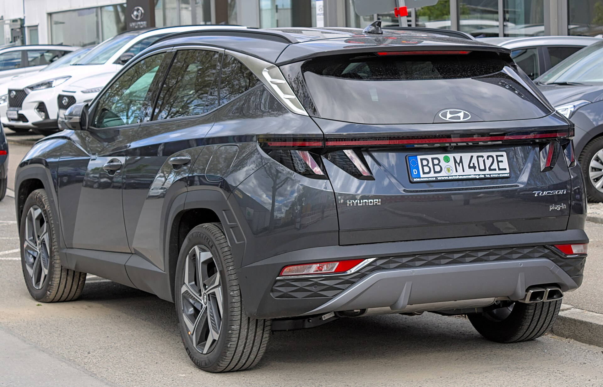
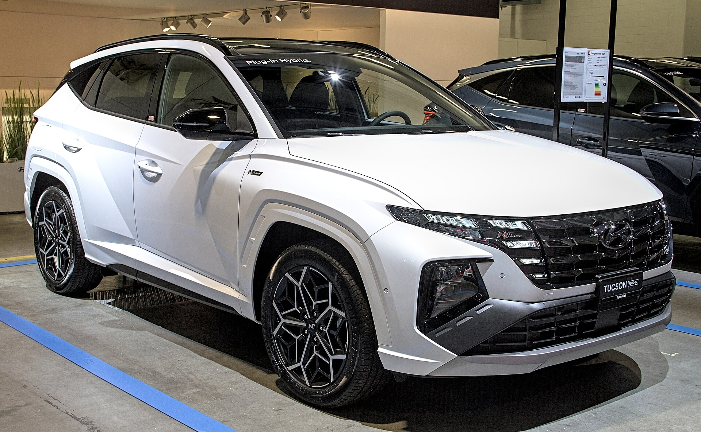
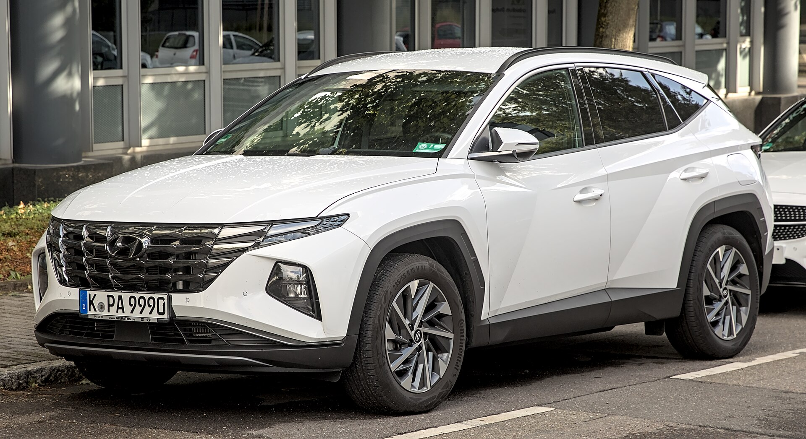
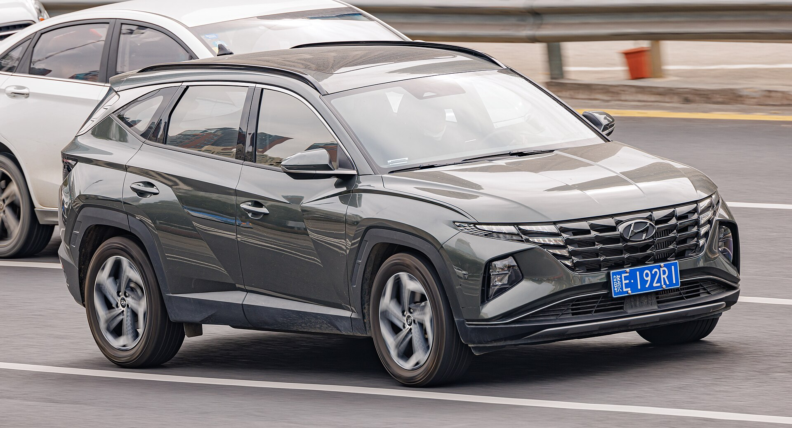
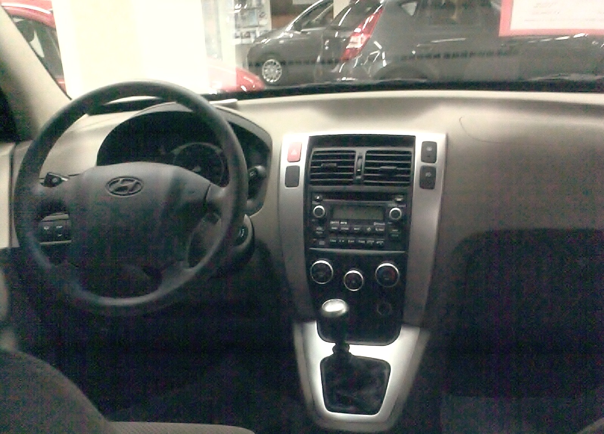
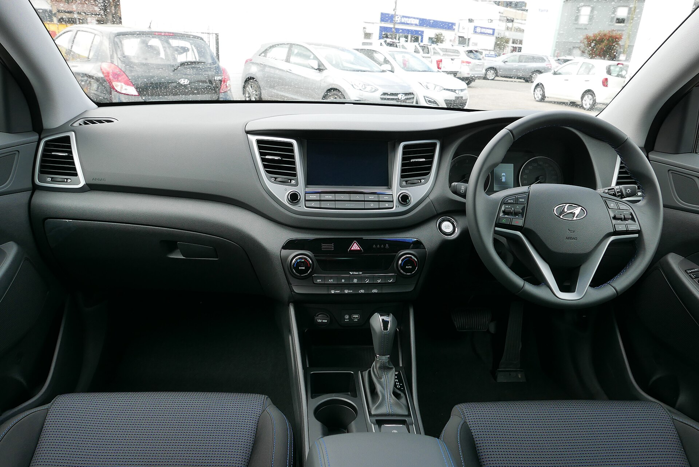
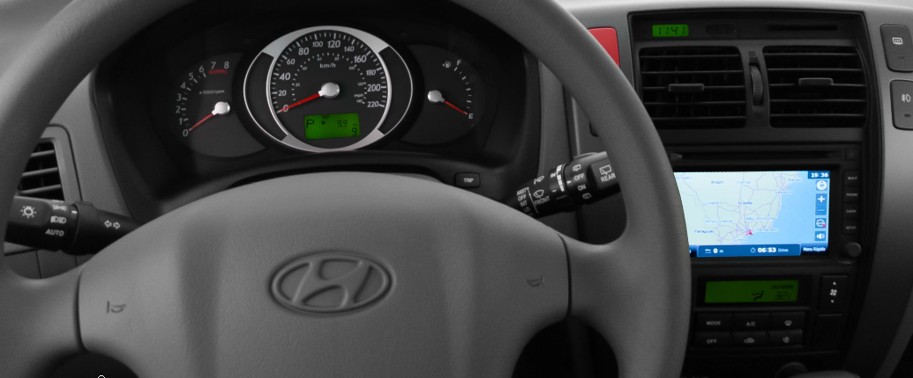

# Hyundai Tucson 2025

*Compact SUV | 5-door compact SUV | NX4 (fourth generation, 2022-present, refreshed 2025)*

**Price range (new, MSRP):** $28,500 - $45,000  
**Typical used:** $25,000 at 2-3 years, $18,500 at 5 years  
**Built in:** South Korea / United States (Montgomery, Alabama)

## Photos

### Exterior

### Interior

Photo sources and licenses: [`photo-credits.json`](photo-credits.json)

## Why a buyer picks this car

- 10 yr / 100,000 mi powertrain warranty is the longest in this catalog and removes most reliability anxiety
- 38.7 cu ft behind the rear seats - best cargo volume among compact SUVs here
- Hybrid returns 38 mpg combined with standard all-wheel drive, a combination rivals charge more for
- Plug-in hybrid gives 33 electric miles, enough to cover the average US commute without gasoline
- Dual 12.3 in curved displays and Bose audio at a price where rivals ship a 7 in screen
- Blind-Spot View Monitor projects a live camera feed into the cluster - the best implementation in the class
- 3 yr / 36,000 mi complimentary maintenance included

## Where it falls short

- 2.5L base engine is unremarkable: 8.8 s to 60 mph and coarse at high revs
- 2025 refresh moved some controls into the touchscreen; the earlier capacitive panel drew complaints
- Resale value trails Toyota and Honda despite the strong warranty
- 13.7 gal fuel tank limits gas-model highway range
- Hybrid and PHEV inventory is often constrained

**Ideal buyer:** Value-focused family that wants maximum equipment and warranty coverage per dollar and plans to keep the vehicle past 100,000 miles.

**Good fit for:** Family compact SUV, Commuting with PHEV electric range, First new-car buyer wanting long warranty, All-weather driving with standard AWD hybrid, Cargo-heavy lifestyle in a compact footprint

## Powertrains

### 2.5L Smartstream

| Field | Value |
|---|---|
| Engine | 2.5L naturally aspirated inline-4 |
| Displacement l | 2.5 |
| Hp | 187 |
| Torque lb ft | 178 |
| Transmission | 8-speed automatic |
| Drivetrain | FWD or HTRAC AWD |
| Fuel | Regular gasoline |
| Epa mpg | City: 25, Highway: 32, Combined: 28 |
| Zero to 60 s | 8.8 |

### 1.6L Turbo Hybrid

| Field | Value |
|---|---|
| Engine | 1.6L turbocharged inline-4 + 47.7 kW electric motor, 1.49 kWh battery |
| Displacement l | 1.6 |
| Hp | 231 |
| Torque lb ft | 271 |
| Transmission | 6-speed automatic |
| Drivetrain | HTRAC AWD standard |
| Fuel | Regular gasoline / hybrid |
| Epa mpg | City: 38, Highway: 38, Combined: 38 |
| Zero to 60 s | 7.5 |

### 1.6L Turbo Plug-in Hybrid

| Field | Value |
|---|---|
| Engine | 1.6L turbo inline-4 + 72 kW motor, 13.8 kWh battery |
| Displacement l | 1.6 |
| Hp | 268 |
| Torque lb ft | 258 |
| Transmission | 6-speed automatic |
| Drivetrain | HTRAC AWD standard |
| Fuel | Plug-in hybrid |
| Epa mpg | City: 35, Highway: 35, Combined: 35 |
| Epa mpge combined | 80 |
| Electric range mi | 33 |
| Zero to 60 s | 7.1 |

## Dimensions

| Field | Value |
|---|---|
| Length in | 182.3 |
| Width in | 73.4 |
| Height in | 65.6 |
| Wheelbase in | 108.5 |
| Curb weight lb | 3600 |
| Ground clearance in | 8.3 |
| Seating | 5 |

## Capacity

| Field | Value |
|---|---|
| Cargo cu ft | 38.7 |
| Max cargo cu ft | 74.5 |
| Towing lb | 2000 |
| Fuel tank gal | 13.7 |
| Range mi combined | 520 |

## Safety

- **NHTSA overall:** 5
- **IIHS:** Top Safety Pick (recent model years)
- **Driver assistance:**
  - Forward Collision-Avoidance Assist with pedestrian and cyclist detection
  - Blind-Spot Collision-Avoidance Assist
  - Lane Keeping and Lane Following Assist
  - Smart Cruise Control with Stop and Go
  - Safe Exit Warning
  - Rear Occupant Alert
  - Available Blind-Spot View Monitor camera in cluster
  - Available Remote Smart Parking Assist

## Warranty

| Field | Value |
|---|---|
| Basic | 5 yr / 60,000 mi |
| Powertrain | 10 yr / 100,000 mi |
| Hybrid ev | 10 yr / 100,000 mi hybrid battery |
| Roadside | 5 yr / unlimited mi |
| Maintenance | 3 yr / 36,000 mi complimentary maintenance |

## Technology and comfort

| Field | Value |
|---|---|
| Infotainment in | 12.3 |
| Digital cluster in | 12.3 |
| Audio | Available 8-speaker Bose premium |
| Connectivity | Dual 12.3 in curved display, Wireless Apple CarPlay and Android Auto, Bluelink+ remote services at no subscription cost, Digital Key 2 phone-as-key, Over-the-air updates |

**Notable features:**

- Blind-Spot View Monitor shows a camera feed in the gauge cluster when you signal
- Remote Smart Parking Assist parks the car from outside
- Available ventilated front seats and heated rear seats
- Hands-free power liftgate
- Available panoramic sunroof
- Parametric jewel grille with hidden daytime running lights

## Trims

SE, SEL, XRT, N Line, Limited, Hybrid Blue, Hybrid SEL Convenience, Hybrid Limited, Plug-in Hybrid SEL, Plug-in Hybrid Limited

## Colors and materials

**Exterior:** Shimmering Silver, Hampton Gray, Amazon Gray, Serenity White Pearl, Titan Gray, Ultimate Red, Cyber Gray

**Interior:** Cloth (SE/SEL), H-Tex synthetic leather, Leather (Limited)

## Ownership costs

| Field | Value |
|---|---|
| Service interval mi | 7500 |
| Typical insurance usd yr | 1750 |
| 5yr cost note | Complimentary maintenance for 3 years plus a 10-year powertrain warranty makes the early ownership window very predictable. |
| Reliability note | The 10-year powertrain warranty applies to the original owner - confirm that when discussing used units. Earlier Theta engine issues do not apply to the current Smartstream family. |

## Cross-shopped against

Toyota RAV4, Honda CR-V, Mazda CX-5, Kia Sportage, Nissan Rogue, Ford Escape

## Handling objections

**"Hyundai resale is not as strong as Toyota."**

> True, and that is exactly why the value is here. You are buying a better-equipped vehicle for less money up front with a warranty twice as long. If you keep cars 8-10 years, resale barely matters; if you trade every three, I would tell you to look at the RAV4.

**"Hyundai engines had problems."**

> That was the Theta II generation, and it was handled through a recall and extended warranty. The current Smartstream engines are a different family, and the 10 yr / 100,000 mi powertrain warranty is Hyundai putting money behind that.

**"The touchscreen controls everything now."**

> The 2025 refresh actually brought back physical climate controls that the 2022-2024 capacitive panel had removed. Sit in it and try adjusting the temperature without looking - that was the specific fix.

**"I want a plug-in but cannot charge at work."**

> You do not need to. 33 electric miles covers the average round-trip commute overnight on a regular 120V outlet, and when the battery is empty it is still a 35 mpg hybrid. There is no scenario where you are stranded.

## Notes for the salesperson

- Lead with the warranty math - 10 yr / 100,000 mi neutralizes most brand objections in one sentence.
- Demonstrate Blind-Spot View Monitor on the test drive by signaling; it converts safety-focused shoppers instantly.
- For hybrid shoppers, note AWD is standard on the hybrid, unlike several competitors.

## Sample payment

| Field | Value |
|---|---|
| Msrp usd | 34000 |
| Down usd | 3000 |
| Apr pct | 6.9 |
| Term months | 60 |
| Approx monthly usd | 612 |

*Illustrative only - not a quote.*

---

*Figures are approximate US-market values for demo purposes. Verify against the manufacturer window sticker before quoting a customer.*
