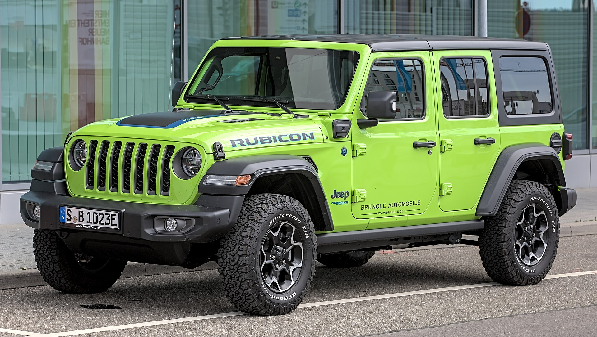
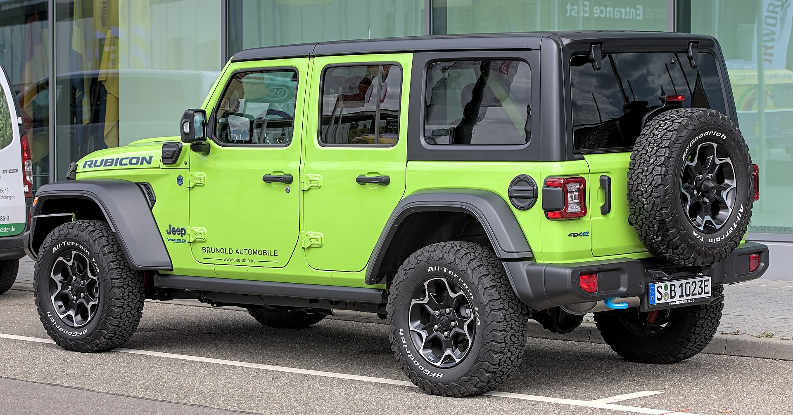
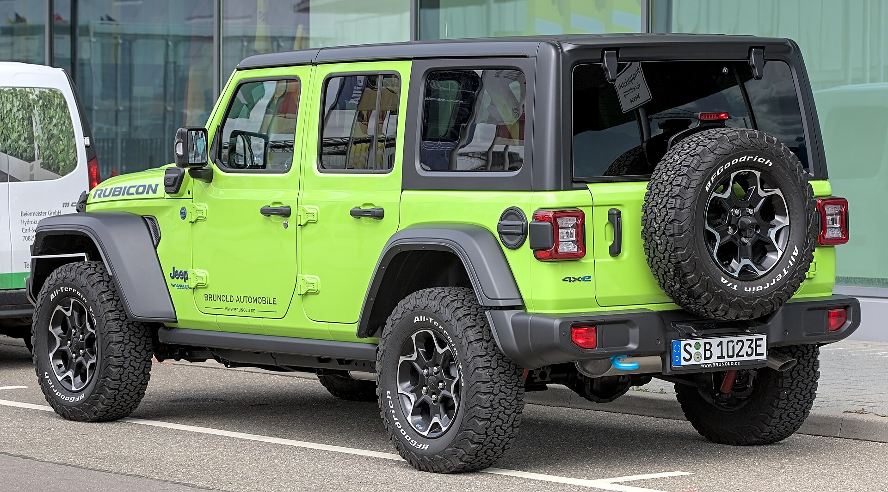
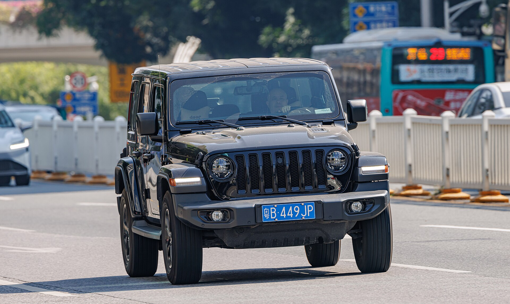
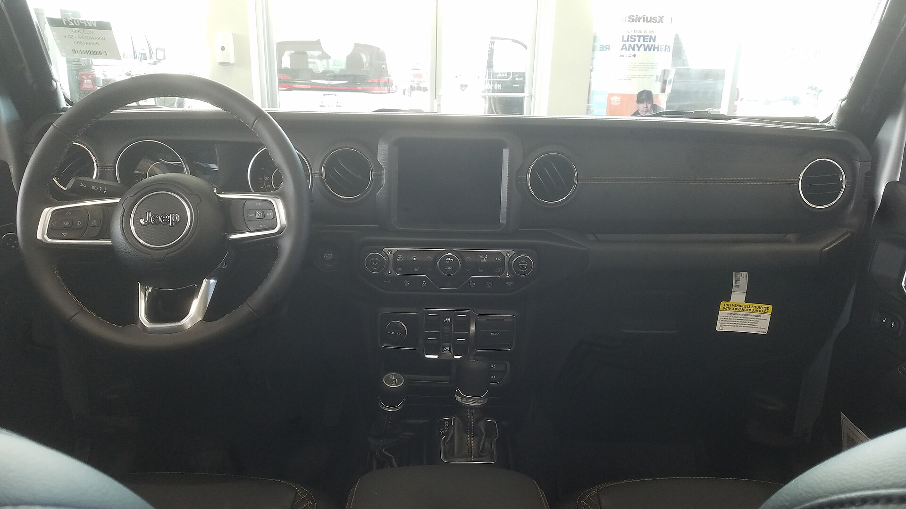
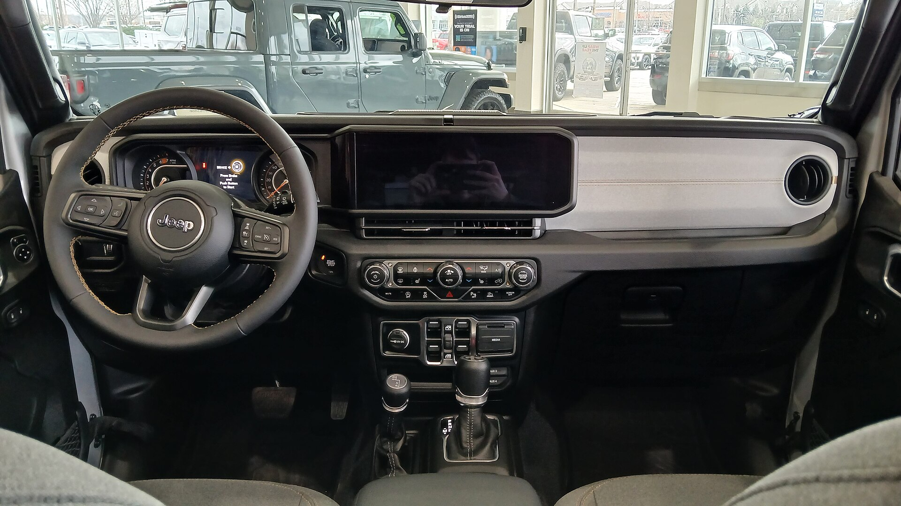
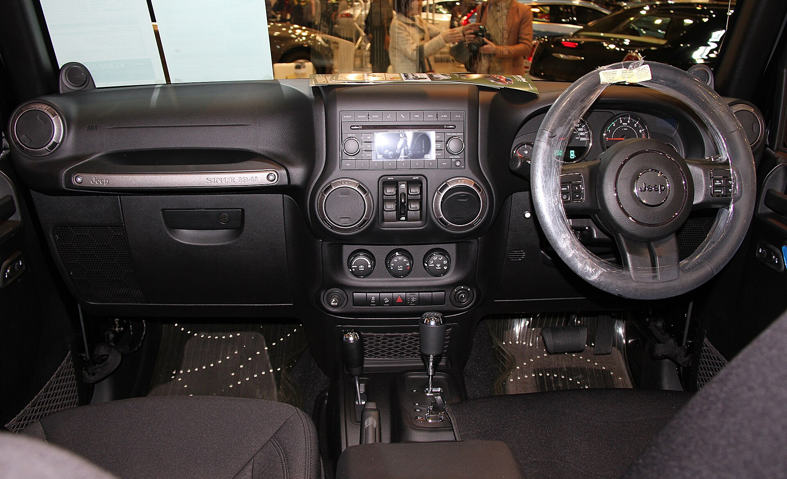

# Jeep Wrangler 2025

*Compact off-road SUV | 2-door or 4-door off-road SUV with removable doors, roof and folding windshield | JL (2018-present, refreshed 2024)*

**Price range (new, MSRP):** $33,990 - $92,000  
**Typical used:** $36,000 at 2-3 years, $29,000 at 5 years  
**Built in:** United States (Toledo, Ohio)

## Photos

### Exterior

### Interior

Photo sources and licenses: [`photo-credits.json`](photo-credits.json)

## Why a buyer picks this car

- Only mainstream SUV with removable doors, roof and a folding windshield - the open-air experience has no direct rival
- Rubicon's sway bar disconnect, 4:1 transfer case and dual lockers make it trail-capable out of the box, no aftermarket needed
- Best-in-class resale value: Wranglers routinely retain 60%+ after 3 years
- Enormous aftermarket - customers can personalize forever, which drives accessory and service revenue
- 4xe gives 21 miles of silent electric trail range and qualifies for some incentives
- Washout interior with floor drain plugs - genuinely hose-out capable
- Body-on-frame with solid axles: damaged parts are cheap and easy to replace

## Where it falls short

- Highway manners: wind noise, steering wander and a firm ride are inherent to the design
- NHTSA 3-star overall and weak IIHS small-overlap results - the worst safety scores in this catalog
- Fuel economy is poor across the range; the 392 returns 14 mpg combined
- Removing and storing doors and roof panels takes two people and garage space
- Death wobble complaints on solid-axle vehicles require proper steering-damper maintenance

**Ideal buyer:** Lifestyle buyer who wants open-air driving and real trail capability, and accepts on-road compromises to get it.

**Good fit for:** Rock crawling and overlanding, Beach and dune driving, Open-air weekend cruising, Deep-snow rural access, Customization platform

## Powertrains

### 2.0L Turbo

| Field | Value |
|---|---|
| Engine | 2.0L turbocharged inline-4 with eTorque |
| Displacement l | 2.0 |
| Hp | 270 |
| Torque lb ft | 295 |
| Transmission | 8-speed automatic |
| Drivetrain | 4WD |
| Fuel | Premium recommended |
| Epa mpg | City: 21, Highway: 24, Combined: 22 |
| Zero to 60 s | 6.8 |

### 3.6L Pentastar V6

| Field | Value |
|---|---|
| Engine | 3.6L naturally aspirated V6 |
| Displacement l | 3.6 |
| Hp | 285 |
| Torque lb ft | 260 |
| Transmission | 6-speed manual or 8-speed automatic |
| Drivetrain | 4WD |
| Fuel | Regular gasoline |
| Epa mpg | City: 17, Highway: 25, Combined: 20 |
| Zero to 60 s | 7.5 |

### 4xe Plug-in Hybrid

| Field | Value |
|---|---|
| Engine | 2.0L turbo + two electric motors, 17.3 kWh battery |
| Displacement l | 2.0 |
| Hp | 375 |
| Torque lb ft | 470 |
| Transmission | 8-speed automatic |
| Drivetrain | 4WD |
| Fuel | Plug-in hybrid |
| Epa mpg | City: 20, Highway: 20, Combined: 20 |
| Epa mpge combined | 49 |
| Electric range mi | 21 |
| Zero to 60 s | 6.0 |

### 6.4L HEMI V8 (Rubicon 392)

| Field | Value |
|---|---|
| Engine | 6.4L naturally aspirated V8 |
| Displacement l | 6.4 |
| Hp | 470 |
| Torque lb ft | 470 |
| Transmission | 8-speed automatic |
| Drivetrain | 4WD |
| Fuel | Premium required |
| Epa mpg | City: 13, Highway: 17, Combined: 14 |
| Zero to 60 s | 4.5 |

## Dimensions

| Field | Value |
|---|---|
| Length in | 188.4 |
| Width in | 73.8 |
| Height in | 73.6 |
| Wheelbase in | 118.4 |
| Curb weight lb | 4450 |
| Ground clearance in | 10.8 |
| Seating | 5 |

## Capacity

| Field | Value |
|---|---|
| Cargo cu ft | 31.7 |
| Max cargo cu ft | 72.4 |
| Towing lb | 3500 |
| Fuel tank gal | 21.5 |
| Approach angle deg | 44.0 |
| Breakover angle deg | 27.8 |
| Departure angle deg | 37.0 |
| Water fording in | 33.6 |

## Safety

- **NHTSA overall:** 3
- **IIHS:** Marginal to Acceptable in small overlap; rollover rating is low by design
- **Driver assistance:**
  - Advanced multistage front airbags
  - Available Blind Spot Monitoring
  - Available Adaptive Cruise Control
  - Available Forward Collision Warning
  - Standard front airbags for first row and curtain airbags (2024+)
  - TrailCam forward-facing off-road camera

## Warranty

| Field | Value |
|---|---|
| Basic | 3 yr / 36,000 mi |
| Powertrain | 5 yr / 60,000 mi |
| Hybrid ev | 8 yr / 100,000 mi 4xe battery |
| Roadside | 5 yr / 60,000 mi |
| Maintenance | Not included |

## Technology and comfort

| Field | Value |
|---|---|
| Infotainment in | 12.3 |
| Digital cluster in | 7 |
| Audio | Available 9-speaker Alpine; available removable Bluetooth speaker |
| Connectivity | Uconnect 5 with wireless CarPlay and Android Auto, Off-road Pages with pitch, roll and drivetrain data, TrailCam with washer, Wi-Fi hotspot |

**Notable features:**

- Removable doors, roof panels and fold-down windshield
- Sky One-Touch power top
- Electronic front sway bar disconnect (Rubicon)
- Front and rear Tru-Lok locking differentials (Rubicon)
- Rock-Trac 4:1 transfer case
- Washout interior with drain plugs

## Trims

Sport, Sport S, Willys, Sahara, Rubicon, Rubicon 392, 4xe plug-in hybrid

## Colors and materials

**Exterior:** Bright White, Black, Firecracker Red, Hydro Blue, Sarge Green, Anvil, High Velocity, Punk'n

**Interior:** Cloth with washout vinyl floor, Leather-trimmed (Sahara/Rubicon), Waterproof seat fabric option

## Ownership costs

| Field | Value |
|---|---|
| Service interval mi | 8000 |
| Typical insurance usd yr | 1950 |
| 5yr cost note | Fuel is high but depreciation is the lowest in the catalog, which usually nets out favorably for buyers who sell at 3-5 years. |
| Reliability note | Check for leaks around the freedom panels and windshield, and for steering damper wear. The 2.0L turbo needs premium fuel for rated output. |

## Cross-shopped against

Ford Bronco, Toyota 4Runner, Land Rover Defender, Toyota Land Cruiser, Chevrolet Colorado ZR2 (cross-shop)

## Handling objections

**"The safety ratings are bad."**

> I am not going to spin that - the small-overlap and rollover numbers are the weakest in its class, and that is the trade for a removable roof and a body-on-frame design. If safety scores are your top priority, the Bronco and the 4Runner test better and I will show you both.

**"It is loud and rides rough on the highway."**

> It does, and you should take a highway loop on the test drive, not just surface streets. The Sahara with the 2.0L and the hard top is meaningfully quieter than a soft-top Sport - that is the version to try.

**"Terrible gas mileage."**

> The 2.0L turbo does 22 mpg combined, and the 4xe runs your 20-mile commute on electricity alone. That said, if fuel economy is your first filter, the Wrangler is the wrong product and we should be looking at a Grand Cherokee.

**"It is expensive for what it is."**

> Look at the back end: three-year-old Wranglers sell for about 60% of sticker. Your effective cost over three years is usually lower than a crossover that lost 45% of its value.

## Notes for the salesperson

- Sell the experience, not the spec sheet - take the doors and roof panels off before the test drive.
- Lead with resale value to counter every price and fuel objection.
- For Rubicon shoppers, demonstrate the sway bar disconnect button; it is the single best hardware story in the lineup.

## Sample payment

| Field | Value |
|---|---|
| Msrp usd | 48000 |
| Down usd | 5000 |
| Apr pct | 7.4 |
| Term months | 72 |
| Approx monthly usd | 740 |

*Illustrative only - not a quote.*

---

*Figures are approximate US-market values for demo purposes. Verify against the manufacturer window sticker before quoting a customer.*
