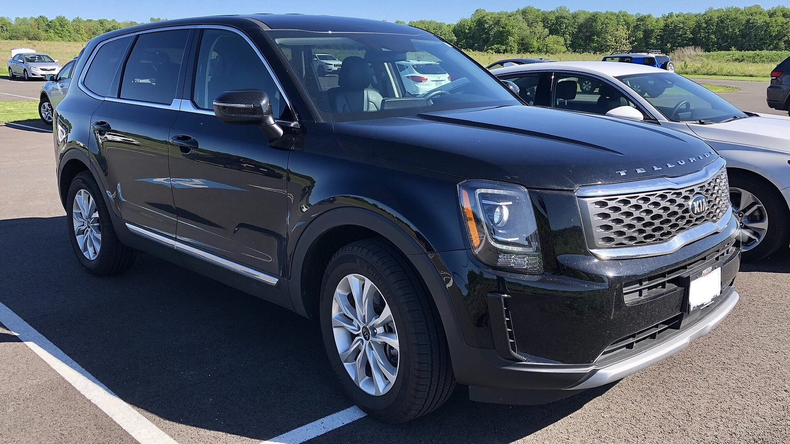
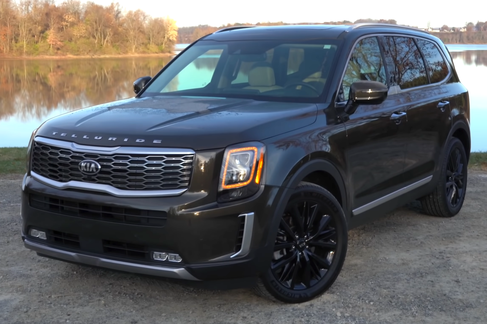
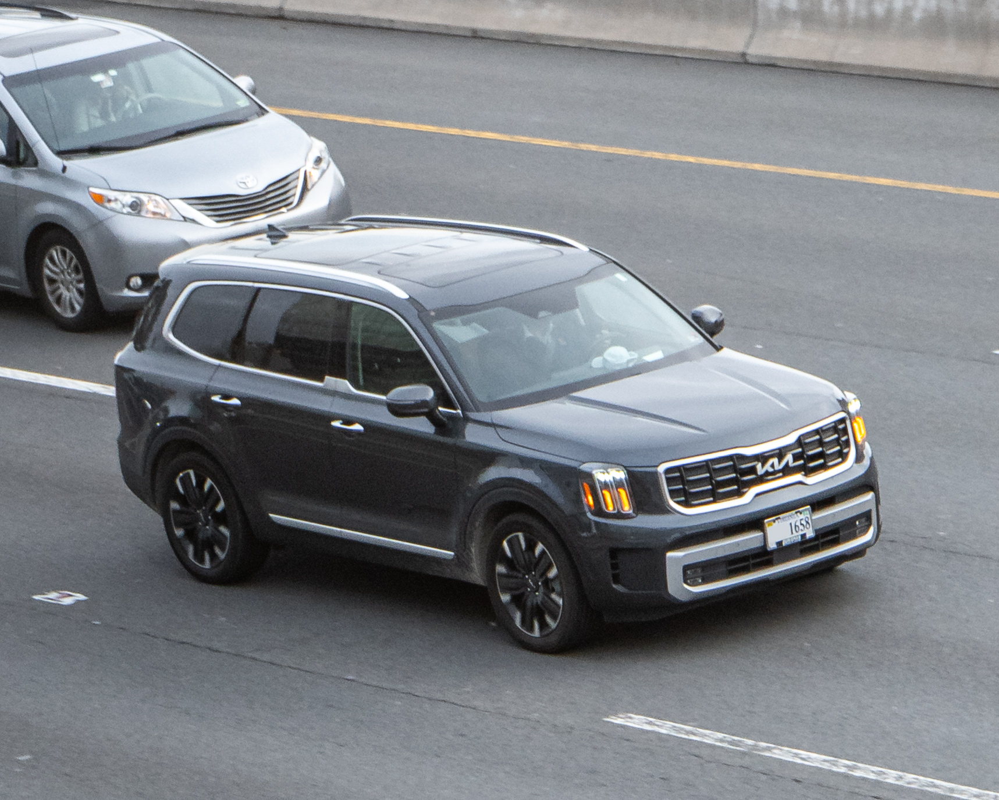
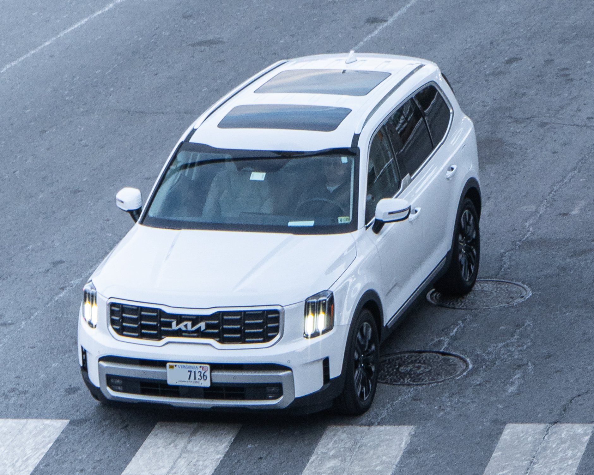
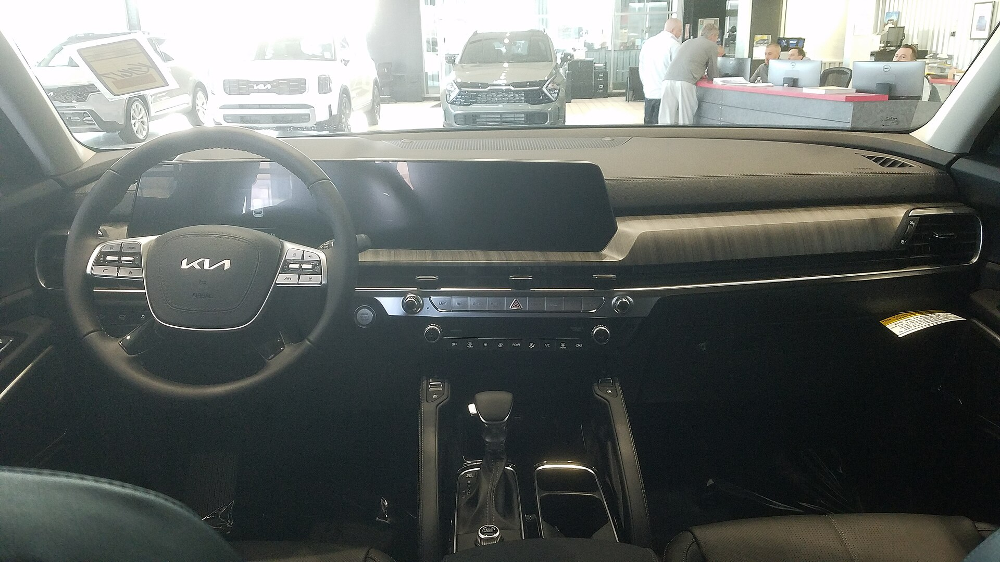

# Kia Telluride 2025

*Midsize 3-row SUV | 5-door 3-row midsize SUV | First generation (2020-present, refreshed 2023)*

**Price range (new, MSRP):** $37,000 - $54,000  
**Typical used:** $36,000 at 2-3 years, $28,000 at 5 years  
**Built in:** United States (West Point, Georgia)

## Photos

### Exterior

### Interior

Photo sources and licenses: [`photo-credits.json`](photo-credits.json)

## Why a buyer picks this car

- Genuinely usable third row - adults fit, which is not true of most midsize three-row rivals
- 87 cu ft of maximum cargo with a flat load floor and a deep well behind the third row
- Driver Talk intercom and Quiet Mode are parent-focused features nobody else offers at this price
- 10 yr / 100,000 mi powertrain warranty on a family vehicle people intend to keep
- Naturally aspirated V6 on regular fuel: simple, proven, and 5,500 lb of towing
- SX Prestige interior with Nappa leather reads as a $65,000 vehicle for around $52,000
- IIHS Top Safety Pick+ with Safe Exit Assist that keeps kids from opening doors into traffic

## Where it falls short

- 23 mpg combined and no hybrid option - the weakest fuel economy story in its class
- High demand means limited discounting and occasional market adjustments
- Ride is comfort-tuned; it does not drive as tightly as a Mazda CX-90
- Second-row captain's chairs drop seating from 8 to 7
- Infotainment lacks a physical tuning knob on some trims

**Ideal buyer:** Family with three or more kids, or anyone who regularly carries 6-8 people and wants minivan space without a minivan.

**Good fit for:** Family of 5-8, Carpool and school runs, Road trips with luggage for six, Towing a small camper or boat up to 5,500 lb, Light trail and snow use (X-Pro)

## Powertrains

### 3.8L Lambda V6

| Field | Value |
|---|---|
| Engine | 3.8L naturally aspirated V6 |
| Displacement l | 3.8 |
| Hp | 291 |
| Torque lb ft | 262 |
| Transmission | 8-speed automatic |
| Drivetrain | FWD or AWD with locking center differential |
| Fuel | Regular gasoline |
| Epa mpg | City: 20, Highway: 26, Combined: 23 |
| Zero to 60 s | 7.1 |

## Dimensions

| Field | Value |
|---|---|
| Length in | 196.9 |
| Width in | 78.3 |
| Height in | 69.3 |
| Wheelbase in | 114.2 |
| Curb weight lb | 4255 |
| Ground clearance in | 8.0 |
| Seating | 8 |

## Capacity

| Field | Value |
|---|---|
| Cargo behind 3rd row cu ft | 21.0 |
| Cargo behind 2nd row cu ft | 46.0 |
| Max cargo cu ft | 87.0 |
| Towing lb | 5500 |
| Fuel tank gal | 18.8 |
| Range mi combined | 430 |

## Safety

- **NHTSA overall:** 5
- **IIHS:** Top Safety Pick+ (multiple years)
- **Driver assistance:**
  - Forward Collision-Avoidance Assist with junction turning
  - Blind-Spot Collision-Avoidance Assist
  - Lane Following Assist
  - Smart Cruise Control with Stop and Go
  - Safe Exit Assist that locks rear doors against passing traffic
  - Rear Occupant Alert with ultrasonic detection
  - Highway Driving Assist 2
  - Available Blind-Spot View Monitor

## Warranty

| Field | Value |
|---|---|
| Basic | 5 yr / 60,000 mi |
| Powertrain | 10 yr / 100,000 mi |
| Roadside | 5 yr / 60,000 mi |
| Maintenance | Not included |

## Technology and comfort

| Field | Value |
|---|---|
| Infotainment in | 12.3 |
| Digital cluster in | 12.3 |
| Audio | Available 12-speaker Harman Kardon |
| Connectivity | Dual 12.3 in panoramic curved display, Wireless Apple CarPlay and Android Auto, Kia Connect remote start and vehicle finder, Digital Key, Over-the-air updates |

**Notable features:**

- Driver Talk cabin intercom to third row
- Driver Sound Mirror to hear rear passengers
- Quiet Mode mutes rear speakers for sleeping kids
- Dual sunroof
- Available captain's chairs with one-touch third-row access
- Available heated and ventilated second row
- X-Pro trim adds 2,500 lb roof rack capacity and all-terrain tires

## Trims

LX, S, EX, EX X-Line, SX, SX X-Line, SX Prestige, SX Prestige X-Pro

## Colors and materials

**Exterior:** Snow White Pearl, Ebony Black, Gravity Gray, Wolf Gray, Dark Moss, Midnight Lake Blue, Sangria

**Interior:** Cloth (LX/S), SynTex synthetic leather (EX), Nappa leather (SX Prestige), Available two-tone Terracotta or Dune

## Ownership costs

| Field | Value |
|---|---|
| Service interval mi | 7500 |
| Typical insurance usd yr | 1900 |
| 5yr cost note | Fuel is the main cost line at 23 mpg. Strong resale offsets it; Tellurides have historically traded near or above book. |
| Reliability note | The 3.8L Lambda V6 is a long-running, well-understood engine. No turbo, no CVT, no hybrid system - fewer failure modes than most rivals. |

## Cross-shopped against

Hyundai Palisade, Toyota Grand Highlander, Honda Pilot, Mazda CX-90, Chevrolet Traverse, Subaru Ascent

## Handling objections

**"23 mpg is not great."**

> It is the honest trade for a V6 that tows 5,500 lb and never needs premium fuel. At 12,000 miles a year the difference against a 28-mpg rival is about $450 annually - roughly one payment. Decide whether the third-row space is worth that.

**"There is no hybrid."**

> Correct. If maximum mpg is the priority, the Grand Highlander Hybrid is the right vehicle and I will say so. What the Telluride gives back is a simpler powertrain, a roomier third row and a 10-year warranty.

**"It is basically a Palisade."**

> Shared bones, different execution. The Telluride is boxier with a more upright third row and more headroom back there; the Palisade is the plusher, more formal one. Sit in the third row of each - that is where the decision gets made.

**"Kia is not a premium brand."**

> Sit in an SX Prestige with Nappa leather and the dual 12.3 in displays, then price the equivalent Acura or Volvo. You are looking at a $12,000-$15,000 difference for the same content and a longer warranty.

## Notes for the salesperson

- Put the customer in the third row during the walkaround - it is the single most persuasive moment.
- Demonstrate Driver Talk and Quiet Mode with kids present; parents close on those features.
- Frame the 10-year powertrain warranty against the fact that families keep three-row SUVs longer than any other body style.

## Sample payment

| Field | Value |
|---|---|
| Msrp usd | 45000 |
| Down usd | 4500 |
| Apr pct | 7.0 |
| Term months | 72 |
| Approx monthly usd | 690 |

*Illustrative only - not a quote.*

---

*Figures are approximate US-market values for demo purposes. Verify against the manufacturer window sticker before quoting a customer.*
