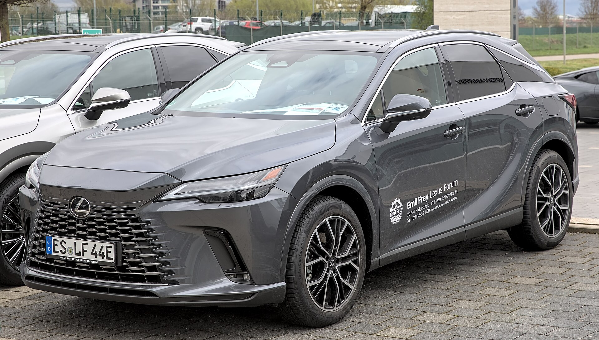
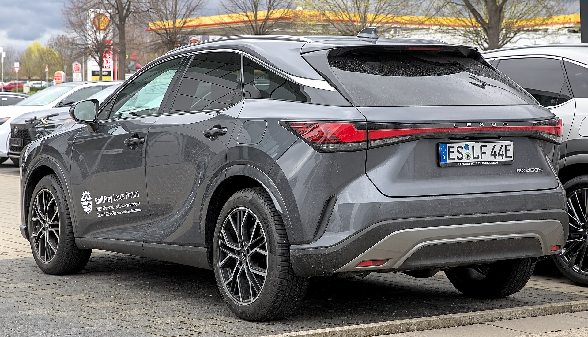
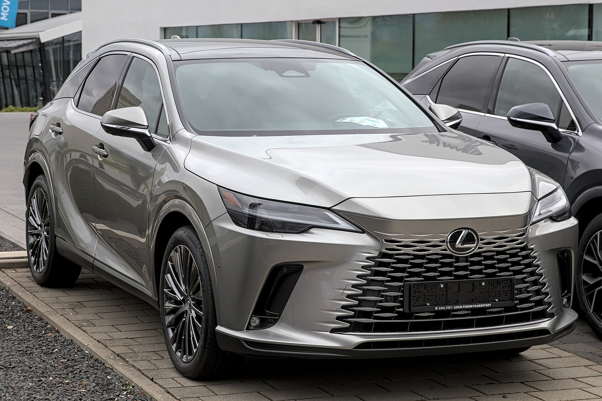
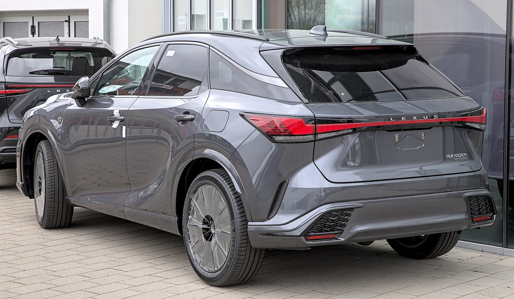
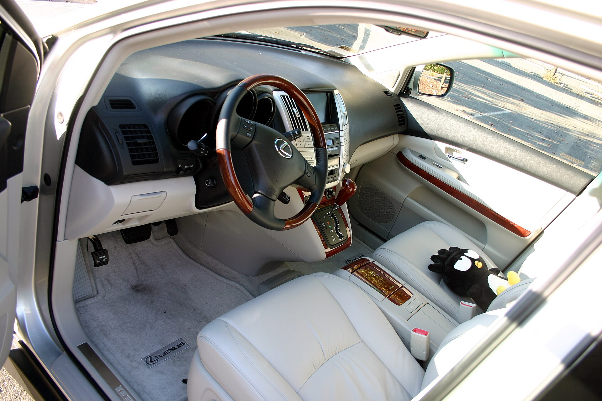
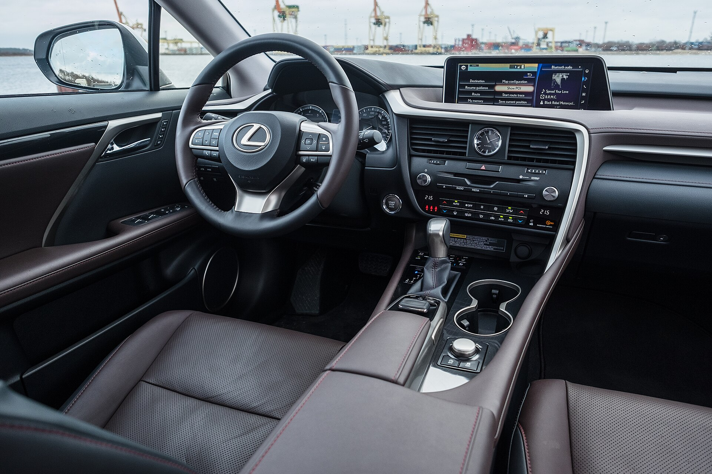
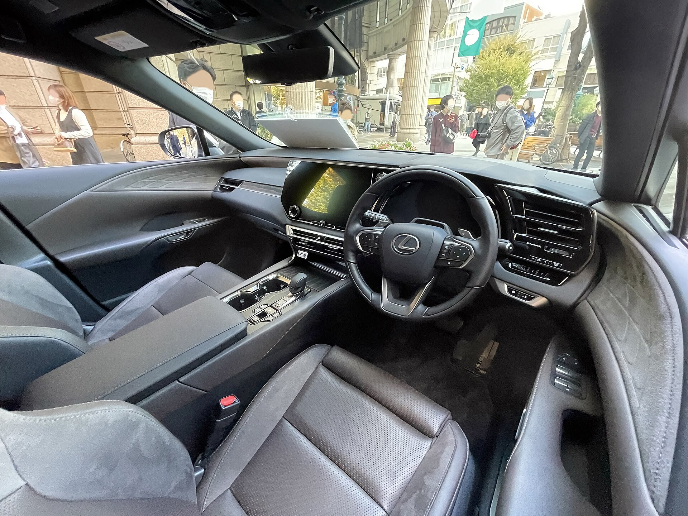

# Lexus RX 2025

*Midsize luxury SUV | 5-door midsize luxury SUV | AL30 (fifth generation, 2023-present)*

**Price range (new, MSRP):** $50,000 - $68,000  
**Typical used:** $44,000 at 2-3 years, $34,000 at 5 years  
**Built in:** Japan (Kyushu) / Canada (Cambridge, Ontario)

## Photos

### Exterior

### Interior

Photo sources and licenses: [`photo-credits.json`](photo-credits.json)

## Why a buyer picks this car

- The quietest, smoothest-riding vehicle in this catalog - Lexus insulation and suspension tuning remain the benchmark
- RX 350h delivers 36 mpg combined with standard AWD, extraordinary for a 4,400 lb luxury SUV
- Consistently at the top of dependability studies - luxury ownership without luxury repair anxiety
- 10 yr / 150,000 mi hybrid battery warranty and 6 yr / 70,000 mi powertrain coverage, longer than the German rivals
- 21-speaker Mark Levinson audio is genuinely among the best factory systems available
- RX 450h+ plug-in does 37 electric miles, covering most commutes with zero fuel use
- Lexus dealership service experience - loaners, pickup and delivery - is a repeat-purchase driver

## Where it falls short

- Two rows only; buyers needing a third row must step to the TX or GX
- 29.6 cu ft cargo trails the BMW X5 and Audi Q7
- RX 350 turbo four sounds coarse under hard acceleration compared with the V6 it replaced
- F SPORT Performance is quick but still not as engaging as a German rival on a back road
- E-Latch electronic door handles have a learning curve for passengers

**Ideal buyer:** Comfort-first luxury buyer who wants a quiet, dependable SUV and values dealership experience over driving dynamics.

**Good fit for:** Luxury daily commuting, Long highway touring, Empty-nester primary vehicle, Hybrid luxury with low running costs, PHEV commuting with 37 electric miles

## Powertrains

### RX 350

| Field | Value |
|---|---|
| Engine | 2.4L turbocharged inline-4 |
| Displacement l | 2.4 |
| Hp | 275 |
| Torque lb ft | 317 |
| Transmission | 8-speed automatic |
| Drivetrain | FWD or AWD |
| Fuel | Regular gasoline |
| Epa mpg | City: 22, Highway: 29, Combined: 25 |
| Zero to 60 s | 7.2 |

### RX 350h Hybrid

| Field | Value |
|---|---|
| Engine | 2.5L inline-4 + front and rear electric motors |
| Displacement l | 2.5 |
| Hp | 246 |
| Torque lb ft | 233 |
| Transmission | eCVT |
| Drivetrain | Electronic on-demand AWD |
| Fuel | Regular gasoline / hybrid |
| Epa mpg | City: 37, Highway: 34, Combined: 36 |
| Zero to 60 s | 7.4 |

### RX 450h+ Plug-in Hybrid

| Field | Value |
|---|---|
| Engine | 2.5L inline-4 + dual motors, 18.1 kWh battery |
| Displacement l | 2.5 |
| Hp | 304 |
| Torque lb ft | 199 |
| Transmission | eCVT |
| Drivetrain | Electronic on-demand AWD |
| Fuel | Plug-in hybrid |
| Epa mpg | City: 36, Highway: 33, Combined: 35 |
| Epa mpge combined | 83 |
| Electric range mi | 37 |
| Zero to 60 s | 6.2 |

### RX 500h F SPORT Performance

| Field | Value |
|---|---|
| Engine | 2.4L turbo inline-4 + two electric motors with DIRECT4 AWD |
| Displacement l | 2.4 |
| Hp | 366 |
| Torque lb ft | 406 |
| Transmission | 6-speed automatic with motor assist |
| Drivetrain | DIRECT4 AWD |
| Fuel | Premium recommended |
| Epa mpg | City: 27, Highway: 28, Combined: 27 |
| Zero to 60 s | 5.9 |

## Dimensions

| Field | Value |
|---|---|
| Length in | 192.5 |
| Width in | 75.6 |
| Height in | 67.3 |
| Wheelbase in | 112.2 |
| Curb weight lb | 4400 |
| Ground clearance in | 8.2 |
| Seating | 5 |

## Capacity

| Field | Value |
|---|---|
| Cargo cu ft | 29.6 |
| Max cargo cu ft | 46.2 |
| Towing lb | 3500 |
| Fuel tank gal | 17.2 |
| Range mi combined | 600 |

## Safety

- **NHTSA overall:** 5
- **IIHS:** Top Safety Pick+ (2023-2025)
- **Driver assistance:**
  - Lexus Safety System+ 3.0
  - Pre-Collision with motorcyclist and intersection support
  - Dynamic Radar Cruise Control
  - Lane Tracing and Lane Departure Alert
  - Proactive Driving Assist
  - Safe Exit Assist
  - Available Advanced Park with remote
  - Available Traffic Jam Assist hands-free to 25 mph

## Warranty

| Field | Value |
|---|---|
| Basic | 4 yr / 50,000 mi |
| Powertrain | 6 yr / 70,000 mi |
| Hybrid ev | 8 yr / 100,000 mi hybrid components, 10 yr / 150,000 mi hybrid battery |
| Roadside | 4 yr / unlimited mi |
| Maintenance | 1 yr / 10,000 mi complimentary |

## Technology and comfort

| Field | Value |
|---|---|
| Infotainment in | 14 |
| Digital cluster in | 12.3 |
| Audio | Available 21-speaker Mark Levinson Surround |
| Connectivity | Lexus Interface with cloud navigation, Wireless Apple CarPlay and Android Auto, 'Hey Lexus' voice assistant, Lexus App remote, Over-the-air updates, Digital Key |

**Notable features:**

- E-Latch electronic door handles with Safe Exit Assist
- Available panoramic roof
- Available 10 in head-up display
- Available digital rearview mirror
- Heated and ventilated front and outboard rear seats
- F SPORT Performance adds DIRECT4 torque vectoring and adaptive variable suspension

## Trims

RX 350, RX 350 Premium, RX 350 Luxury, RX 350h Hybrid, RX 450h+ Plug-in Hybrid, RX 500h F SPORT Performance

## Colors and materials

**Exterior:** Eminent White Pearl, Nightfall Mica, Caviar, Cloudburst Gray, Matador Red Mica, Nori Green Pearl, Copper Crest

**Interior:** NuLuxe synthetic leather standard, Semi-aniline leather (Luxury), Open-pore wood, Ultrasuede and bamboo trim options

## Ownership costs

| Field | Value |
|---|---|
| Service interval mi | 10000 |
| Typical insurance usd yr | 2100 |
| 5yr cost note | Lowest projected repair costs of any luxury SUV in this catalog. The hybrid's brake pad life is exceptional thanks to regeneration. |
| Reliability note | Lexus hybrids routinely exceed 200,000 miles on original battery packs. The 2.4L turbo is newer - prefer the hybrid for the longest-term buyer. |

## Cross-shopped against

BMW X5, Mercedes-Benz GLE, Acura MDX, Genesis GV80, Volvo XC90, Audi Q7

## Handling objections

**"It is not as fun to drive as a BMW."**

> It is not, and if back-road driving is what you want, I would put you in an X5 honestly. The RX is engineered for the other 95% of miles - quiet, smooth, and something you will still enjoy at year eight when the X5 is out of warranty.

**"No third row."**

> Correct - the RX is a two-row vehicle. If you need seven seats, the TX is built on this same platform with the third row you want. Let me show you both so you are not compromising either way.

**"The turbo four feels strained."**

> It does under full throttle - 317 lb-ft arrives early but it is not a V6 soundtrack. That is a good reason to drive the 350h: it is quieter, smoother, returns 36 mpg and costs about the same.

**"German rivals feel more prestigious."**

> They photograph better in a driveway. Look at five-year cost of ownership and dependability data, then factor in the Lexus service experience. Most buyers who cross-shop and choose Lexus do it the second time around.

## Notes for the salesperson

- Run the test drive over rough pavement with the Mark Levinson system playing - the silence sells itself.
- Lead with the hybrid, not the RX 350; it is quieter, more efficient and barely costs more.
- For German cross-shoppers, present the 6 yr / 70,000 mi powertrain warranty against their 4 yr / 50,000 mi.

## Sample payment

| Field | Value |
|---|---|
| Msrp usd | 56000 |
| Down usd | 7000 |
| Apr pct | 6.5 |
| Term months | 60 |
| Approx monthly usd | 959 |

*Illustrative only - not a quote.*

---

*Figures are approximate US-market values for demo purposes. Verify against the manufacturer window sticker before quoting a customer.*
