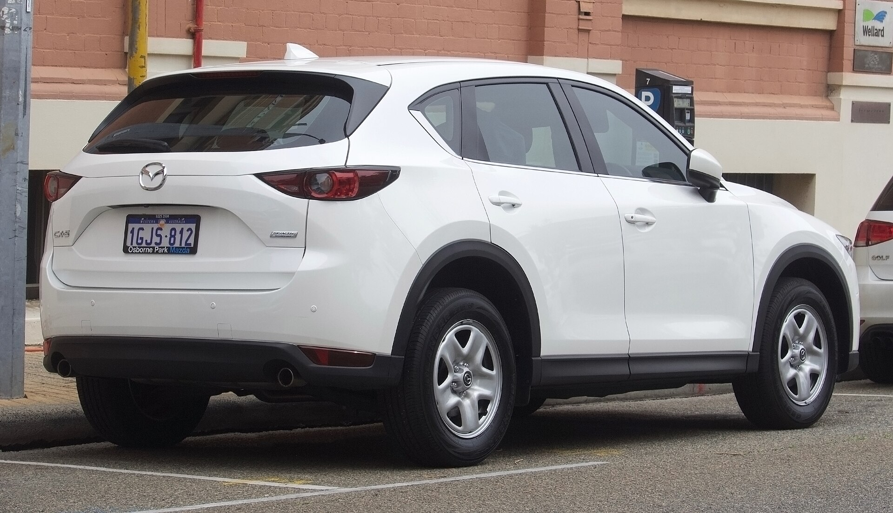
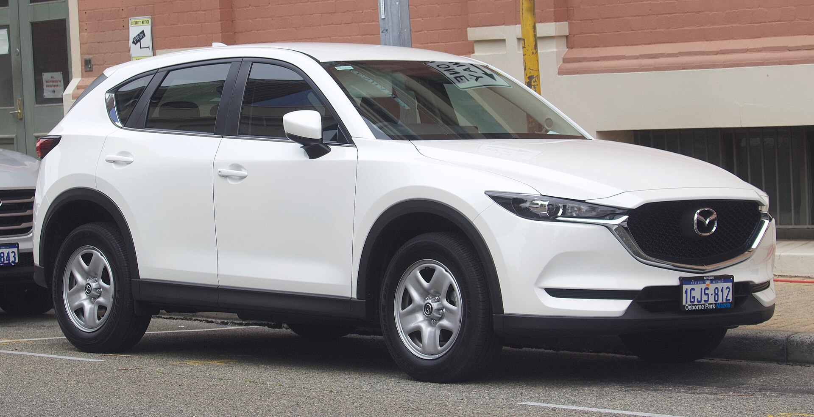
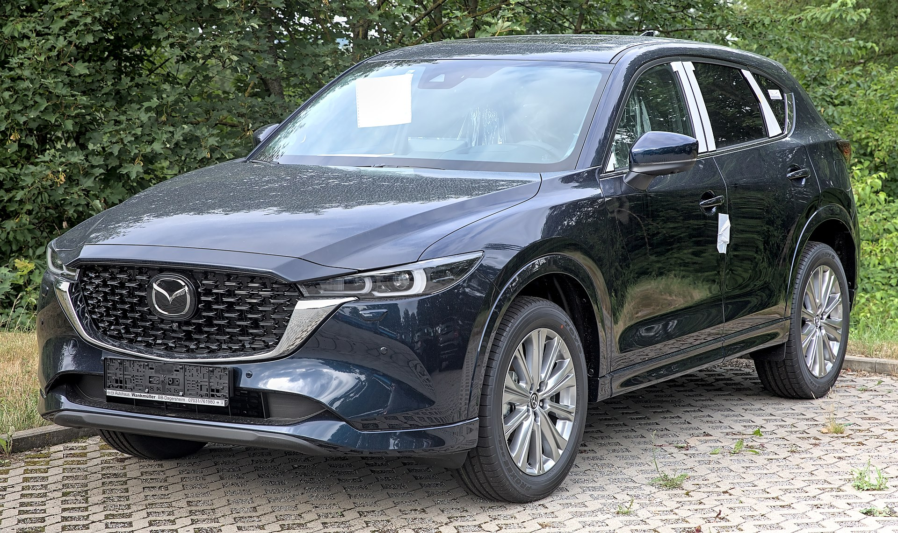
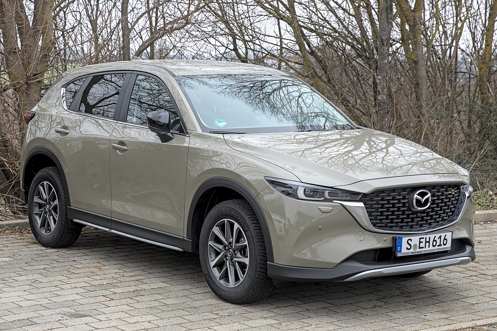
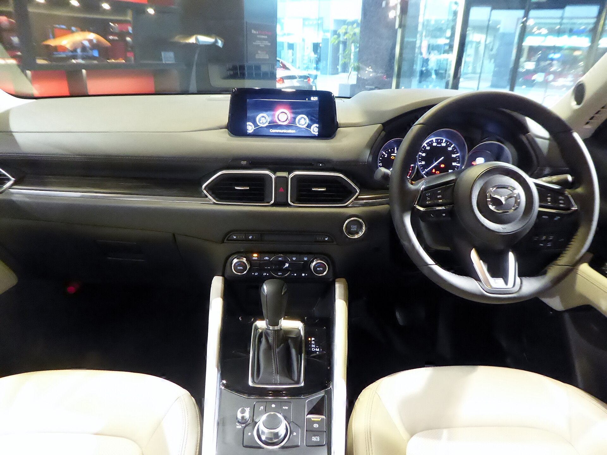
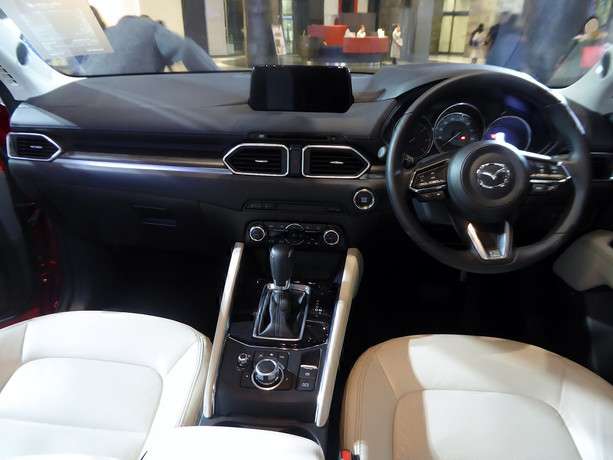

# Mazda CX-5 2025

*Compact SUV | 5-door compact SUV | KF (second generation, 2017-present)*

**Price range (new, MSRP):** $29,300 - $41,000  
**Typical used:** $25,500 at 2-3 years, $19,500 at 5 years  
**Built in:** Japan (Hiroshima)

## Photos

### Exterior

### Interior

Photo sources and licenses: [`photo-credits.json`](photo-credits.json)

## Why a buyer picks this car

- Best-driving compact SUV in the mainstream class - steering weight and body control feel European
- i-ACTIV all-wheel drive is standard on every trim in the US lineup, no upcharge
- Signature trim's Nappa leather and layered wood genuinely compete with entry luxury interiors at $40,000
- Soul Red Crystal paint is a showroom magnet and one of the best factory finishes at any price
- 2.5L Turbo makes 320 lb-ft - more torque than most V6 rivals, and it works on regular fuel at 227 hp
- 2 yr / 24,000 mi scheduled maintenance included, uncommon in this segment
- Rotary Commander control keeps eyes on the road; the screen locks out touch above parking speed by design

## Where it falls short

- 30.8 cu ft cargo trails the CR-V and RAV4 noticeably - it is the practicality trade for the styling
- No hybrid or plug-in option in the US CX-5 lineup
- 6-speed automatic has fewer ratios than rivals' 8-speeds, costing a little highway mpg
- Rear seat legroom is mid-pack; three across is tight
- Turbo needs 93 octane to hit its 256 hp rating

**Ideal buyer:** Buyer who would rather have a great-driving, beautifully finished SUV than the biggest cargo number in the class.

**Good fit for:** Daily commuting with AWD security, Couples and small families, Downsizing from a luxury sedan, All-weather driving without a hybrid premium, Style-conscious buyer under $40,000

## Powertrains

### 2.5L Skyactiv-G

| Field | Value |
|---|---|
| Engine | 2.5L naturally aspirated inline-4 with cylinder deactivation |
| Displacement l | 2.5 |
| Hp | 187 |
| Torque lb ft | 186 |
| Transmission | 6-speed automatic |
| Drivetrain | i-ACTIV AWD standard |
| Fuel | Regular gasoline |
| Epa mpg | City: 24, Highway: 30, Combined: 26 |
| Zero to 60 s | 8.2 |

### 2.5L Turbo

| Field | Value |
|---|---|
| Engine | 2.5L turbocharged inline-4 |
| Displacement l | 2.5 |
| Hp | 256 |
| Torque lb ft | 320 |
| Transmission | 6-speed automatic |
| Drivetrain | i-ACTIV AWD standard |
| Fuel | 93 octane for 256 hp; 227 hp on regular |
| Epa mpg | City: 22, Highway: 27, Combined: 24 |
| Zero to 60 s | 6.1 |

## Dimensions

| Field | Value |
|---|---|
| Length in | 180.1 |
| Width in | 72.6 |
| Height in | 65.3 |
| Wheelbase in | 106.2 |
| Curb weight lb | 3700 |
| Ground clearance in | 7.6 |
| Seating | 5 |

## Capacity

| Field | Value |
|---|---|
| Cargo cu ft | 30.8 |
| Max cargo cu ft | 59.3 |
| Towing lb | 2000 |
| Fuel tank gal | 15.3 |
| Range mi combined | 400 |

## Safety

- **NHTSA overall:** 5
- **IIHS:** Top Safety Pick+ (multiple years)
- **Driver assistance:**
  - Smart Brake Support with pedestrian detection
  - Mazda Radar Cruise Control with Stop and Go
  - Lane Departure Warning with Lane Keep Assist
  - Blind Spot Monitoring with Rear Cross Traffic Alert
  - Driver Attention Alert
  - High Beam Control
  - Available 360-degree View Monitor

## Warranty

| Field | Value |
|---|---|
| Basic | 3 yr / 36,000 mi |
| Powertrain | 5 yr / 60,000 mi |
| Roadside | 3 yr / 36,000 mi |
| Maintenance | 2 yr / 24,000 mi scheduled maintenance included |

## Technology and comfort

| Field | Value |
|---|---|
| Infotainment in | 10.25 |
| Digital cluster in | 7 |
| Audio | Available 10-speaker Bose Centerpoint |
| Connectivity | Mazda Connect with rotary Commander control, Wireless Apple CarPlay and Android Auto, MyMazda remote app, Available head-up display, Wi-Fi hotspot |

**Notable features:**

- i-ACTIV AWD standard on every trim
- G-Vectoring Control Plus torque-based cornering aid
- Available ventilated front seats and heated rear seats
- Nappa leather and real wood on Signature
- Frameless rearview mirror
- Rotary controller instead of touchscreen while driving

## Trims

S Select, S Preferred, S Carbon Edition, S Premium, S Premium Plus, 2.5 Turbo Premium, 2.5 Turbo Signature

## Colors and materials

**Exterior:** Soul Red Crystal Metallic, Machine Gray Metallic, Jet Black Mica, Snowflake White Pearl, Deep Crystal Blue Mica, Polymetal Gray Metallic, Sonic Silver Metallic

**Interior:** Cloth (S Select), Leatherette (Preferred), Leather (Premium), Nappa leather with layered wood (Signature)

## Ownership costs

| Field | Value |
|---|---|
| Service interval mi | 7500 |
| Typical insurance usd yr | 1700 |
| 5yr cost note | Included maintenance covers the first two years. Parts and labor run close to Toyota and Honda levels. |
| Reliability note | The naturally aspirated Skyactiv-G 2.5 has an excellent record. The turbo is proven across the Mazda lineup; keep up with oil changes given the turbocharger. |

## Cross-shopped against

Toyota RAV4, Honda CR-V, Hyundai Tucson, Subaru Forester, Nissan Rogue, Kia Sportage

## Handling objections

**"The CR-V and RAV4 have more cargo space."**

> They do, by roughly 8 cu ft. Bring your stroller or your golf clubs and let us load them - most buyers find the CX-5 holds everything they actually carry. What you get back is the way it drives and an interior a class above.

**"No hybrid option."**

> Correct, and if 40 mpg is your requirement, the RAV4 Hybrid is the right car and I will say so. If you are at 26 mpg combined either way in real mixed driving, the CX-5 gives you standard AWD and a much nicer cabin for the same money.

**"Only 6 gears?"**

> It is a torque converter tuned for response instead of ratio count - it holds gears through corners instead of hunting. Drive it against an 8-speed rival; the difference you will actually notice is smoothness, not mpg.

**"The turbo needs premium fuel."**

> Only if you want all 256 hp. On regular it makes 227 hp and 310 lb-ft, which is still more torque than a V6 Highlander. Run regular daily, use premium when you want it.

## Notes for the salesperson

- Get them into a Signature on the test drive even if they are shopping Preferred - the interior does the selling.
- Emphasize standard AWD on every trim; most rivals charge $1,400-$1,800 for it.
- For cargo objections, load the customer's actual gear rather than arguing cubic feet.

## Sample payment

| Field | Value |
|---|---|
| Msrp usd | 34000 |
| Down usd | 3500 |
| Apr pct | 6.9 |
| Term months | 60 |
| Approx monthly usd | 602 |

*Illustrative only - not a quote.*

---

*Figures are approximate US-market values for demo purposes. Verify against the manufacturer window sticker before quoting a customer.*
