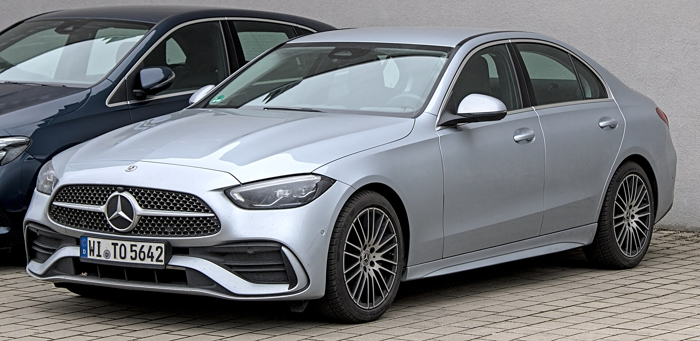
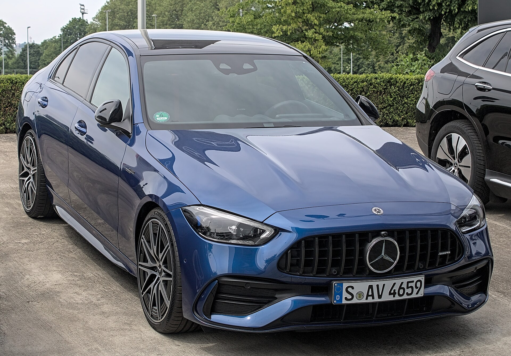
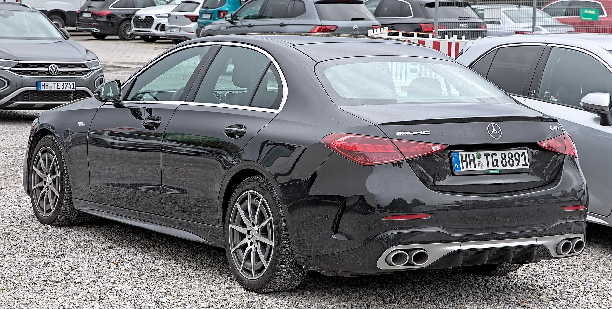
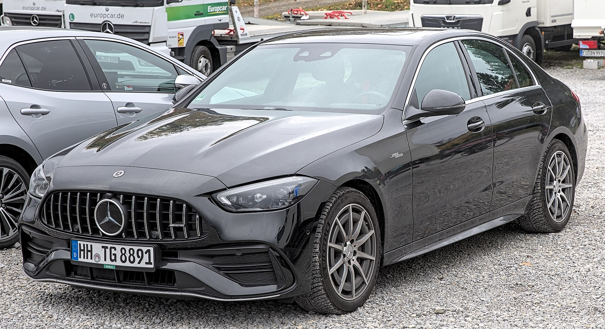
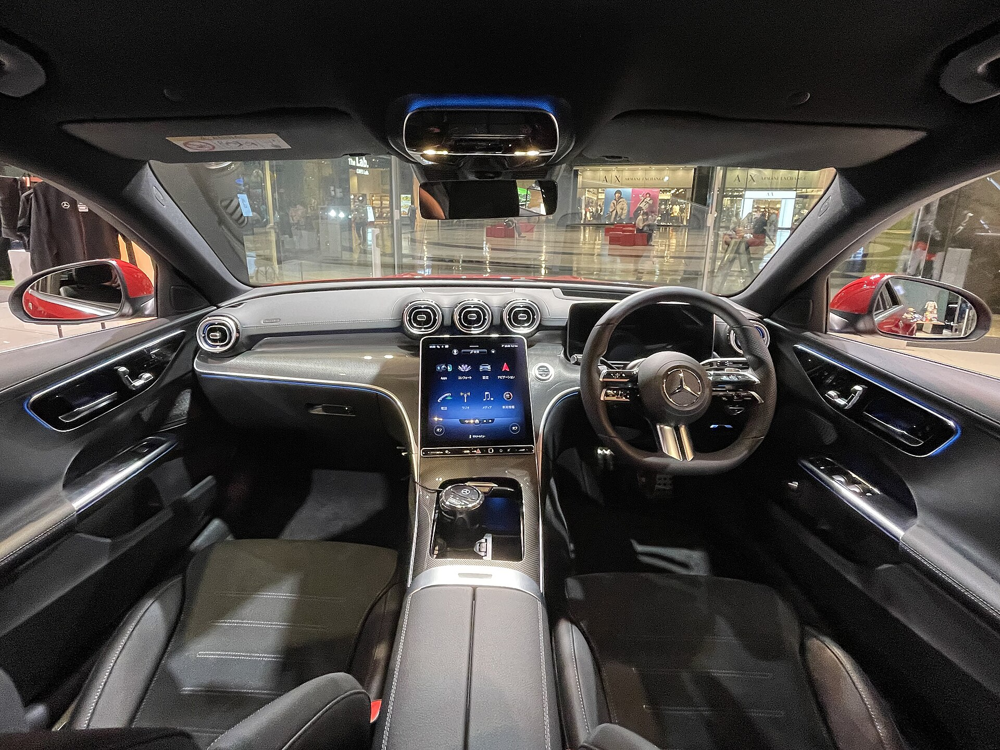
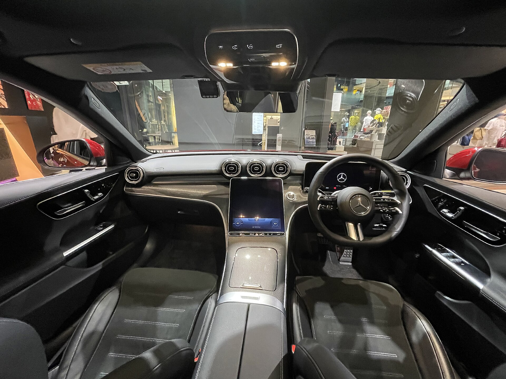
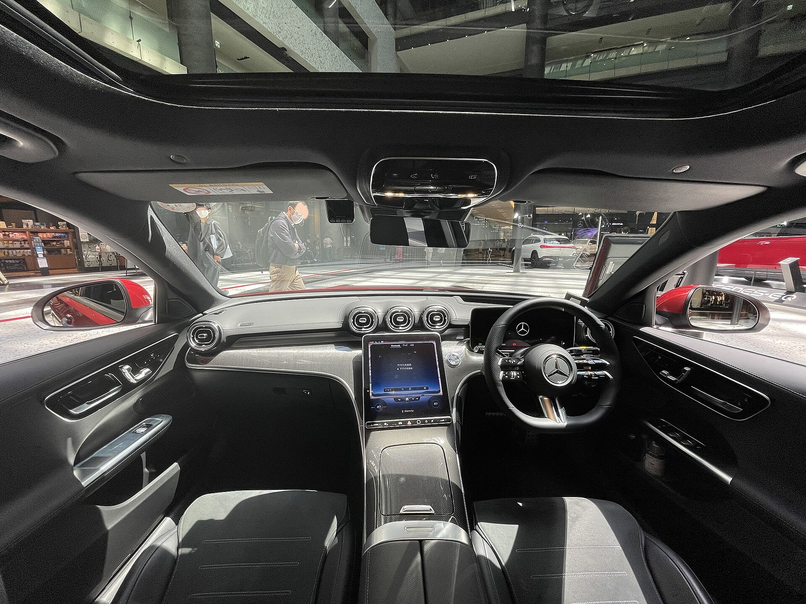

# Mercedes-Benz C-Class 2025

*Compact executive / luxury sedan | 4-door sedan (coupe and cabriolet replaced by CLE) | W206 (fifth generation, 2022-present)*

**Price range (new, MSRP):** $48,500 - $86,000  
**Typical used:** $37,000 at 2-3 years, $26,500 at 5 years  
**Built in:** Germany (Bremen)

## Photos

### Exterior

### Interior

Photo sources and licenses: [`photo-credits.json`](photo-credits.json)

## Why a buyer picks this car

- Best interior in the segment - the 11.9 in portrait screen, 64-color ambient lighting and Burmester audio feel a class above
- Quietest cabin here: excellent sound insulation makes it the segment's best highway cruiser
- MBUX voice control genuinely works - 'Hey Mercedes, I'm cold' adjusts the climate without menus
- Rear-axle steering shrinks the turning circle in parking garages
- Brand equity: the three-pointed star still closes deals that spec sheets cannot
- AMG C 63 S E Performance makes 671 hp from a four-cylinder hybrid - a genuine halo
- Unlimited-mileage roadside assistance during the warranty period

## Where it falls short

- 12.6 cu ft trunk is the smallest in this comparison set
- Almost all controls moved to the touchscreen; there is no rotary controller anymore
- No included scheduled maintenance, unlike BMW
- C 300 is smooth but not sporty - buyers wanting engagement should drive a 330i first
- Depreciation is steep in years 1-3; best value is often a certified pre-owned unit
- Repair costs out of warranty are among the highest in this catalog

**Ideal buyer:** Buyer who prioritizes interior quality, quietness and brand presence over outright driving engagement; frequently a lease customer on a 36-month cycle.

**Good fit for:** Executive commuting, Client-facing professional, Long highway trips in comfort, Lease cycle luxury, Performance halo (AMG)

## Powertrains

### C 300

| Field | Value |
|---|---|
| Engine | 2.0L turbocharged inline-4 M254 with 48V ISG mild hybrid |
| Displacement l | 2.0 |
| Hp | 255 |
| Torque lb ft | 295 |
| Transmission | 9G-TRONIC 9-speed automatic |
| Drivetrain | RWD or 4MATIC AWD |
| Fuel | Premium required |
| Epa mpg | City: 25, Highway: 35, Combined: 29 |
| Zero to 60 s | 5.9 |

### AMG C 43

| Field | Value |
|---|---|
| Engine | 2.0L turbo inline-4 with electric exhaust gas turbocharger and 48V |
| Displacement l | 2.0 |
| Hp | 416 |
| Torque lb ft | 369 |
| Transmission | AMG Speedshift MCT 9G |
| Drivetrain | 4MATIC AWD |
| Fuel | Premium required |
| Epa mpg | City: 21, Highway: 29, Combined: 24 |
| Zero to 60 s | 4.6 |

### AMG C 63 S E Performance

| Field | Value |
|---|---|
| Engine | 2.0L turbo inline-4 + rear electric motor, 6.1 kWh battery |
| Displacement l | 2.0 |
| Hp | 671 |
| Torque lb ft | 752 |
| Transmission | AMG Speedshift MCT 9G |
| Drivetrain | 4MATIC+ AWD with rear-axle steering |
| Fuel | Plug-in hybrid, premium |
| Epa mpg | City: 18, Highway: 25, Combined: 21 |
| Electric range mi | 5 |
| Zero to 60 s | 3.3 |

## Dimensions

| Field | Value |
|---|---|
| Length in | 187.0 |
| Width in | 71.7 |
| Height in | 56.6 |
| Wheelbase in | 112.8 |
| Curb weight lb | 3770 |
| Ground clearance in | 5.1 |
| Seating | 5 |

## Capacity

| Field | Value |
|---|---|
| Cargo cu ft | 12.6 |
| Towing lb | 0 |
| Fuel tank gal | 17.4 |
| Range mi combined | 500 |

## Safety

- **NHTSA overall:** 5
- **IIHS:** Good in crashworthiness; Top Safety Pick eligible by build
- **Driver assistance:**
  - Active Brake Assist with cross-traffic function
  - Attention Assist drowsiness monitor
  - Blind Spot Assist
  - Available Driver Assistance Package with Distronic and Active Steering Assist
  - PRE-SAFE occupant protection
  - Car-to-X communication

## Warranty

| Field | Value |
|---|---|
| Basic | 4 yr / 50,000 mi |
| Powertrain | 4 yr / 50,000 mi |
| Hybrid ev | 8 yr / 100,000 mi high-voltage battery (C 63) |
| Roadside | Unlimited mileage for the warranty period |
| Maintenance | Not included; prepaid service plans available |

## Technology and comfort

| Field | Value |
|---|---|
| Infotainment in | 11.9 |
| Digital cluster in | 12.3 |
| Audio | Available 15-speaker Burmester 3D surround |
| Connectivity | MBUX with 'Hey Mercedes' natural voice, Wireless CarPlay and Android Auto, Over-the-air updates, Mercedes me connect remote, Fingerprint and profile recognition |

**Notable features:**

- Portrait center screen angled to the driver
- 64-color ambient lighting
- Available augmented-reality navigation
- Rear-axle steering up to 2.5 degrees
- AIRMATIC-style adaptive damping available
- Digital Light headlamps with projection

## Trims

C 300, C 300 4MATIC, AMG C 43 4MATIC, AMG C 63 S E Performance

## Colors and materials

**Exterior:** Polar White, Obsidian Black Metallic, Selenite Grey Metallic, High-Tech Silver, Spectral Blue Metallic, Opalite White Bright, Patagonia Red Metallic

**Interior:** ARTICO synthetic leather standard, Nappa leather available, Open-pore wood, aluminum or backlit trim

## Ownership costs

| Field | Value |
|---|---|
| Service interval mi | 10000 |
| Typical insurance usd yr | 2450 |
| 5yr cost note | Prepaid maintenance plans are worth quoting up front - unplanned service A/B visits surprise first-time Mercedes owners. |
| Reliability note | The M254 four-cylinder with 48V ISG is newer; verify software update history. Air suspension and electronics are the expensive out-of-warranty items. |

## Cross-shopped against

BMW 3 Series, Audi A4 / A5, Genesis G70, Lexus IS, Volvo S60

## Handling objections

**"The BMW includes maintenance and this does not."**

> True, so let me quote the prepaid service plan into your payment - it usually lands within $15 a month and then you are comparing apples to apples. Where we win is the cabin: sit in both at night with the ambient lighting on.

**"A four-cylinder in a Mercedes?"**

> With 48V mild hybrid assist it makes 255 hp and 295 lb-ft and runs 0-60 in 5.9 seconds, quicker than the old V6. If you want the theater, the C 43 makes 416 hp from the same displacement with an electric turbocharger.

**"The trunk is small."**

> It is - 12.6 cu ft. If you routinely carry golf bags for four or large luggage, I would put you in a GLC on this same platform rather than sell you a car you will resent in six months.

**"It will depreciate badly."**

> It will in the first three years, which is exactly why I would show you a certified pre-owned 2023 with the balance of warranty - you let the first owner absorb the depreciation and you get the same car.

## Notes for the salesperson

- Sell the cabin: do a night-time walkaround with the ambient lighting and Burmester system running.
- Demonstrate 'Hey Mercedes' voice control live - it consistently surprises shoppers.
- Lead value-focused shoppers to certified pre-owned; the depreciation curve is the dealership's friend here.

## Sample payment

| Field | Value |
|---|---|
| Msrp usd | 52000 |
| Down usd | 6000 |
| Apr pct | 6.9 |
| Term months | 60 |
| Approx monthly usd | 910 |

*Illustrative only - not a quote.*

---

*Figures are approximate US-market values for demo purposes. Verify against the manufacturer window sticker before quoting a customer.*
