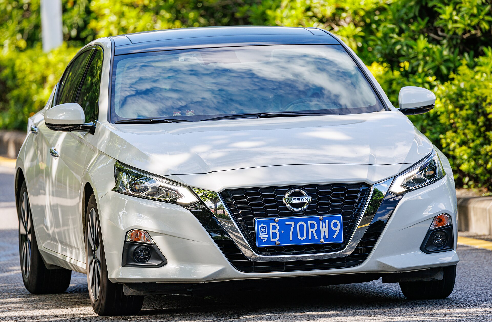
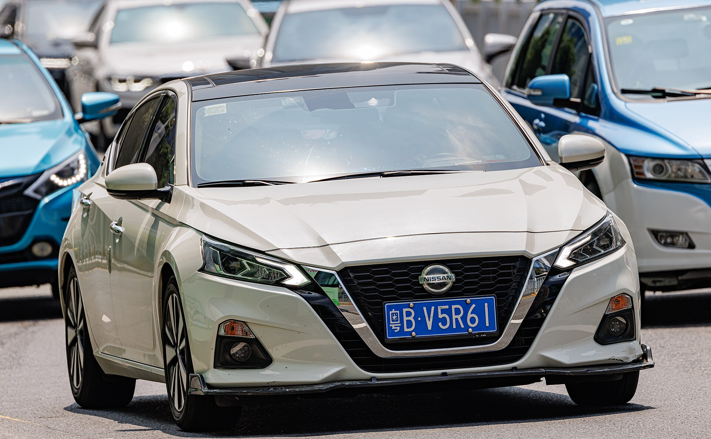
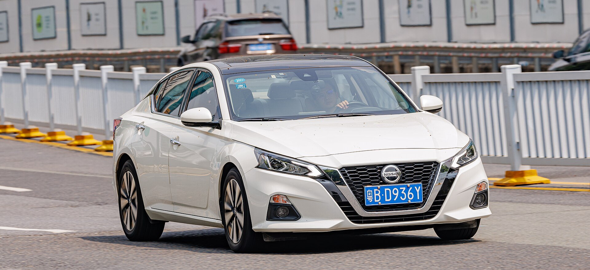
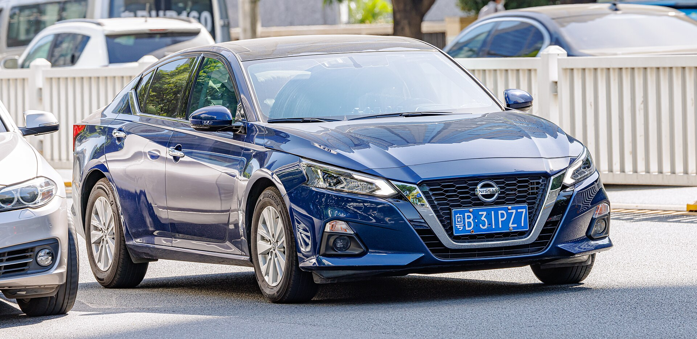
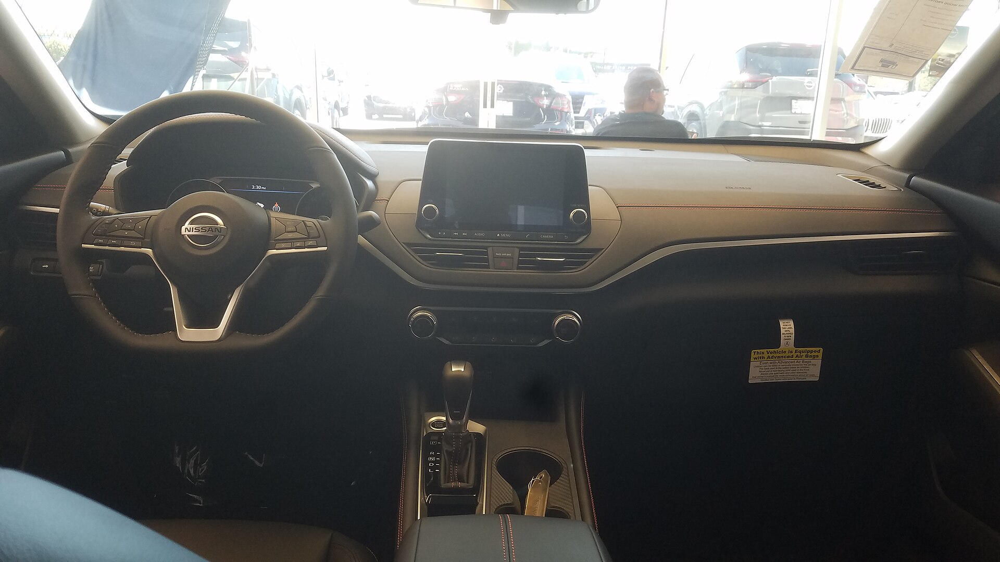
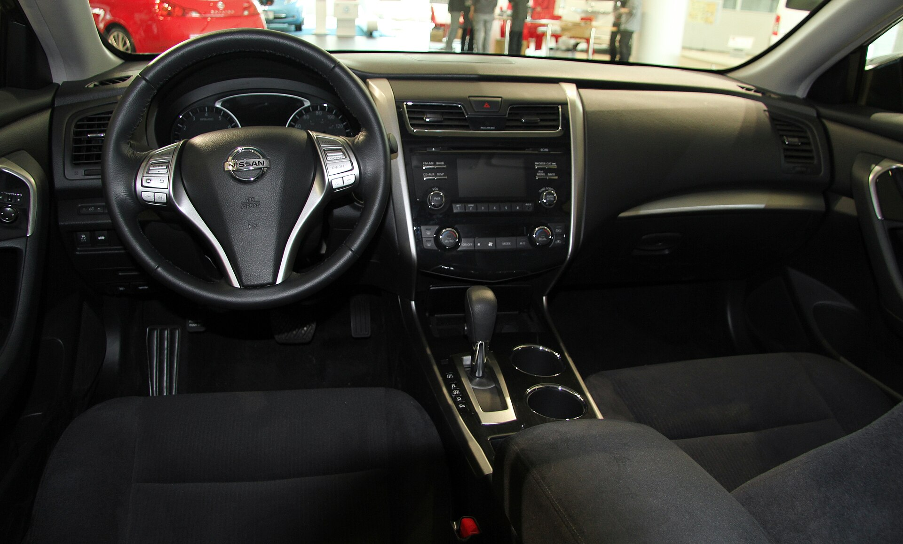

# Nissan Altima 2025

*Midsize sedan | 4-door sedan | L34 (sixth generation, 2019-present, refreshed 2023)*

**Price range (new, MSRP):** $26,500 - $36,000  
**Typical used:** $20,500 at 2-3 years, $15,000 at 5 years  
**Built in:** United States (Smyrna, Tennessee and Canton, Mississippi)

## Photos

### Exterior

### Interior

Photo sources and licenses: [`photo-credits.json`](photo-credits.json)

## Why a buyer picks this car

- 39 mpg highway from the 2.5L - one of the best non-hybrid highway numbers in the midsize class
- Available all-wheel drive, which the Camry only recently matched and the Accord does not offer at all
- Zero Gravity seats are the most comfortable in the segment for long drives - a real differentiator for high-mileage drivers
- VC-Turbo's variable compression engine makes 248 hp and 273 lb-ft, genuinely quick for the price
- Aggressive pricing and strong incentives make it the value play among midsize sedans
- 15.4 cu ft trunk is among the largest here
- Safety Shield 360 is standard on every trim, including the base S

## Where it falls short

- Resale value is the weakest of the mainstream midsize sedans - a buying advantage, a selling disadvantage
- Xtronic CVT has a mixed long-term reputation, especially in older Nissans
- Interior materials on base trims feel a step behind Camry and Accord
- No hybrid option, which increasingly matters in this segment
- AWD is not available with the VC-Turbo engine

**Ideal buyer:** High-mileage commuter or budget-conscious buyer who wants the most car per dollar and values highway comfort over badge or resale.

**Good fit for:** Long highway commuting, Rideshare and delivery, Snow-state sedan buyer needing AWD, Value-focused family sedan, Fleet purchasing

## Powertrains

### 2.5L

| Field | Value |
|---|---|
| Engine | 2.5L naturally aspirated inline-4 |
| Displacement l | 2.5 |
| Hp | 188 |
| Torque lb ft | 180 |
| Transmission | Xtronic CVT |
| Drivetrain | FWD |
| Fuel | Regular gasoline |
| Epa mpg | City: 27, Highway: 39, Combined: 32 |
| Zero to 60 s | 7.6 |

### 2.5L AWD

| Field | Value |
|---|---|
| Engine | 2.5L naturally aspirated inline-4 |
| Displacement l | 2.5 |
| Hp | 182 |
| Torque lb ft | 178 |
| Transmission | Xtronic CVT |
| Drivetrain | Intelligent AWD |
| Fuel | Regular gasoline |
| Epa mpg | City: 26, Highway: 36, Combined: 30 |
| Zero to 60 s | 7.9 |

### 2.0L VC-Turbo

| Field | Value |
|---|---|
| Engine | 2.0L variable compression turbocharged inline-4 |
| Displacement l | 2.0 |
| Hp | 248 |
| Torque lb ft | 273 |
| Transmission | Xtronic CVT |
| Drivetrain | FWD |
| Fuel | Premium recommended |
| Epa mpg | City: 25, Highway: 34, Combined: 29 |
| Zero to 60 s | 6.1 |

## Dimensions

| Field | Value |
|---|---|
| Length in | 192.9 |
| Width in | 72.9 |
| Height in | 56.7 |
| Wheelbase in | 111.2 |
| Curb weight lb | 3210 |
| Ground clearance in | 5.4 |
| Seating | 5 |

## Capacity

| Field | Value |
|---|---|
| Cargo cu ft | 15.4 |
| Towing lb | 0 |
| Fuel tank gal | 16.2 |
| Range mi combined | 520 |

## Safety

- **NHTSA overall:** 5
- **IIHS:** Good in most crashworthiness tests
- **Driver assistance:**
  - Safety Shield 360: automatic emergency braking with pedestrian detection
  - Blind Spot Warning
  - Rear Cross Traffic Alert
  - Lane Departure Warning
  - Rear Automatic Braking
  - High Beam Assist
  - Available ProPILOT Assist hands-on highway driving

## Warranty

| Field | Value |
|---|---|
| Basic | 3 yr / 36,000 mi |
| Powertrain | 5 yr / 60,000 mi |
| Roadside | 3 yr / 36,000 mi |
| Maintenance | Not included |

## Technology and comfort

| Field | Value |
|---|---|
| Infotainment in | 12.3 |
| Digital cluster in | 7 |
| Audio | Available 9-speaker Bose premium |
| Connectivity | Wireless Apple CarPlay, wired Android Auto, NissanConnect remote services, Wi-Fi hotspot, Available wireless charging |

**Notable features:**

- Zero Gravity front seats derived from NASA posture research
- Available Intelligent AWD - rare in a midsize sedan
- ProPILOT Assist with Navi-link
- Available around-view monitor
- Remote engine start with climate

## Trims

S, SV, SR, SR VC-Turbo, SL

## Colors and materials

**Exterior:** Super Black, Glacier White, Brilliant Silver Metallic, Gun Metallic, Scarlet Ember Tintcoat, Deep Blue Pearl, Boulder Gray Pearl

**Interior:** Cloth (S/SV), Sport cloth with contrast stitching (SR), Leather-appointed (SL)

## Ownership costs

| Field | Value |
|---|---|
| Service interval mi | 5000 |
| Typical insurance usd yr | 1650 |
| 5yr cost note | Lowest acquisition cost in the midsize group, offset by the steepest depreciation. Best value for buyers who keep vehicles long-term. |
| Reliability note | Follow the CVT fluid service schedule - it is the single most important maintenance item on this car. The VC-Turbo is complex; prefer it with a service contract. |

## Cross-shopped against

Toyota Camry, Honda Accord, Hyundai Sonata, Kia K5, Subaru Legacy, Mazda6 (used)

## Handling objections

**"Nissan CVTs fail."**

> The reputation comes from the 2013-2016 generation. The current Xtronic is a revised unit, and the fluid service interval is the thing that actually determines its life. I would recommend an extended powertrain contract if you plan to keep it past 100,000 miles - and I would recommend it honestly, not as an upsell.

**"It will not hold its value."**

> It will not, and that is exactly why you are getting a well-equipped midsize sedan several thousand dollars below a comparable Camry. If you keep cars eight years, depreciation is a sunk cost either way and you are ahead on day one.

**"The Camry and Accord are better cars."**

> They have better resale and better reputations. Neither offers all-wheel drive at Accord's price, and neither seat is as comfortable on a four-hour drive. Sit in all three for ten minutes each - the Zero Gravity seats are not marketing.

**"No hybrid."**

> Correct. But 39 mpg highway from a conventional engine with no battery to worry about, at $6,000 less than a hybrid Camry, covers a lot of fuel. If your driving is mostly city stop-and-go, the hybrid wins; if it is highway, this is the better math.

## Notes for the salesperson

- Lead with total equipment per dollar - the Altima's value story is its strongest asset.
- Put highway commuters in the Zero Gravity seats for at least 20 minutes on the test drive.
- For snow-state buyers, AWD availability is the differentiator against the Accord.

## Sample payment

| Field | Value |
|---|---|
| Msrp usd | 29000 |
| Down usd | 2500 |
| Apr pct | 7.2 |
| Term months | 60 |
| Approx monthly usd | 528 |

*Illustrative only - not a quote.*

---

*Figures are approximate US-market values for demo purposes. Verify against the manufacturer window sticker before quoting a customer.*
