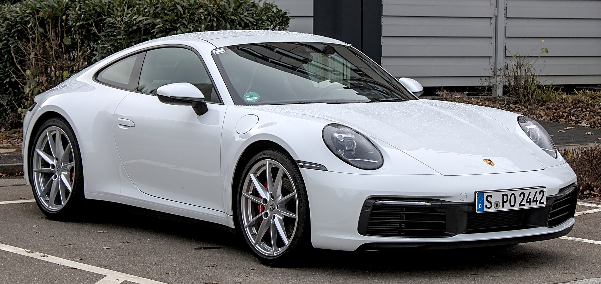
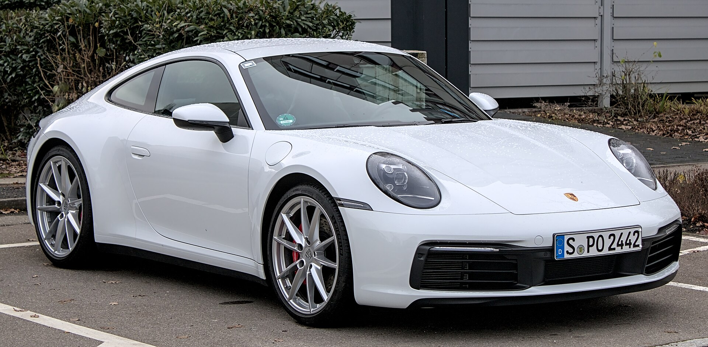
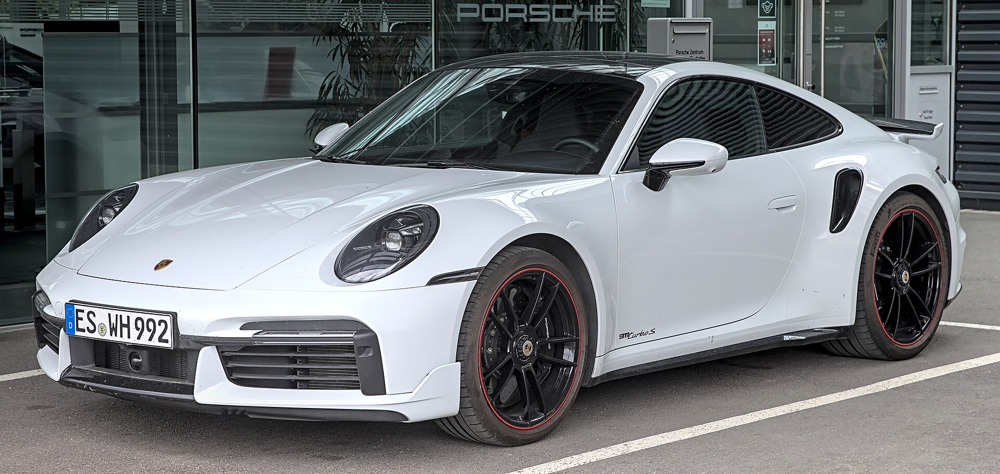
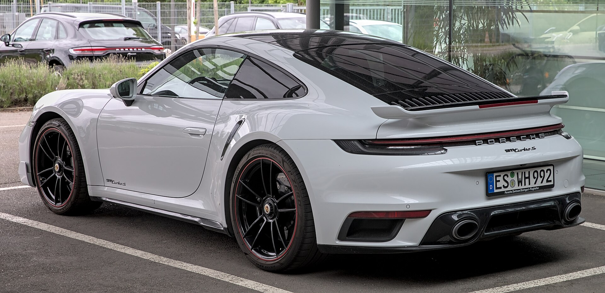
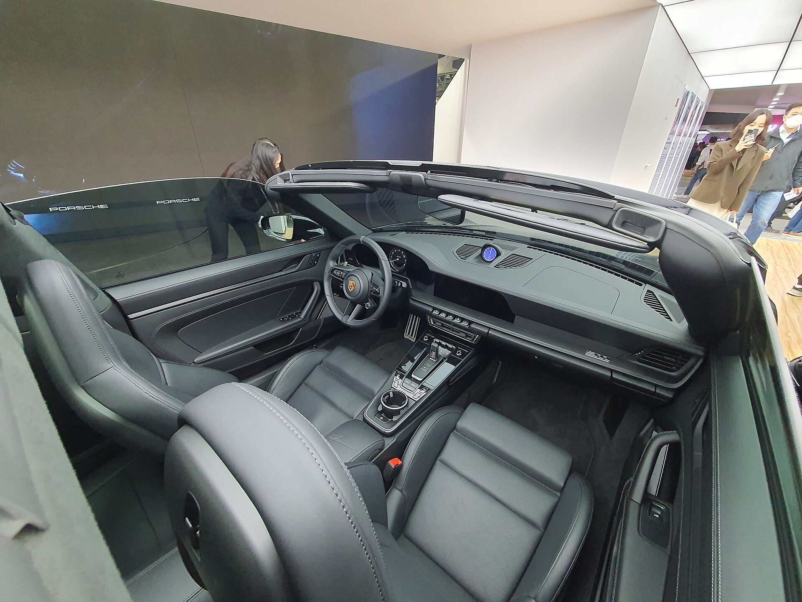
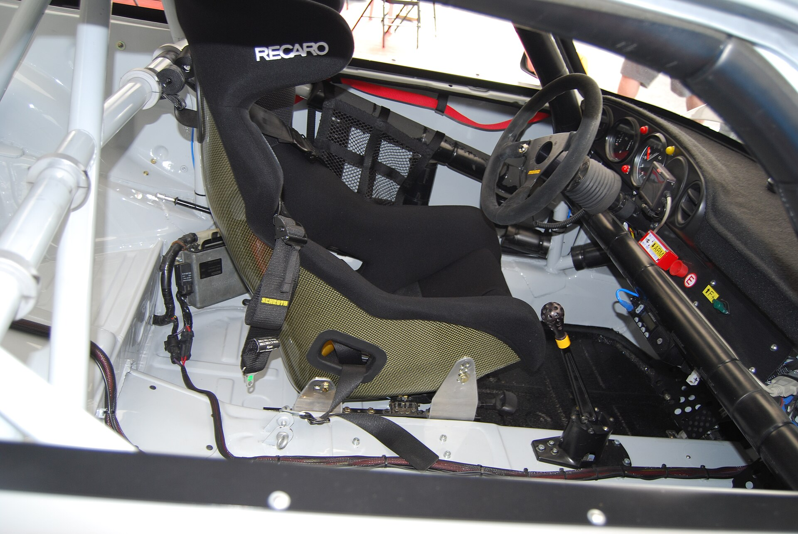
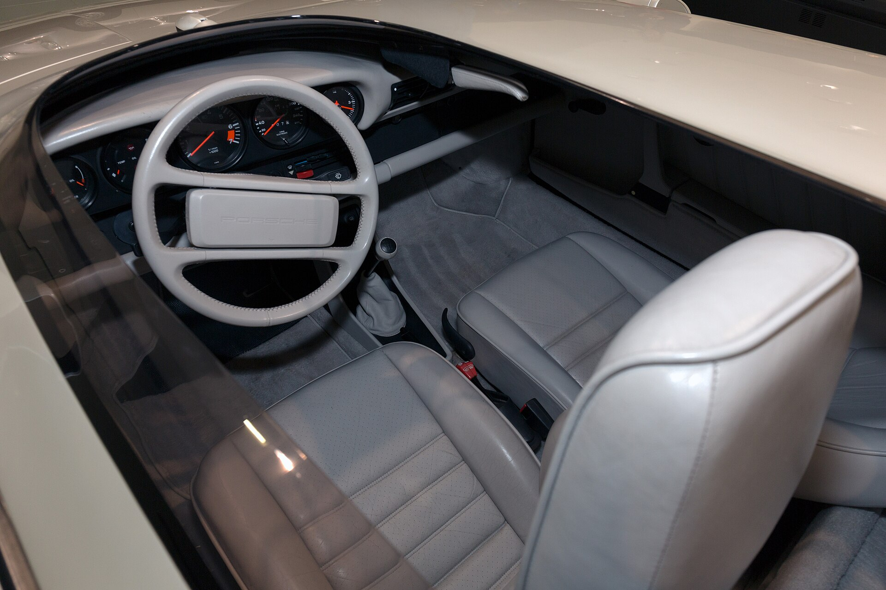

# Porsche 911 2025

*Luxury sports car | 2-door coupe, cabriolet and Targa; 2+2 seating | 992.2 (2024-present facelift of the 992 launched 2019)*

**Price range (new, MSRP):** $120,100 - $300,000  
**Typical used:** $118,000 at 2-3 years, $98,000 at 5 years  
**Built in:** Germany (Zuffenhausen, Stuttgart)

## Photos

### Exterior

### Interior

Photo sources and licenses: [`photo-credits.json`](photo-credits.json)

## Why a buyer picks this car

- The most usable supercar-adjacent sports car ever built - you can genuinely daily drive it
- Rear-engine layout gives extraordinary traction out of corners and a driving character no rival replicates
- Best-in-class residual values: 911s regularly retain 70%+ after three years, and GT cars often appreciate
- PDK is the benchmark dual-clutch; the GT3 still offers a six-speed manual
- Two usable luggage spaces: a 4.6 cu ft frunk plus folding rear seats for weekend bags
- Porsche Exclusive Manufaktur means no two cars need be identical - a powerful upsell channel
- 60 years of continuity: the used market, club scene and parts support are unmatched

## Where it falls short

- Option list can add $40,000-plus; the base price is genuinely just the starting point
- Rear seats are for cargo or small children only
- 4.2 in ground clearance means the front axle lift is close to mandatory in many neighborhoods
- Running costs are serious: tires, ceramic brakes and annual service are all premium-priced
- GT3 and GT3 RS allocations are limited and often dealer-allocated to repeat customers

**Ideal buyer:** Established enthusiast buying their aspirational car, or a second-car buyer who wants a weekend machine that still works on a Monday.

**Good fit for:** Weekend driving and canyon roads, Track days (GT3), Grand touring (Turbo, Targa), Collector and investment purchase, Daily driving for a committed enthusiast

## Powertrains

### Carrera

| Field | Value |
|---|---|
| Engine | 3.0L twin-turbo flat-six, rear-mounted |
| Displacement l | 3.0 |
| Hp | 388 |
| Torque lb ft | 331 |
| Transmission | 8-speed PDK dual-clutch |
| Drivetrain | RWD |
| Fuel | Premium required |
| Epa mpg | City: 18, Highway: 25, Combined: 21 |
| Zero to 60 s | 3.9 |

### Carrera GTS T-Hybrid

| Field | Value |
|---|---|
| Engine | 3.6L flat-six with electric turbocharger and 1.9 kWh hybrid system |
| Displacement l | 3.6 |
| Hp | 532 |
| Torque lb ft | 449 |
| Transmission | 8-speed PDK |
| Drivetrain | RWD or AWD |
| Fuel | Premium required, hybrid assist |
| Epa mpg | City: 17, Highway: 24, Combined: 20 |
| Zero to 60 s | 2.9 |

### Turbo S

| Field | Value |
|---|---|
| Engine | 3.7L twin-turbo flat-six |
| Displacement l | 3.7 |
| Hp | 640 |
| Torque lb ft | 590 |
| Transmission | 8-speed PDK |
| Drivetrain | AWD |
| Fuel | Premium required |
| Epa mpg | City: 15, Highway: 20, Combined: 17 |
| Zero to 60 s | 2.6 |

### GT3

| Field | Value |
|---|---|
| Engine | 4.0L naturally aspirated flat-six, 9,000 rpm redline |
| Displacement l | 4.0 |
| Hp | 502 |
| Torque lb ft | 331 |
| Transmission | 6-speed manual or 7-speed PDK |
| Drivetrain | RWD |
| Fuel | Premium required |
| Epa mpg | City: 14, Highway: 19, Combined: 16 |
| Zero to 60 s | 3.2 |

## Dimensions

| Field | Value |
|---|---|
| Length in | 178.4 |
| Width in | 72.9 |
| Height in | 51.1 |
| Wheelbase in | 96.5 |
| Curb weight lb | 3354 |
| Ground clearance in | 4.2 |
| Seating | 4 |

## Capacity

| Field | Value |
|---|---|
| Frunk cu ft | 4.6 |
| Rear seat cargo cu ft | 9.0 |
| Towing lb | 0 |
| Fuel tank gal | 16.9 |
| Range mi combined | 355 |

## Safety

- **NHTSA overall:** not rated
- **IIHS:** Not rated - low volume sports car
- **Driver assistance:**
  - Porsche Active Safe with forward collision warning
  - Lane Change Assist available
  - Adaptive cruise control available
  - Night vision assist available
  - Front axle lift system available
  - Porsche Stability Management

## Warranty

| Field | Value |
|---|---|
| Basic | 4 yr / 50,000 mi |
| Powertrain | 4 yr / 50,000 mi |
| Corrosion | 12 yr |
| Roadside | 4 yr |
| Maintenance | Not included; prepaid Porsche maintenance plans available |

## Technology and comfort

| Field | Value |
|---|---|
| Infotainment in | 10.9 |
| Digital cluster in | 12.6 |
| Audio | Available 855-watt Burmester high-end surround |
| Connectivity | PCM 6.0 with wireless CarPlay and Android Auto, Porsche Connect app with remote, Porsche Track Precision app for lap timing, Over-the-air updates |

**Notable features:**

- Rear-axle steering available
- PASM adaptive dampers
- Porsche Dynamic Chassis Control anti-roll
- Ceramic composite brakes available
- Sport Chrono with launch control and Mode switch
- Front axle lift to clear driveways
- Individually configurable via Porsche Exclusive Manufaktur

## Trims

Carrera, Carrera T, Carrera S, Carrera GTS T-Hybrid, Targa 4 GTS, Turbo S, GT3, GT3 RS

## Colors and materials

**Exterior:** GT Silver Metallic, Guards Red, Shark Blue, Racing Yellow, Agate Grey Metallic, Carrara White Metallic, Gentian Blue Metallic, Paint to Sample (custom)

**Interior:** Leather standard, Club leather, Race-Tex suede, Carbon fiber, aluminum or wood trim, Full custom colors via Exclusive Manufaktur

## Ownership costs

| Field | Value |
|---|---|
| Service interval mi | 10000 |
| Typical insurance usd yr | 3200 |
| 5yr cost note | Depreciation is usually the smallest line item on a 911, which is unusual at this price point. Budget for tires and brake service instead. |
| Reliability note | Modern flat-sixes are durable when serviced on time. Verify service records and check for track use on used GT cars. |

## Cross-shopped against

Chevrolet Corvette, Mercedes-AMG GT, BMW M4, Aston Martin Vantage, Maserati GranTurismo

## Handling objections

**"A Corvette is half the price and just as fast."**

> In a straight line, yes. The 911 story is the chassis, the build quality and the residual value - three-year-old 911s hold 70% where the Corvette holds closer to 60%. Drive both; if the Corvette speaks to you, that is a great car too.

**"The options double the price."**

> They can, so let us build it deliberately. My advice: Sport Chrono, front axle lift and the seats you actually want. Skip the cosmetic packages - they add cost without adding much resale.

**"It is impractical as a daily driver."**

> It is the one sports car in this price class that genuinely is not. 4.6 cu ft up front, folding rear seats, adaptive dampers in Comfort mode and front axle lift for your driveway. Take it home overnight and try your actual commute.

**"I want a GT3 but there is a wait."**

> GT allocation goes to established relationships, so the honest path is to start with a Carrera or a GTS and build history with the store. I will be straight with you about where you sit on the list instead of promising something I cannot deliver.

## Notes for the salesperson

- Sell residual value early - it reframes the price conversation from cost to cost-of-ownership.
- Do a configuration session on the Porsche configurator with the customer; the personalization process is part of the product.
- Offer an extended test drive over real roads - 15 minutes around the block undersells this car badly.

## Sample payment

| Field | Value |
|---|---|
| Msrp usd | 135000 |
| Down usd | 25000 |
| Apr pct | 6.5 |
| Term months | 60 |
| Approx monthly usd | 2152 |

*Illustrative only - not a quote. Many buyers in this segment use lease or balloon structures.*

---

*Figures are approximate US-market values for demo purposes. Verify against the manufacturer window sticker before quoting a customer.*
