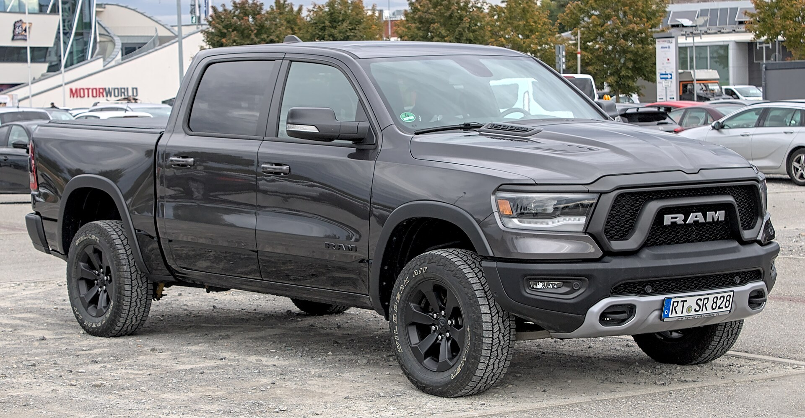
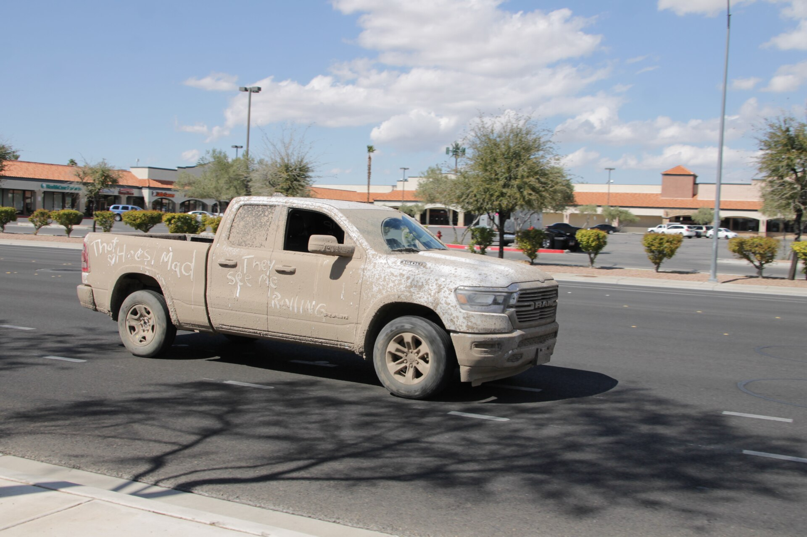
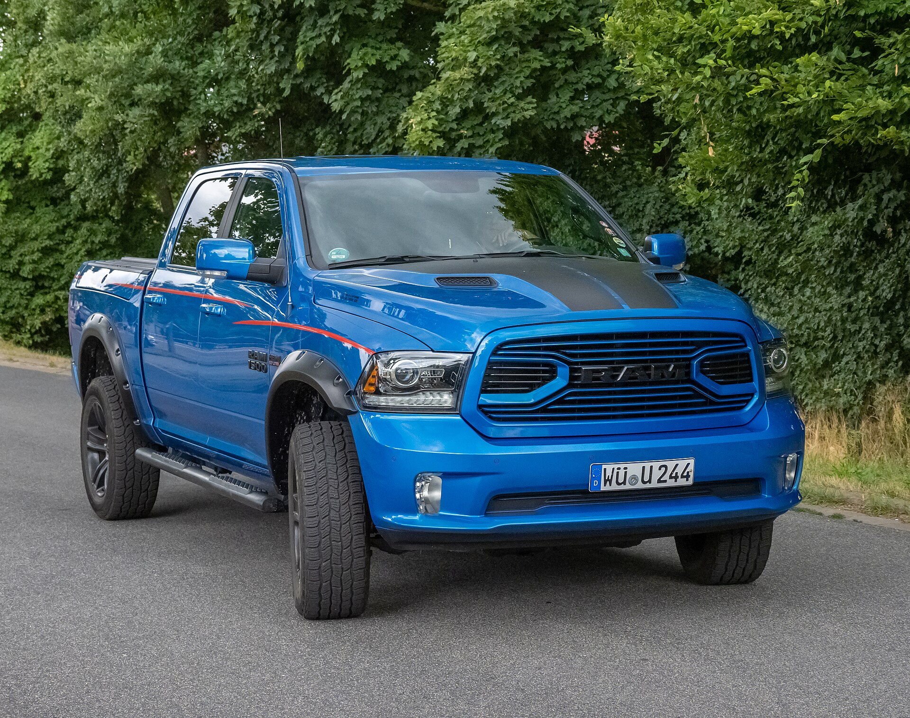
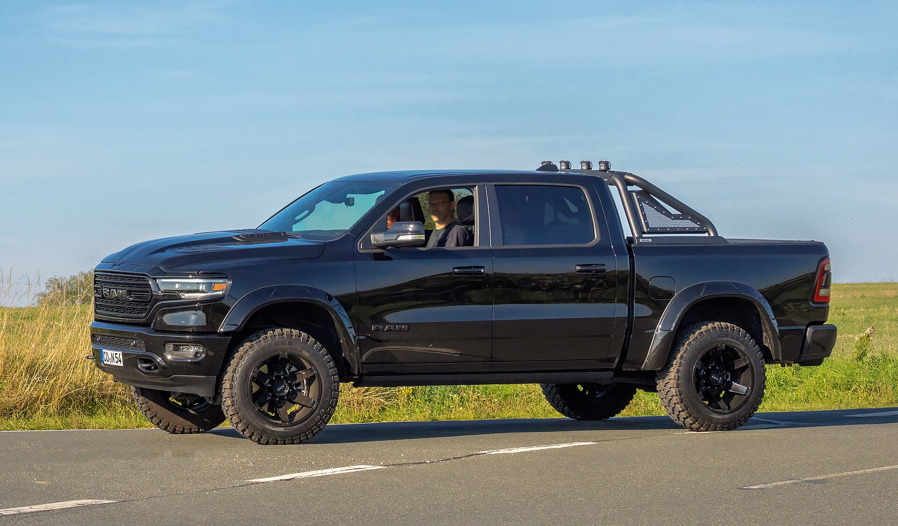
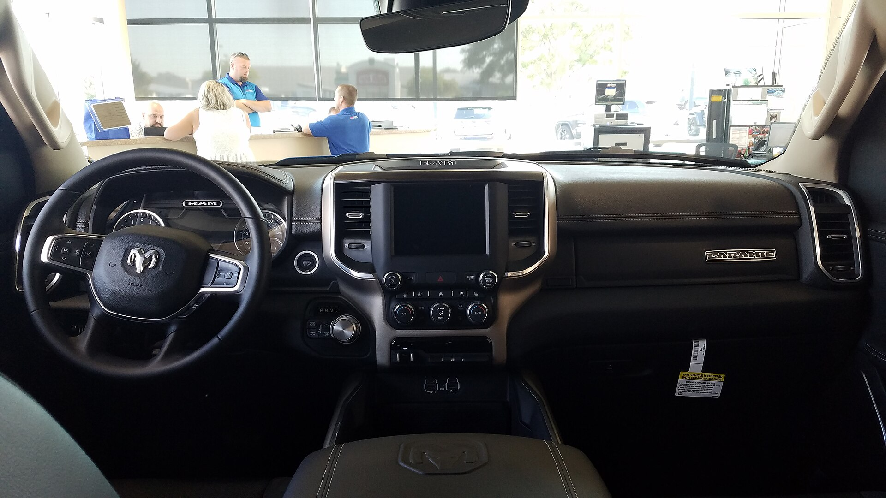
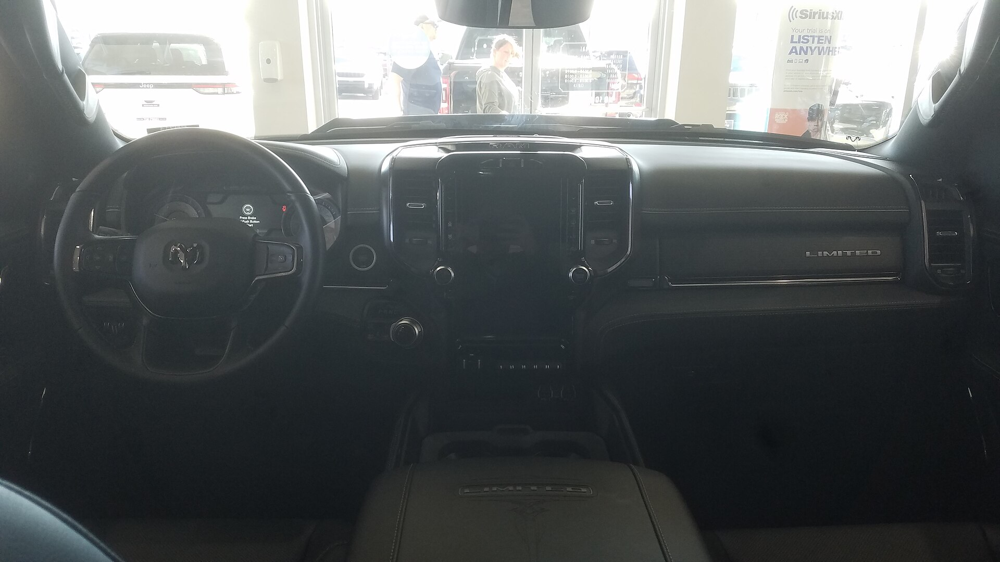
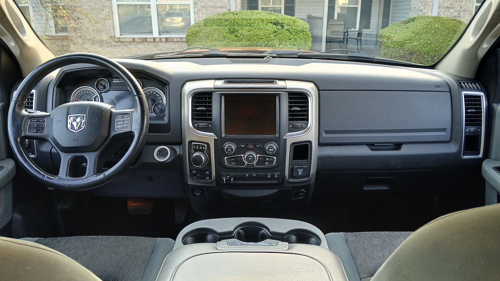

# Ram 1500 2025

*Full-size light-duty pickup | Pickup truck - Quad Cab and Crew Cab; 5.7 or 6.4 ft beds | DT (fifth generation, 2019-present, refreshed 2025)*

**Price range (new, MSRP):** $40,000 - $85,000  
**Typical used:** $42,000 at 2-3 years, $31,000 at 5 years  
**Built in:** United States (Sterling Heights, Michigan)

## Photos

### Exterior

### Interior

Photo sources and licenses: [`photo-credits.json`](photo-credits.json)

## Why a buyer picks this car

- Coil-spring rear suspension makes it the best-riding full-size pickup by a wide margin - no rival comes close unloaded
- Available four-corner air suspension adds load leveling, aero mode and a kneel function for easy loading
- Limited and Tungsten interiors are the nicest in any pickup at any price, luxury sedan territory
- 14.5 in center screen plus a dedicated 10.25 in passenger display
- RamBox bed-side storage is lockable and drainable - a cooler that comes with the truck
- Hurricane inline-six makes 540 hp in high-output form while using regular or premium, no diesel required
- Rear seats recline 8 degrees, the only full-size pickup that offers it

## Where it falls short

- 11,550 lb max tow trails Ford and Chevrolet at the top of their ranges
- Air suspension adds complexity and is a known out-of-warranty expense
- Uconnect 5 is excellent but the screen-heavy dash reduces physical controls
- HEMI V8 dropped from the core lineup for 2025 - a sticking point for loyal V8 buyers
- 53.9 cu ft bed volume is smaller than the F-150 and Silverado

**Ideal buyer:** Truck buyer who drives unloaded most of the time and wants the ride and interior of a luxury SUV with a bed attached.

**Good fit for:** Daily driver truck, Family crew cab, Towing trailers up to 11,550 lb, Contractor who also carries clients, Luxury truck buyer

## Powertrains

### 3.6L Pentastar eTorque V6

| Field | Value |
|---|---|
| Engine | 3.6L V6 with 48V belt-starter generator |
| Displacement l | 3.6 |
| Hp | 305 |
| Torque lb ft | 269 |
| Transmission | 8-speed automatic |
| Drivetrain | RWD or 4WD |
| Fuel | Regular gasoline |
| Epa mpg | City: 20, Highway: 25, Combined: 22 |
| Zero to 60 s | 7.2 |

### 3.0L Hurricane Standard Output

| Field | Value |
|---|---|
| Engine | 3.0L twin-turbo inline-6 |
| Displacement l | 3.0 |
| Hp | 420 |
| Torque lb ft | 469 |
| Transmission | 8-speed automatic |
| Drivetrain | RWD or 4WD |
| Fuel | Regular gasoline |
| Epa mpg | City: 18, Highway: 24, Combined: 20 |
| Zero to 60 s | 5.8 |

### 3.0L Hurricane High Output

| Field | Value |
|---|---|
| Engine | 3.0L twin-turbo inline-6, high output |
| Displacement l | 3.0 |
| Hp | 540 |
| Torque lb ft | 521 |
| Transmission | 8-speed automatic |
| Drivetrain | RWD or 4WD |
| Fuel | Premium recommended |
| Epa mpg | City: 16, Highway: 22, Combined: 18 |
| Zero to 60 s | 4.6 |

## Dimensions

| Field | Value |
|---|---|
| Length in | 232.9 |
| Width in | 82.1 |
| Height in | 77.5 |
| Wheelbase in | 144.6 |
| Curb weight lb | 4900 |
| Ground clearance in | 8.7 |
| Seating | 6 |

## Capacity

| Field | Value |
|---|---|
| Bed volume cu ft | 53.9 |
| Towing lb | 11550 |
| Payload lb | 2300 |
| Fuel tank gal | 26.0 |
| Range mi combined | 570 |

## Safety

- **NHTSA overall:** 5
- **IIHS:** Good crashworthiness; headlights vary by trim
- **Driver assistance:**
  - Forward Collision Warning with Active Braking
  - Available Blind Spot Monitoring with trailer detection
  - Available Adaptive Cruise Control with Stop and Go
  - Available Hands-Free Active Driving Assist
  - 360-degree surround view camera available
  - Trailer reverse steering control

## Warranty

| Field | Value |
|---|---|
| Basic | 3 yr / 36,000 mi |
| Powertrain | 5 yr / 60,000 mi |
| Roadside | 5 yr / 60,000 mi |
| Maintenance | Not included |

## Technology and comfort

| Field | Value |
|---|---|
| Infotainment in | 14.5 |
| Digital cluster in | 12.3 |
| Passenger screen in | 10.25 |
| Audio | Available 23-speaker Klipsch reference premium |
| Connectivity | Uconnect 5 with wireless CarPlay and Android Auto, Available dedicated passenger touchscreen, Ram Connect remote, Over-the-air updates, Wi-Fi hotspot |

**Notable features:**

- Coil-spring rear suspension - unique in the class
- Available four-corner air suspension with load leveling and kneel mode
- RamBox lockable, drainable bed-side storage
- Multifunction split tailgate
- Rear seats recline up to 8 degrees
- Available 23-speaker Klipsch audio
- Available head-up display

## Trims

Tradesman, Big Horn / Lone Star, Laramie, Rebel, Limited Longhorn, Limited, Tungsten, RHO

## Colors and materials

**Exterior:** Bright White, Diamond Black Crystal, Billet Silver Metallic, Granite Crystal Metallic, Flame Red, Hydro Blue, Delmonico Red Pearl

**Interior:** Vinyl (Tradesman), Cloth (Big Horn), Leather (Laramie), Full-grain leather with real wood and metal (Limited/Tungsten)

## Ownership costs

| Field | Value |
|---|---|
| Service interval mi | 10000 |
| Typical insurance usd yr | 2100 |
| 5yr cost note | The Hurricane six improves fuel economy over the old HEMI while adding power. Air suspension service should be budgeted after year 6. |
| Reliability note | Air suspension height sensors and compressors are the most common out-of-warranty item. The Pentastar V6 is a long-proven engine. |

## Cross-shopped against

Ford F-150, Chevrolet Silverado 1500, GMC Sierra 1500, Toyota Tundra, Nissan Titan

## Handling objections

**"Ford tows more."**

> By about 2,000 lb at maximum configuration. Ask yourself what you actually tow - if it is under 11,000 lb, that capacity is theoretical, and you spend 95% of your miles driving empty on a coil-spring suspension that rides like an SUV.

**"They dropped the HEMI."**

> I understand the attachment. The Hurricane inline-six makes 540 hp and 521 lb-ft in high output - more than the 6.4L HEMI ever did - with better fuel economy. Drive it before you judge it on cylinder count.

**"Air suspension is expensive to fix."**

> It is, out of warranty, and I will not pretend otherwise. You can skip it entirely - the standard coil-spring setup still rides better than any leaf-spring competitor. Buy the air suspension only if you load heavily or tow often.

**"It is more expensive than the Silverado."**

> Compare equivalent trims and it is close. Where Ram charges more is at the top, because a Limited has real wood, full-grain leather and 23-speaker Klipsch - content that does not exist on a High Country.

## Notes for the salesperson

- The test drive is the whole pitch: drive a Ram and a competitor over the same rough road, unloaded.
- Open the RamBox and the split tailgate during the walkaround - both are instant, tangible differentiators.
- For luxury cross-shoppers, compare a Limited interior directly against a midsize luxury SUV at the same price.

## Sample payment

| Field | Value |
|---|---|
| Msrp usd | 56000 |
| Down usd | 6000 |
| Apr pct | 7.4 |
| Term months | 72 |
| Approx monthly usd | 863 |

*Illustrative only - not a quote.*

---

*Figures are approximate US-market values for demo purposes. Verify against the manufacturer window sticker before quoting a customer.*
