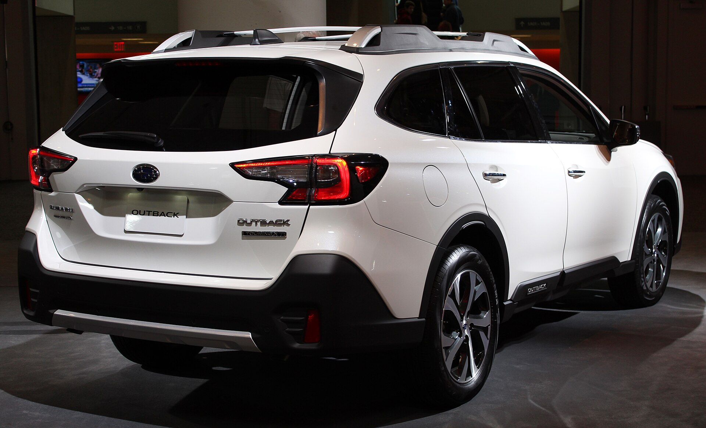
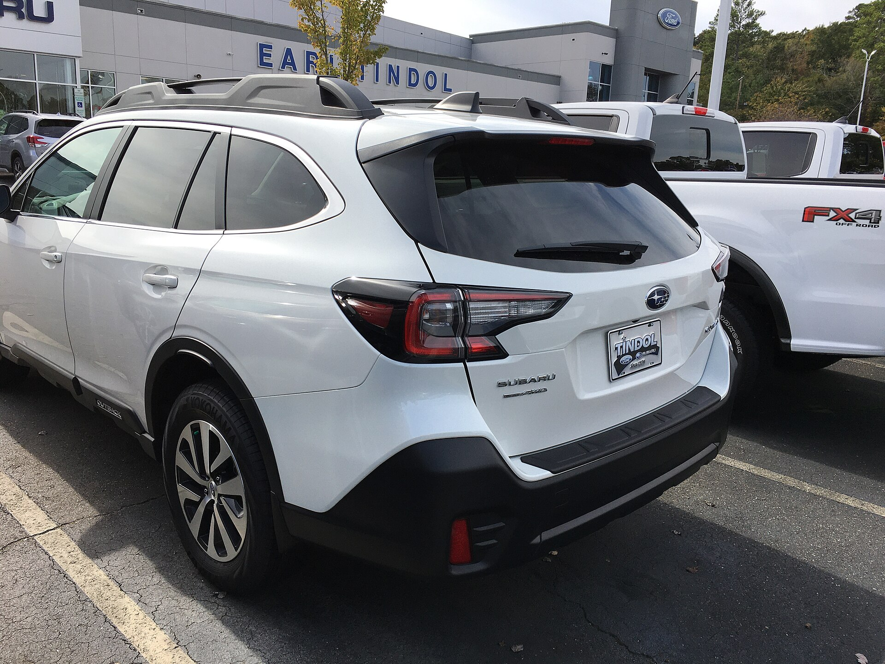
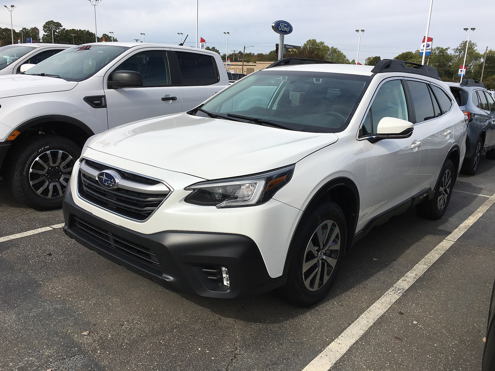
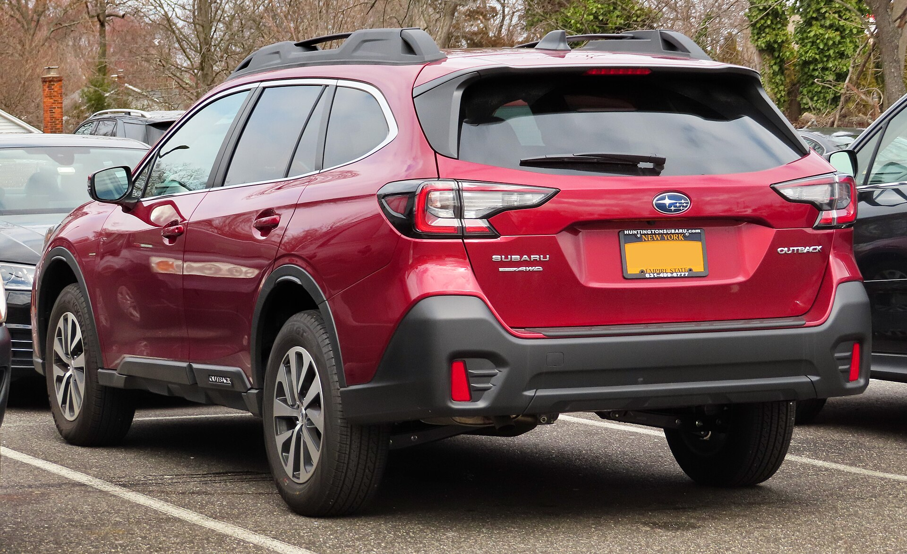
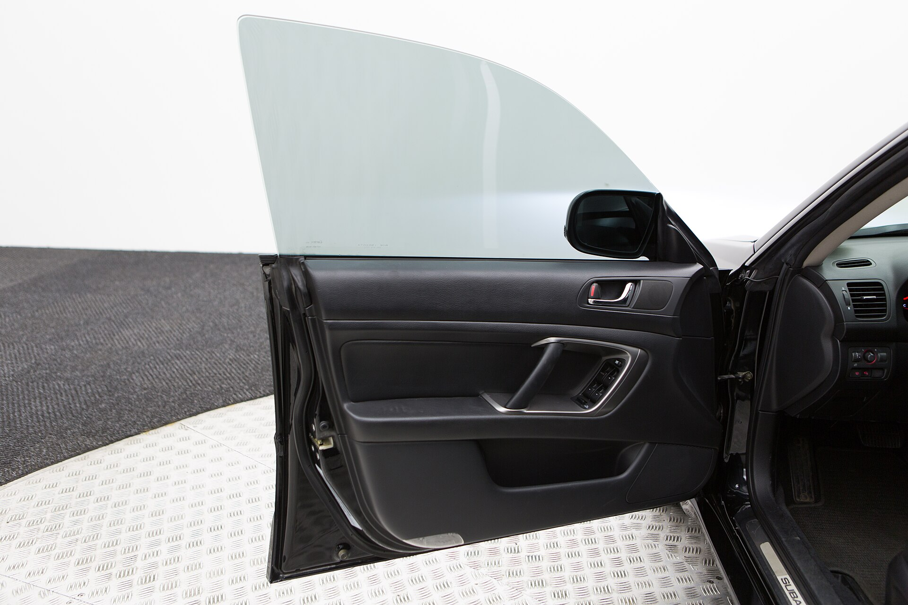
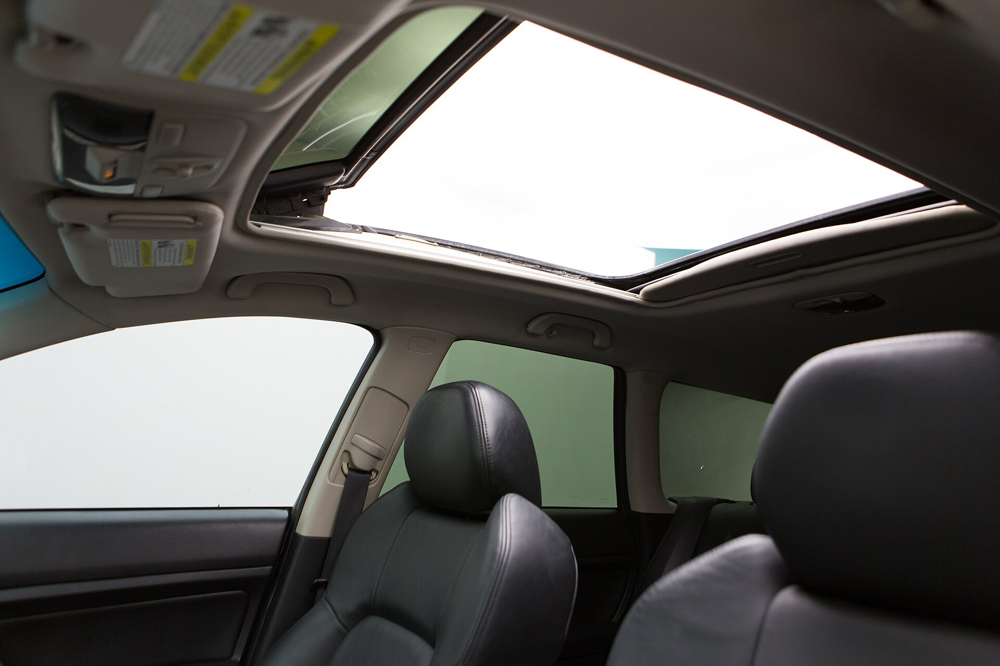
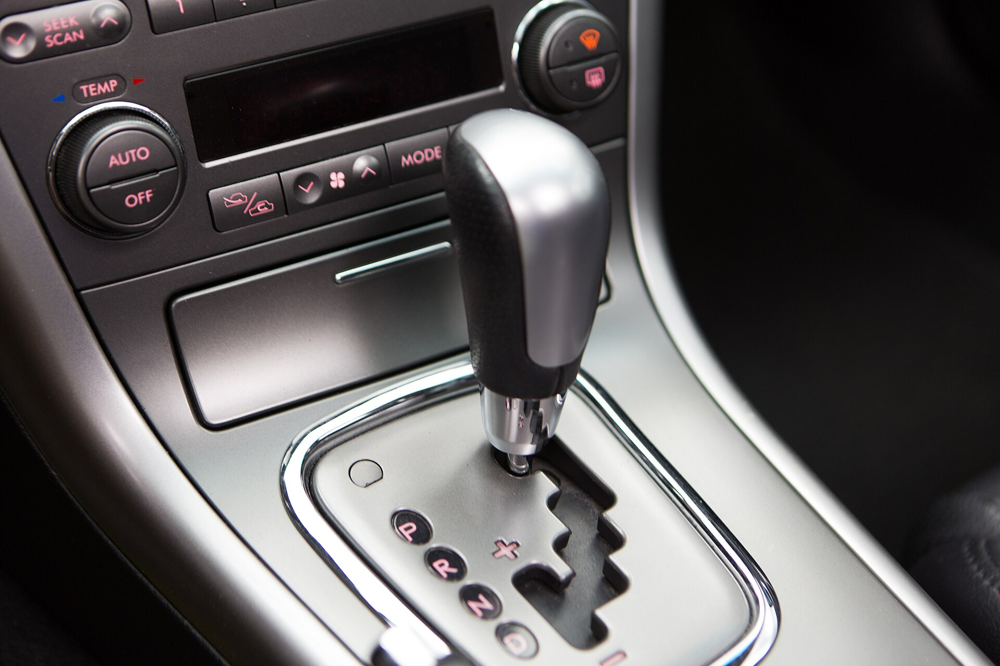

# Subaru Outback 2025

*Midsize crossover wagon | 5-door wagon-crossover | Sixth generation (BT, 2020-present, refreshed 2023)*

**Price range (new, MSRP):** $30,000 - $44,000  
**Typical used:** $27,500 at 2-3 years, $21,000 at 5 years  
**Built in:** Japan / United States (Lafayette, Indiana)

## Photos

### Exterior

### Interior

Photo sources and licenses: [`photo-credits.json`](photo-credits.json)

## Why a buyer picks this car

- Symmetrical all-wheel drive standard on every single trim, no exceptions and no upcharge
- 8.7 in of ground clearance - more than many SUVs - in a body that drives like a car
- EyeSight is standard across the range and the Outback has been an IIHS Top Safety Pick+ repeatedly
- 700 lb static roof load supports rooftop tents, a genuine differentiator for camping buyers
- StarTex water-repellent upholstery on Onyx and Wilderness handles dogs, mud and wet gear
- 75.6 cu ft of cargo with the seats folded, with a low load floor a tall SUV cannot match
- Wilderness trim adds 9.5 in clearance, a front skid plate and a shorter final drive for real trail use

## Where it falls short

- Base 2.5L is slow: 8.7 s to 60 mph and it gets noisy under load
- CVT drone is noticeable in hard acceleration despite the simulated gears
- The 11.6 in portrait screen absorbed most climate controls - a step back for glove-wearing users
- Head gasket reputation from older Subaru boxer engines still comes up, even though the FB engines addressed it
- Interior materials on base trims trail Mazda and Hyundai at similar prices

**Ideal buyer:** Outdoor-oriented buyer, dog owner, or snow-state family who wants SUV capability without SUV height, fuel penalty or handling.

**Good fit for:** Camping and trailhead access, Snow-belt daily driving, Dog and gear hauling, Rooftop tent overlanding (Wilderness), Light towing up to 3,500 lb

## Powertrains

### 2.5L BOXER

| Field | Value |
|---|---|
| Engine | 2.5L naturally aspirated flat-4 |
| Displacement l | 2.5 |
| Hp | 182 |
| Torque lb ft | 176 |
| Transmission | Lineartronic CVT with 8-speed manual mode |
| Drivetrain | Symmetrical AWD |
| Fuel | Regular gasoline |
| Epa mpg | City: 26, Highway: 32, Combined: 28 |
| Zero to 60 s | 8.7 |

### 2.4L Turbo XT

| Field | Value |
|---|---|
| Engine | 2.4L turbocharged flat-4 |
| Displacement l | 2.4 |
| Hp | 260 |
| Torque lb ft | 277 |
| Transmission | Lineartronic CVT |
| Drivetrain | Symmetrical AWD |
| Fuel | Regular gasoline |
| Epa mpg | City: 22, Highway: 29, Combined: 25 |
| Zero to 60 s | 6.1 |

### 2.4L Turbo Wilderness

| Field | Value |
|---|---|
| Engine | 2.4L turbocharged flat-4 with revised final drive |
| Displacement l | 2.4 |
| Hp | 260 |
| Torque lb ft | 277 |
| Transmission | Lineartronic CVT |
| Drivetrain | Symmetrical AWD with dual-function X-MODE |
| Fuel | Regular gasoline |
| Epa mpg | City: 21, Highway: 26, Combined: 23 |
| Zero to 60 s | 6.5 |

## Dimensions

| Field | Value |
|---|---|
| Length in | 191.3 |
| Width in | 73.0 |
| Height in | 66.4 |
| Wheelbase in | 108.1 |
| Curb weight lb | 3900 |
| Ground clearance in | 8.7 |
| Ground clearance wilderness in | 9.5 |
| Seating | 5 |

## Capacity

| Field | Value |
|---|---|
| Cargo cu ft | 32.6 |
| Max cargo cu ft | 75.6 |
| Towing lb | 3500 |
| Roof load static lb | 700 |
| Fuel tank gal | 18.5 |
| Range mi combined | 515 |

## Safety

- **NHTSA overall:** 5
- **IIHS:** Top Safety Pick+ (multiple consecutive years)
- **Driver assistance:**
  - EyeSight Driver Assist: adaptive cruise, pre-collision braking, lane keep
  - Automatic Emergency Steering
  - Lane Departure Prevention
  - Available DriverFocus distraction mitigation
  - Available Blind Spot Detection with Rear Cross-Traffic Alert
  - Reverse Automatic Braking

## Warranty

| Field | Value |
|---|---|
| Basic | 3 yr / 36,000 mi |
| Powertrain | 5 yr / 60,000 mi |
| Roadside | 3 yr / 36,000 mi |
| Maintenance | Not included; Subaru Added Security plans available |

## Technology and comfort

| Field | Value |
|---|---|
| Infotainment in | 11.6 |
| Digital cluster in | 0 |
| Audio | Available 12-speaker Harman Kardon |
| Connectivity | STARLINK 11.6 in portrait touchscreen, Apple CarPlay and Android Auto (wireless on upper trims), MySubaru remote app, Wi-Fi hotspot, Over-the-air map updates |

**Notable features:**

- X-MODE with hill descent control
- Standard roof rails with integrated crossbars
- 700 lb static roof load for rooftop tents
- StepGate rear tailgate access (Wilderness)
- Water-repellent StarTex upholstery
- Full-size spare available

## Trims

Base, Premium, Onyx Edition, Limited, Touring, Wilderness, Onyx XT, Limited XT, Touring XT

## Colors and materials

**Exterior:** Crystal White Pearl, Magnetite Gray Metallic, Autumn Green Metallic, Geyser Blue, Crimson Red Pearl, Brilliant Bronze Metallic, Crystal Black Silica

**Interior:** Cloth standard, StarTex water-repellent synthetic (Onyx/Wilderness), Nappa leather (Touring)

## Ownership costs

| Field | Value |
|---|---|
| Service interval mi | 6000 |
| Typical insurance usd yr | 1650 |
| 5yr cost note | 6,000 mile oil change interval is shorter than most rivals - factor that into the maintenance conversation. |
| Reliability note | Current FB and FA boxer engines are solid; the older head gasket issue belongs to the EJ generation. CVT has a 100,000 mi extended coverage history on earlier models. |

## Cross-shopped against

Toyota RAV4, Honda CR-V, Volkswagen Golf Alltrack (used), Toyota Crown Signia, Mazda CX-50

## Handling objections

**"Subarus blow head gaskets."**

> That was the EJ-series engine, phased out over a decade ago. The current FB and FA boxers have an entirely different head design. Look at reliability surveys from the last five model years rather than a 2005 reputation.

**"It is slow."**

> The 2.5L is, honestly - 8.7 seconds. That is why the XT exists: 260 hp and 277 lb-ft, 0-60 in 6.1 s, on regular fuel. Drive the XT and the base back to back and the upcharge will make its own case.

**"Why not a real SUV?"**

> You get 8.7 in of clearance either way, but with a lower center of gravity, better mpg and a load floor you can actually lift a dog into. The Outback is the SUV that did not forget it has to drive 12,000 miles a year on pavement.

**"CVTs do not last."**

> Subaru's Lineartronic has been in production since 2009 with millions of units. It is also covered by the 5 yr / 60,000 mi powertrain warranty, and we can extend that if you plan to keep it past 100,000 miles.

## Notes for the salesperson

- Qualify on lifestyle: dogs, bikes, skis, camping. The Outback closes on gear stories, not spec sheets.
- Demonstrate the 700 lb roof load and the standard crossbars - rooftop tent shoppers convert on the spot.
- Always offer an XT test drive to anyone who mentions merging, hills or towing.

## Sample payment

| Field | Value |
|---|---|
| Msrp usd | 36000 |
| Down usd | 3500 |
| Apr pct | 6.9 |
| Term months | 60 |
| Approx monthly usd | 642 |

*Illustrative only - not a quote.*

---

*Figures are approximate US-market values for demo purposes. Verify against the manufacturer window sticker before quoting a customer.*
