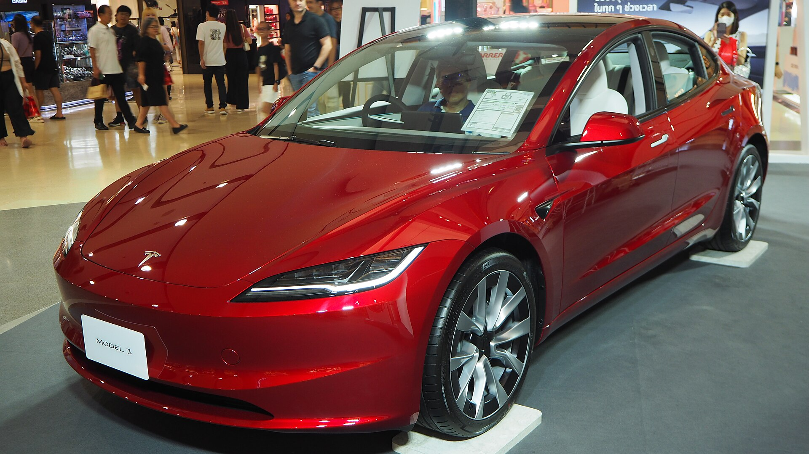
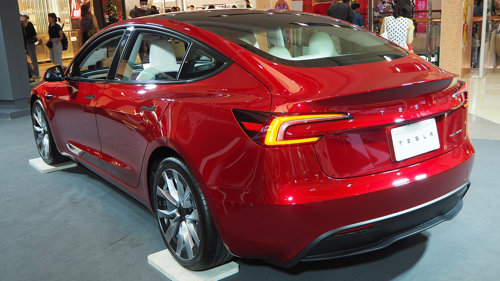
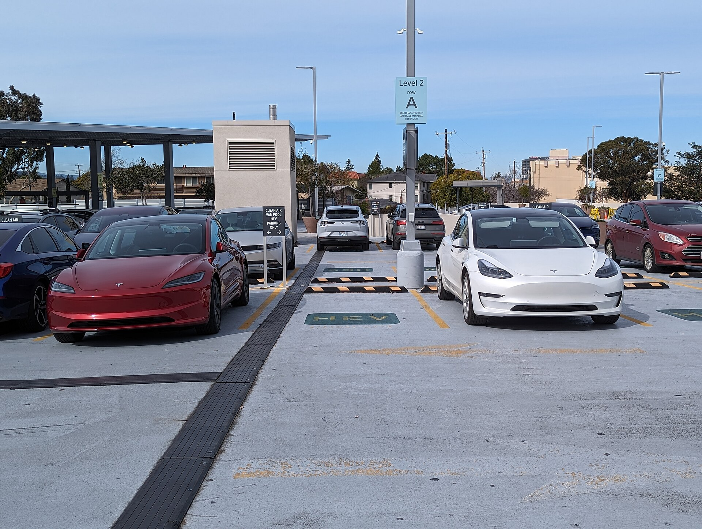
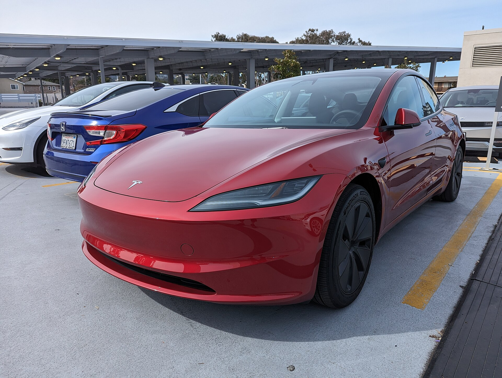
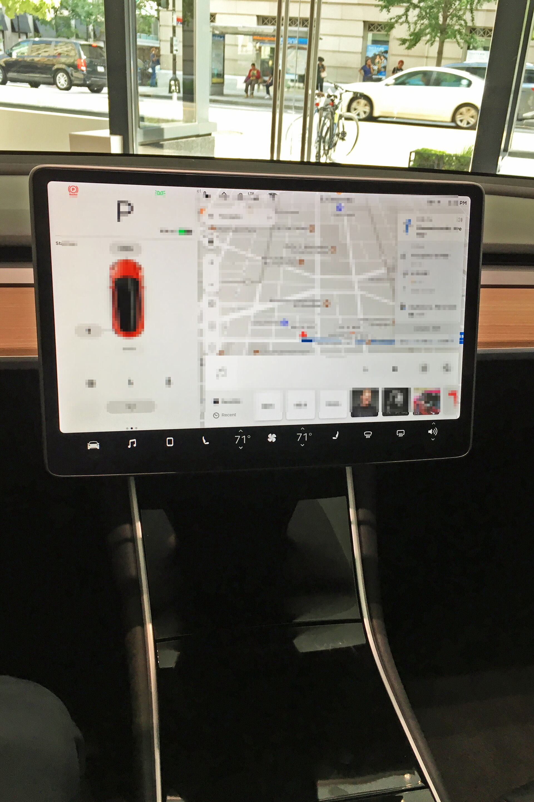
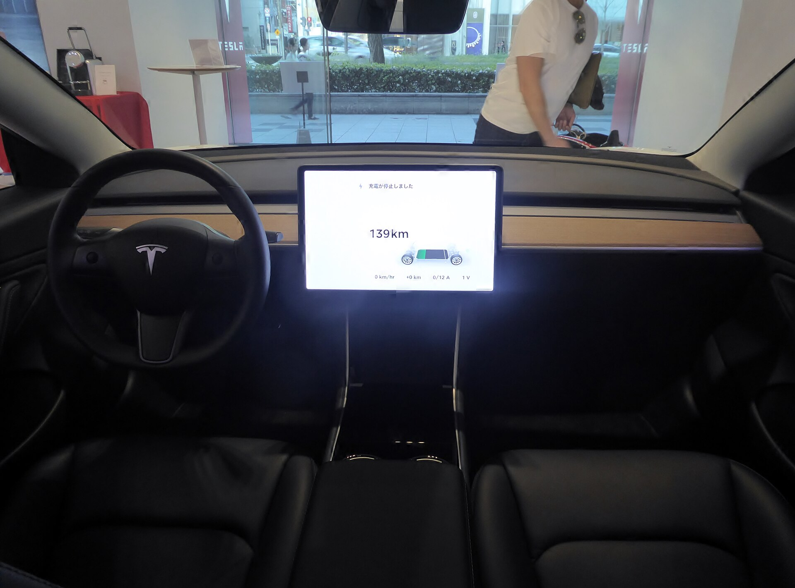
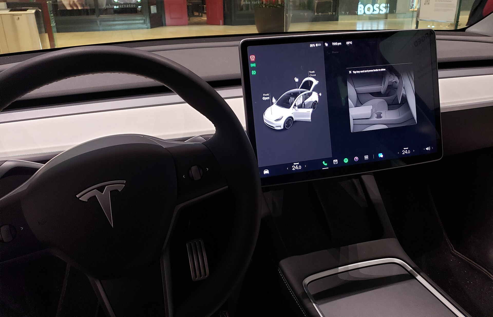

# Tesla Model 3 2025

*Compact / midsize electric luxury sedan | 4-door sedan | Highland refresh (2024-present)*

**Price range (new, MSRP):** $42,490 - $54,990  
**Typical used:** $29,000 at 2-3 years, $22,000 at 5 years  
**Built in:** United States (Fremont, California)

## Photos

### Exterior

### Interior

Photo sources and licenses: [`photo-credits.json`](photo-credits.json)

## Why a buyer picks this car

- Access to the Supercharger network - the only charging experience that reliably just works on road trips
- No oil changes, no spark plugs, no transmission service; brake pads last 100,000+ mi thanks to regen
- Over-the-air updates add features years after purchase - the car improves while parked
- Performance trim hits 60 mph in 2.9 s, supercar territory for $55,000
- Highland refresh fixed the biggest complaints: much quieter cabin, better ride, rear screen, ventilated seats
- 19.8 cu ft of trunk plus a 3.1 cu ft frunk - more usable space than most midsize sedans
- Home charging means leaving every morning with a full 'tank' for about $9 of electricity

## Where it falls short

- No Apple CarPlay or Android Auto - a hard no for some buyers
- Nearly every control lives in the touchscreen, including the wipers and mirrors
- Stalkless column takes a week to adapt to; test drive it before you commit
- Service is appointment-and-app based with no traditional dealer counter
- Panel-gap and paint quality complaints persist versus German rivals
- Cold weather can cut real-world range by 20-30%

**Ideal buyer:** Tech-forward commuter with home charging and a 30-60 mile daily round trip who wants near-zero running costs.

**Good fit for:** Daily commuting with overnight home charging, Tech enthusiast first EV, Two-car household second vehicle, Rideshare with low per-mile cost, Performance buyer wanting 0-60 in under 3 s

## Powertrains

### RWD

| Field | Value |
|---|---|
| Engine | Single rear permanent-magnet motor |
| Battery kwh | 57.5 |
| Hp | 283 |
| Torque lb ft | 310 |
| Transmission | Single-speed |
| Drivetrain | RWD |
| Fuel | Electric |
| Epa range mi | 272 |
| Epa mpge combined | 132 |
| Zero to 60 s | 5.8 |

### Long Range AWD

| Field | Value |
|---|---|
| Engine | Dual motor |
| Battery kwh | 75.0 |
| Hp | 394 |
| Torque lb ft | 377 |
| Transmission | Single-speed |
| Drivetrain | AWD |
| Fuel | Electric |
| Epa range mi | 363 |
| Epa mpge combined | 123 |
| Zero to 60 s | 4.2 |

### Performance AWD

| Field | Value |
|---|---|
| Engine | Dual motor, high output rear unit |
| Battery kwh | 79.0 |
| Hp | 510 |
| Torque lb ft | 554 |
| Transmission | Single-speed |
| Drivetrain | AWD |
| Fuel | Electric |
| Epa range mi | 298 |
| Epa mpge combined | 113 |
| Zero to 60 s | 2.9 |

## Charging

| Field | Value |
|---|---|
| Max dc kw | 250 |
| Dc 10 to 80 min | 27 |
| Ac onboard kw | 11.5 |
| Port | NACS (Tesla) - adapters available for CCS |
| Network | Tesla Supercharger, 2,500+ US stations |
| Home 240v hours full | 8 |

## Dimensions

| Field | Value |
|---|---|
| Length in | 185.8 |
| Width in | 72.8 |
| Height in | 56.3 |
| Wheelbase in | 113.2 |
| Curb weight lb | 3880 |
| Ground clearance in | 5.5 |
| Seating | 5 |

## Capacity

| Field | Value |
|---|---|
| Cargo cu ft | 19.8 |
| Frunk cu ft | 3.1 |
| Max cargo cu ft | 24.0 |
| Towing lb | 0 |

## Safety

- **NHTSA overall:** 5
- **IIHS:** Top Safety Pick+ (2024-2025)
- **Driver assistance:**
  - Autopilot: traffic-aware cruise and autosteer
  - Automatic Emergency Braking
  - Lane Departure Avoidance
  - Blind Spot Camera
  - Available Full Self-Driving (Supervised)
  - Sentry Mode and Dashcam
  - 8 exterior cameras

## Warranty

| Field | Value |
|---|---|
| Basic | 4 yr / 50,000 mi |
| Powertrain | 8 yr / 120,000 mi battery and drive unit (Long Range/Performance), 8 yr / 100,000 mi (RWD) |
| Battery retention | Minimum 70% capacity retention over the warranty period |
| Roadside | 4 yr / 50,000 mi |
| Maintenance | No scheduled maintenance - cabin filter, tires, brake fluid check |

## Technology and comfort

| Field | Value |
|---|---|
| Infotainment in | 15.4 |
| Rear screen in | 8 |
| Digital cluster in | 0 |
| Audio | 9-speaker standard; 17-speaker with subwoofer on Long Range/Performance |
| Connectivity | Over-the-air updates, Phone-as-key via Bluetooth, Tesla app remote climate and charge, Premium Connectivity streaming, No Apple CarPlay or Android Auto |

**Notable features:**

- Ventilated front seats
- Acoustic double-pane glass all around
- Full-length glass roof with UV coating
- Ambient light bar
- Stalkless steering column (turn signals on wheel)
- Rear 8 in screen with climate and media

## Trims

Rear-Wheel Drive, Long Range RWD, Long Range AWD, Performance AWD

## Colors and materials

**Exterior:** Stealth Grey, Pearl White Multi-Coat, Deep Blue Metallic, Diamond Black, Ultra Red, Quicksilver

**Interior:** Vegan leather with textile dash insert - black or white

## Ownership costs

| Field | Value |
|---|---|
| Service interval mi | 12500 |
| Typical insurance usd yr | 2400 |
| 5yr cost note | Roughly $600/yr in home electricity at 12,000 mi versus $1,900 for a 30-mpg gas car. Insurance and tires run higher than average. |
| Reliability note | Drivetrain is very reliable; complaints cluster around build quality, 12V systems and service wait times. Tires wear fast due to weight and torque. |

## Cross-shopped against

Hyundai Ioniq 6, Polestar 2, BMW i4, Kia EV6, Toyota Camry Hybrid (cross-shop)

## Handling objections

**"I am worried about running out of charge."**

> Long Range does 363 miles - more than most people's bladder range. And the Supercharger network puts a 27-minute 10-80% stop on essentially every interstate. Ask yourself how often you actually drive more than 300 miles in a day.

**"No CarPlay is a dealbreaker."**

> Fair - and I will not talk you out of it. Try the built-in nav on the test drive: it routes around traffic and pre-conditions the battery before a charging stop, which CarPlay cannot do. If you still want CarPlay after that, let us look at the Ioniq 6.

**"Battery replacement will cost me $20,000."**

> Covered 8 years / 120,000 miles with a guaranteed 70% minimum capacity. Fleet data on high-mileage Model 3s shows roughly 10% degradation at 200,000 miles - most of these cars will never need a pack.

**"I do not have a garage / home charger."**

> Then be honest with yourself: EV ownership without home charging means Supercharging weekly at about half the savings. In that case a hybrid may genuinely serve you better, and I would rather tell you that now.

## Notes for the salesperson

- Qualify on home charging access in the first two minutes - it decides whether this car fits at all.
- Do the fuel-cost math live: their current mpg, their annual miles, local electricity rate.
- Let them drive it in one-pedal mode for 10 minutes; regen braking converts skeptics faster than the 0-60 number.

## Sample payment

| Field | Value |
|---|---|
| Msrp usd | 44000 |
| Down usd | 5000 |
| Apr pct | 6.5 |
| Term months | 72 |
| Approx monthly usd | 655 |

*Illustrative only - not a quote. Check current federal, state and utility EV incentives separately.*

---

*Figures are approximate US-market values for demo purposes. EV pricing, range ratings and incentives change frequently - verify before quoting.*
