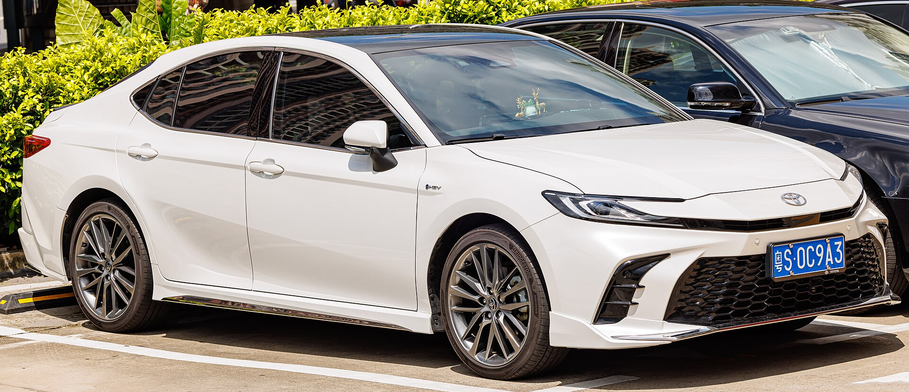
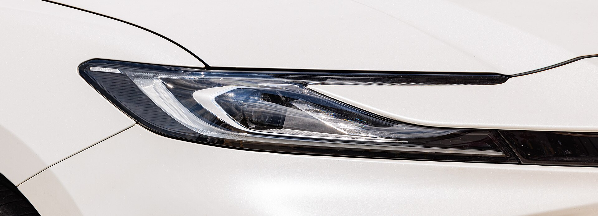
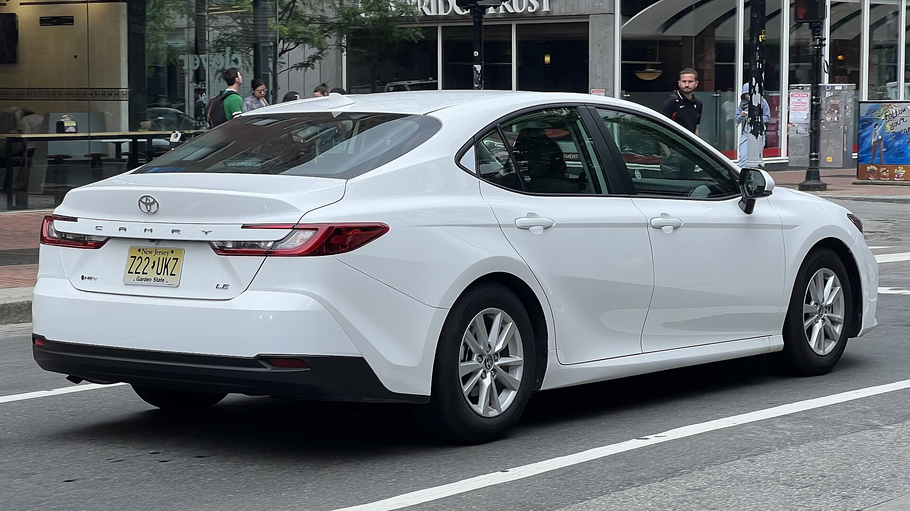
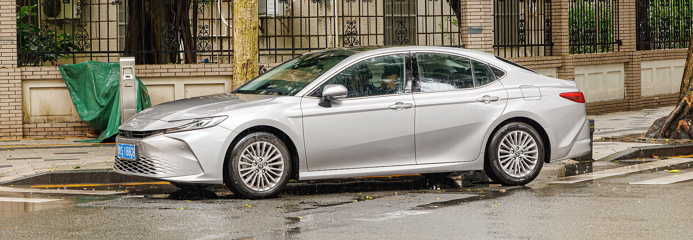
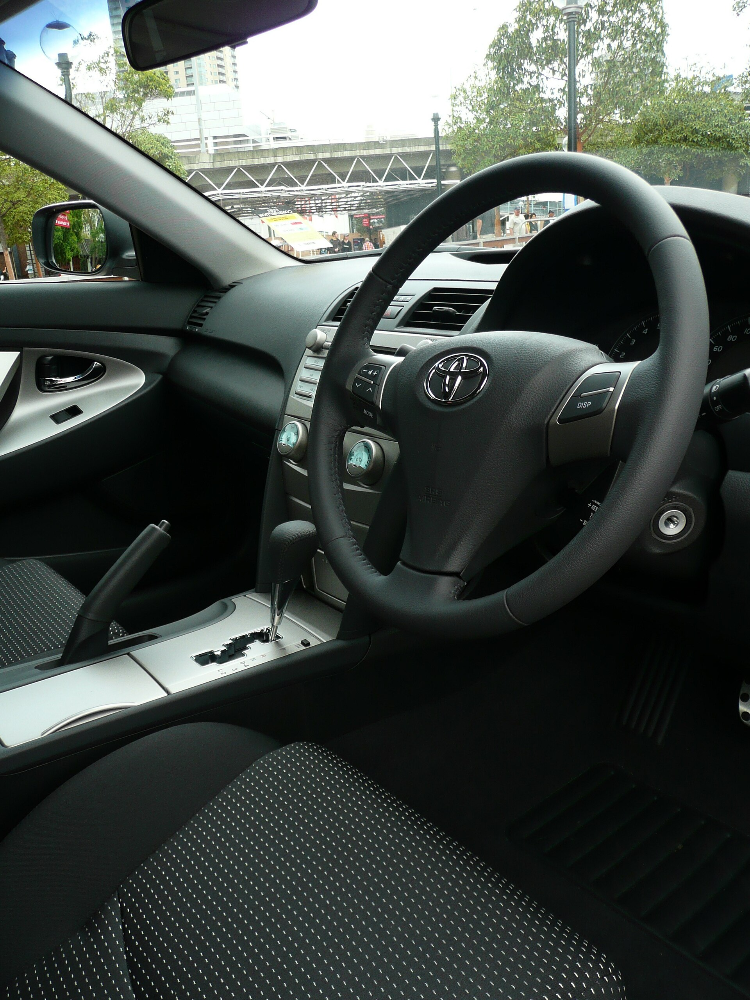
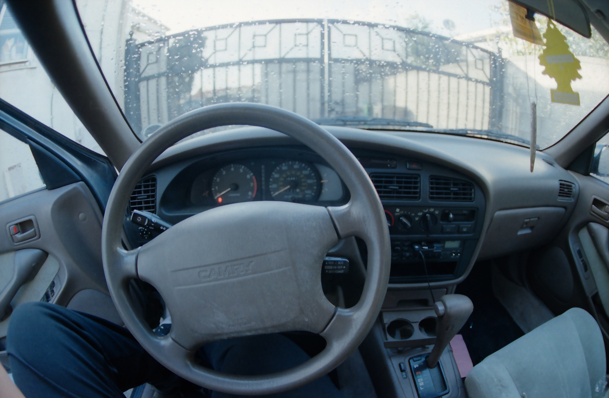
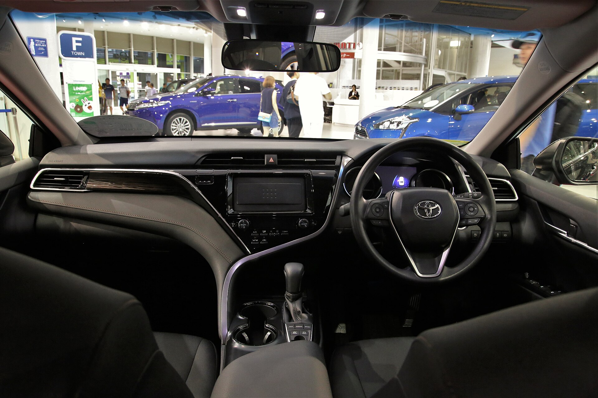

# Toyota Camry 2025

*Midsize sedan | 4-door sedan | XV80 (ninth generation, 2025-present)*

**Price range (new, MSRP):** $28,700 - $39,100  
**Typical used:** $24,000 at 2-3 years, $19,000 at 5 years  
**Built in:** Japan (US-built in Georgetown, Kentucky)

## Photos

### Exterior

### Interior

Photo sources and licenses: [`photo-credits.json`](photo-credits.json)

## Why a buyer picks this car

- Every 2025 Camry is a hybrid: 51 mpg combined with no plug and no range anxiety
- Toyota reliability record - among the lowest 10-year ownership cost in the segment
- Strongest resale value of any midsize sedan; great for lease and trade-in math
- Available electric AWD for snow states without a fuel economy penalty
- 10 yr / 150,000 mi hybrid battery warranty removes the #1 hybrid fear
- Quiet, comfortable ride with usable 15.1 cu ft trunk and adult-size rear seat
- Huge parts and service network; cheap to insure and maintain

## Where it falls short

- eCVT drone under hard acceleration - it is not a sport sedan
- No V6 offered anymore; buyers coming from a 301-hp V6 Camry will notice
- Base LE interior is plain; the 12.3 in screens require a higher trim
- Trunk pass-through is smaller than some rivals; no hatchback practicality

**Ideal buyer:** Commuter, rideshare driver, or family that wants the lowest-risk, lowest-running-cost sedan and plans to keep it 8+ years.

**Good fit for:** Daily commuting 30+ mi, Rideshare / fleet, First family car, Highway road trips, Snow-belt buyer needing AWD

## Powertrains

### 2.5L Hybrid FWD

| Field | Value |
|---|---|
| Engine | 2.5L inline-4 Dynamic Force + 2 electric motors (THS II) |
| Displacement l | 2.5 |
| Hp | 225 |
| Torque lb ft | 163 |
| Transmission | eCVT |
| Drivetrain | FWD |
| Fuel | Regular gasoline / hybrid |
| Epa mpg | City: 53, Highway: 50, Combined: 51 |
| Zero to 60 s | 7.7 |

### 2.5L Hybrid AWD

| Field | Value |
|---|---|
| Engine | 2.5L inline-4 + 2 electric motors + rear e-motor |
| Displacement l | 2.5 |
| Hp | 232 |
| Torque lb ft | 163 |
| Transmission | eCVT |
| Drivetrain | AWD (electric rear axle) |
| Fuel | Regular gasoline / hybrid |
| Epa mpg | City: 51, Highway: 49, Combined: 50 |
| Zero to 60 s | 7.4 |

## Dimensions

| Field | Value |
|---|---|
| Length in | 193.5 |
| Width in | 72.4 |
| Height in | 56.9 |
| Wheelbase in | 111.2 |
| Curb weight lb | 3450 |
| Ground clearance in | 5.7 |
| Seating | 5 |

## Capacity

| Field | Value |
|---|---|
| Cargo cu ft | 15.1 |
| Towing lb | 0 |
| Fuel tank gal | 13.2 |
| Range mi combined | 660 |

## Safety

- **NHTSA overall:** 5
- **IIHS:** Top Safety Pick+ (2025)
- **Driver assistance:**
  - Pre-Collision with Pedestrian Detection
  - Full-Speed Dynamic Radar Cruise Control
  - Lane Departure Alert with Steering Assist
  - Lane Tracing Assist
  - Road Sign Assist
  - Proactive Driving Assist
  - Automatic High Beams
  - Blind Spot Monitor (2025 standard)

## Warranty

| Field | Value |
|---|---|
| Basic | 3 yr / 36,000 mi |
| Powertrain | 5 yr / 60,000 mi |
| Hybrid ev | 8 yr / 100,000 mi hybrid components, 10 yr / 150,000 mi hybrid battery |
| Roadside | 2 yr / unlimited mi |
| Maintenance | ToyotaCare 2 yr / 25,000 mi included |

## Technology and comfort

| Field | Value |
|---|---|
| Infotainment in | 8 |
| Infotainment optional in | 12.3 |
| Digital cluster in | 7 |
| Digital cluster optional in | 12.3 |
| Audio | 6-speaker standard; 9-speaker JBL optional |
| Connectivity | Wireless Apple CarPlay, Wireless Android Auto, Cloud navigation, Toyota app remote start, Wi-Fi hotspot, Digital Key |

**Notable features:**

- Available panoramic moonroof
- Available head-up display 10 in
- Wireless phone charger
- Heated/ventilated front seats
- Digital rearview mirror (XSE)

## Trims

LE, SE, XLE, XSE

## Colors and materials

**Exterior:** Wind Chill Pearl, Celestial Silver Metallic, Midnight Black Metallic, Heavy Metal, Reservoir Blue, Supersonic Red, Ocean Gem, Ginger Beige

**Interior:** Fabric (LE), SofTex synthetic leather (SE/XLE/XSE), Leather-trimmed (XLE/XSE package)

## Ownership costs

| Field | Value |
|---|---|
| Service interval mi | 10000 |
| Typical insurance usd yr | 1700 |
| 5yr cost note | Roughly $1,100/yr in fuel at 12,000 mi and $3.50/gal; below-average maintenance spend. |
| Reliability note | THS hybrid system has 25 years of field data; brake pads last long due to regeneration. |

## Cross-shopped against

Honda Accord Hybrid, Hyundai Sonata Hybrid, Kia K5, Nissan Altima, Subaru Legacy

## Handling objections

**"Hybrid batteries are expensive to replace."**

> Covered 10 years / 150,000 miles from the factory. Toyota has sold over 6 million hybrids in the US and battery replacement outside warranty is rare; when it happens, remanufactured packs are a fraction of what people assume.

**"I wanted a V6 / it feels slow."**

> 0-60 in 7.4 s with the AWD model beats the old four-cylinder Camry, and the electric motor gives instant torque off the line where you actually drive. The trade is 51 mpg instead of 26.

**"It is boring."**

> Take the XSE with the 12.3 in screens and the two-tone roof out for 10 minutes. Then look at the resale number - the boring choice is the one that costs you $6,000 more in depreciation.

**"Cheaper to just keep my current car."**

> Run the fuel math: going from 25 mpg to 51 mpg at 15,000 mi/yr saves about $1,000 a year, plus you reset the warranty clock and drop your repair risk to zero for 3 years.

## Notes for the salesperson

- Lead with total cost of ownership, not monthly payment - the Camry wins on the 5-year number.
- For AWD shoppers, point out the rear e-motor has no driveshaft: less to maintain, no mpg hit.
- Show the ToyotaCare included maintenance - first 2 years of service are already paid.

## Sample payment

| Field | Value |
|---|---|
| Msrp usd | 30000 |
| Down usd | 3000 |
| Apr pct | 6.9 |
| Term months | 60 |
| Approx monthly usd | 534 |

*Illustrative only - not a quote.*

---

*Figures are approximate US-market values for demo purposes. Verify against the manufacturer window sticker before quoting a customer.*
