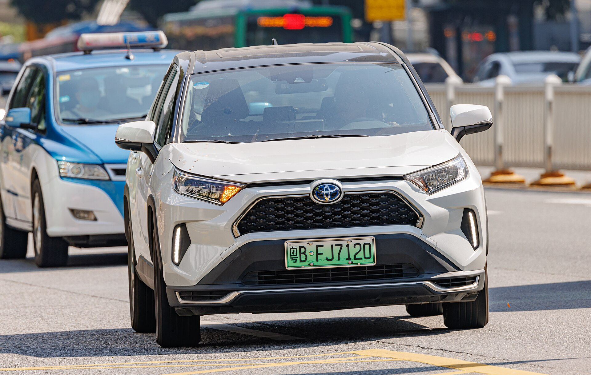
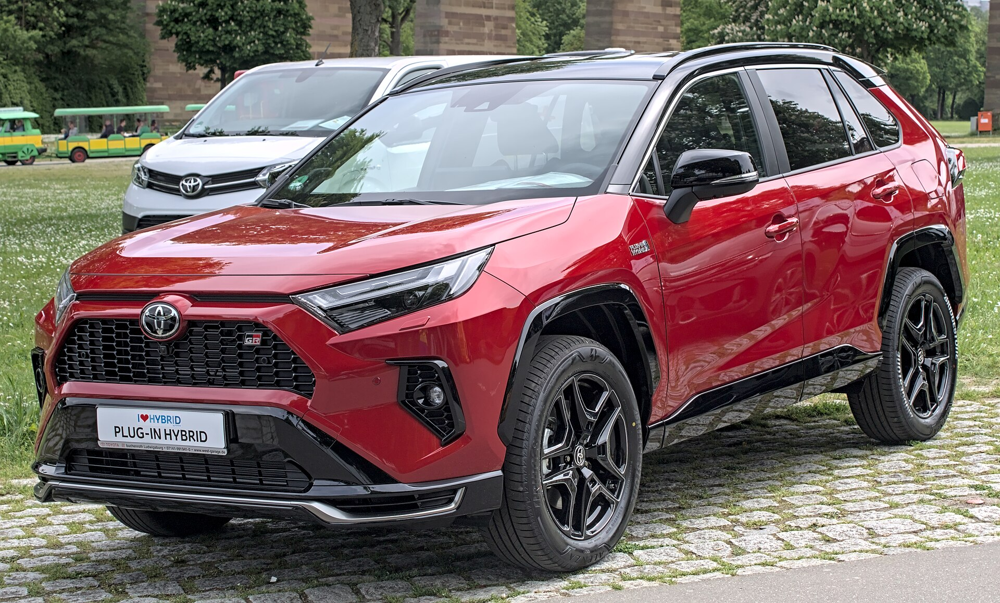
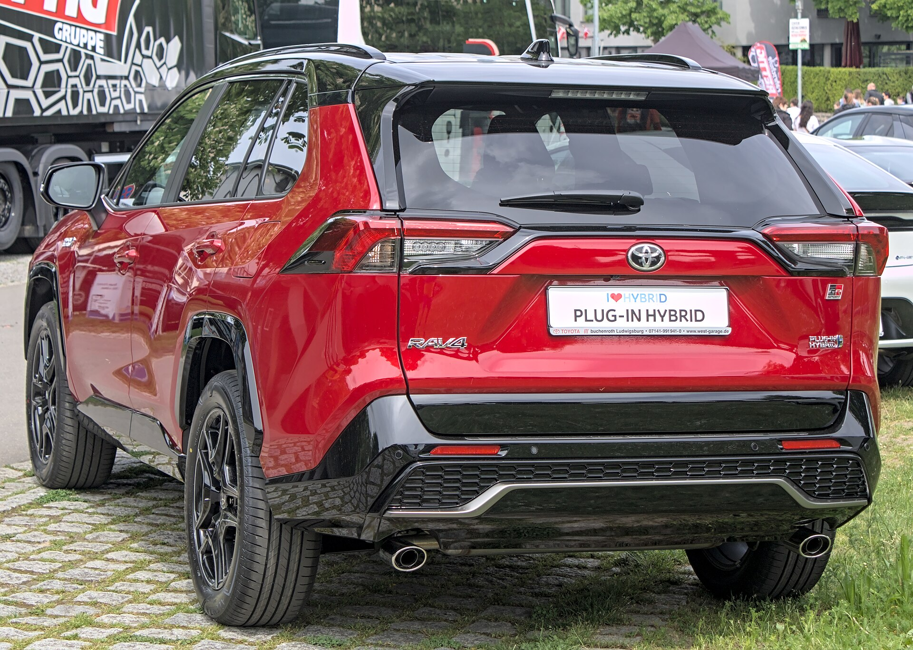
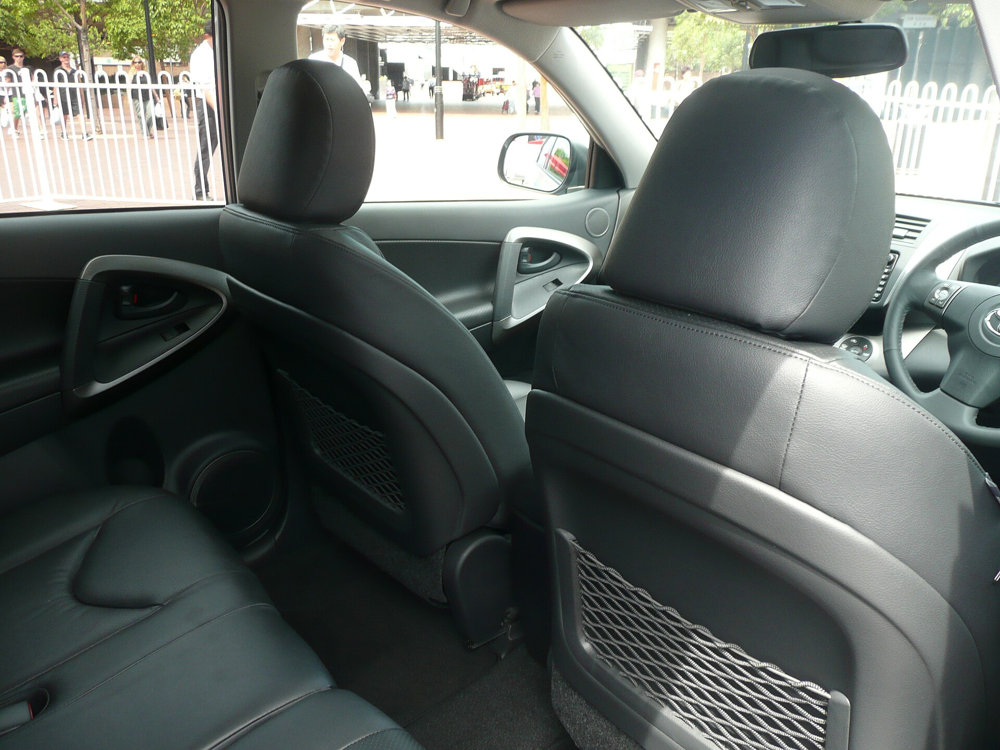
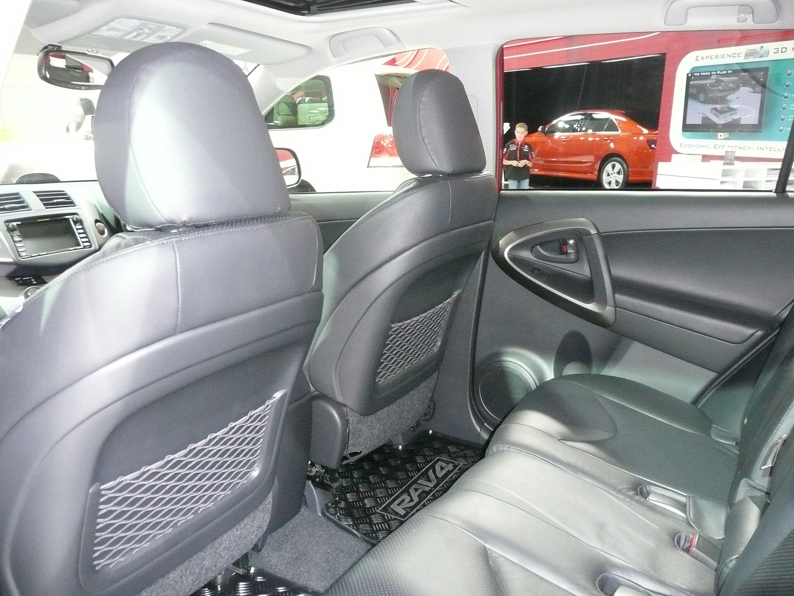
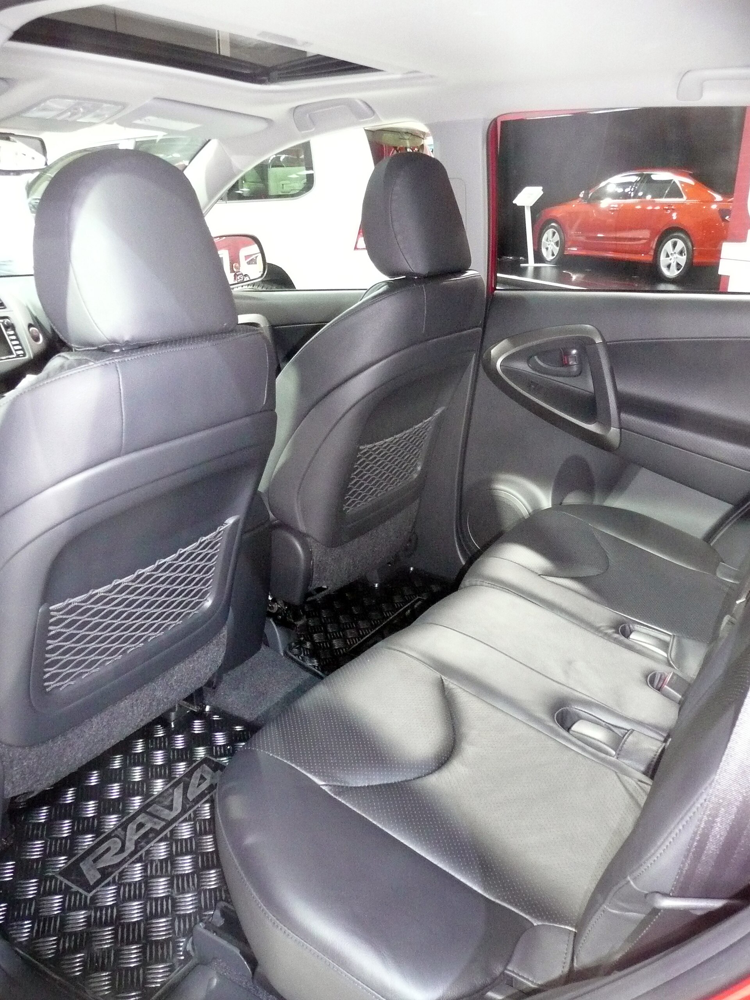

# Toyota RAV4 2025

*Compact SUV | 5-door compact SUV | XA50 (fifth generation, 2019-present)*

**Price range (new, MSRP):** $29,000 - $48,000  
**Typical used:** $29,000 at 2-3 years, $23,000 at 5 years  
**Built in:** Japan / Canada (Woodstock and Cambridge, Ontario)

## Photos

### Exterior

### Interior

Photo sources and licenses: [`photo-credits.json`](photo-credits.json)

## Why a buyer picks this car

- Best-selling non-pickup vehicle in the United States - parts, service and resale are all effortless
- Hybrid returns 39 mpg combined with standard all-wheel drive and is quicker than the gas model
- RAV4 Prime does 42 miles on electricity and 0-60 in 5.5 s, making it the quickest RAV4 and a genuine EV substitute for most commutes
- 3,500 lb tow rating on the hybrid and Prime, enough for a small camper or a pair of jet skis
- 37.6 cu ft of cargo with a wide, square opening - genuinely practical shape
- 10 yr / 150,000 mi hybrid battery warranty
- TRD Off-Road and Adventure trims provide real trail hardware, not just cladding

## Where it falls short

- Base 8 in screen and interior plastics feel plain against a Hyundai Tucson at the same price
- Road and engine noise are higher than a CR-V or CX-5
- Ride is firmer than most rivals, especially on 19 in wheels
- RAV4 Prime supply is limited and often carries market adjustment
- eCVT drone under acceleration is characteristic of the hybrid

**Ideal buyer:** Mainstream family or commuter who wants the lowest-risk compact SUV with hybrid efficiency and Toyota resale.

**Good fit for:** Family compact SUV, Hybrid commuting, PHEV commuting with 42 electric miles, Light towing and outdoor gear, Snow-state AWD driving

## Powertrains

### 2.5L Dynamic Force

| Field | Value |
|---|---|
| Engine | 2.5L naturally aspirated inline-4 |
| Displacement l | 2.5 |
| Hp | 203 |
| Torque lb ft | 184 |
| Transmission | 8-speed automatic |
| Drivetrain | FWD or AWD |
| Fuel | Regular gasoline |
| Epa mpg | City: 27, Highway: 35, Combined: 30 |
| Zero to 60 s | 8.0 |

### 2.5L Hybrid

| Field | Value |
|---|---|
| Engine | 2.5L inline-4 + front and rear electric motors |
| Displacement l | 2.5 |
| Hp | 219 |
| Torque lb ft | 163 |
| Transmission | eCVT |
| Drivetrain | Electronic on-demand AWD standard |
| Fuel | Regular gasoline / hybrid |
| Epa mpg | City: 41, Highway: 38, Combined: 39 |
| Zero to 60 s | 7.4 |

### Plug-in Hybrid (RAV4 Prime)

| Field | Value |
|---|---|
| Engine | 2.5L inline-4 + dual motors, 18.1 kWh battery |
| Displacement l | 2.5 |
| Hp | 302 |
| Torque lb ft | 199 |
| Transmission | eCVT |
| Drivetrain | Electronic on-demand AWD |
| Fuel | Plug-in hybrid |
| Epa mpg | City: 40, Highway: 36, Combined: 38 |
| Epa mpge combined | 94 |
| Electric range mi | 42 |
| Zero to 60 s | 5.5 |

## Dimensions

| Field | Value |
|---|---|
| Length in | 180.9 |
| Width in | 73.0 |
| Height in | 67.0 |
| Wheelbase in | 105.9 |
| Curb weight lb | 3600 |
| Ground clearance in | 8.4 |
| Seating | 5 |

## Capacity

| Field | Value |
|---|---|
| Cargo cu ft | 37.6 |
| Max cargo cu ft | 69.8 |
| Towing lb | 3500 |
| Fuel tank gal | 14.5 |
| Range mi combined | 580 |

## Safety

- **NHTSA overall:** 5
- **IIHS:** Top Safety Pick (recent model years)
- **Driver assistance:**
  - Toyota Safety Sense 2.5+: pre-collision with pedestrian detection
  - Full-Speed Dynamic Radar Cruise Control
  - Lane Departure Alert with Steering Assist
  - Lane Tracing Assist
  - Road Sign Assist
  - Automatic High Beams
  - Available Blind Spot Monitor with Rear Cross-Traffic Alert

## Warranty

| Field | Value |
|---|---|
| Basic | 3 yr / 36,000 mi |
| Powertrain | 5 yr / 60,000 mi |
| Hybrid ev | 8 yr / 100,000 mi hybrid components, 10 yr / 150,000 mi hybrid battery |
| Roadside | 2 yr / unlimited mi |
| Maintenance | ToyotaCare 2 yr / 25,000 mi included |

## Technology and comfort

| Field | Value |
|---|---|
| Infotainment in | 8 |
| Infotainment optional in | 10.5 |
| Digital cluster in | 7 |
| Audio | Available 11-speaker JBL |
| Connectivity | Wireless Apple CarPlay and Android Auto, Cloud navigation and Intelligent Assistant, Toyota app remote start, Wi-Fi hotspot, Over-the-air updates |

**Notable features:**

- Multi-Terrain Select with Mud/Sand, Rock/Dirt and Snow modes
- Dynamic Torque Vectoring AWD with rear driveline disconnect (Adventure/TRD)
- Available digital rearview mirror
- 1,500-watt AC outlet on RAV4 Prime
- Hands-free power liftgate
- TRD Off-Road tuned springs and dampers with 18 in wheels

## Trims

LE, XLE, XLE Premium, Adventure, TRD Off-Road, Limited, Hybrid LE/XLE/SE/XSE/Limited/Woodland, Plug-in Hybrid SE/XSE

## Colors and materials

**Exterior:** Super White, Midnight Black Metallic, Magnetic Gray Metallic, Silver Sky Metallic, Blueprint, Ruby Flare Pearl, Lunar Rock, Cavalry Blue

**Interior:** Fabric (LE/XLE), SofTex synthetic leather (XSE/Limited), Available two-tone with orange accents (Adventure)

## Ownership costs

| Field | Value |
|---|---|
| Service interval mi | 10000 |
| Typical insurance usd yr | 1750 |
| 5yr cost note | ToyotaCare covers the first two years. The hybrid's regenerative braking dramatically extends brake pad life - many owners reach 80,000 miles on original pads. |
| Reliability note | One of the most reliable vehicles in this catalog. The hybrid system is the same proven THS II architecture used since 1997. |

## Cross-shopped against

Honda CR-V, Mazda CX-5, Hyundai Tucson, Subaru Forester, Nissan Rogue, Kia Sportage

## Handling objections

**"The interior is plain for the price."**

> It is, compared with a Tucson Limited. What you are buying instead is the resale curve and the service network. Three years from now the RAV4 will be worth several thousand more, which is usually a bigger number than the interior upgrade.

**"It is noisy."**

> Fair - it is louder than a CR-V on coarse pavement. Drive the Limited with the acoustic windshield and 18 in wheels rather than the XSE on 19s; it makes a real difference.

**"The Prime is too expensive."**

> Look at it as a fuel contract. 42 electric miles covers most commutes entirely - many owners fill the tank once a month. At 15,000 miles a year that is roughly $1,400 saved, plus it is the quickest RAV4 you can buy.

**"Hybrids cost more up front."**

> About $1,500 over the gas model, and the hybrid includes all-wheel drive that costs $1,400 on the gas version. You are essentially getting 39 mpg for free, and it is quicker.

## Notes for the salesperson

- For anyone considering the gas AWD model, show that the hybrid's AWD is included - the premium nearly disappears.
- Quantify the Prime's electric range against the customer's actual daily commute.
- Lead with resale value when comparing against better-equipped Korean rivals.

## Sample payment

| Field | Value |
|---|---|
| Msrp usd | 36000 |
| Down usd | 3500 |
| Apr pct | 6.9 |
| Term months | 60 |
| Approx monthly usd | 642 |

*Illustrative only - not a quote.*

---

*Figures are approximate US-market values for demo purposes. Verify against the manufacturer window sticker before quoting a customer.*
