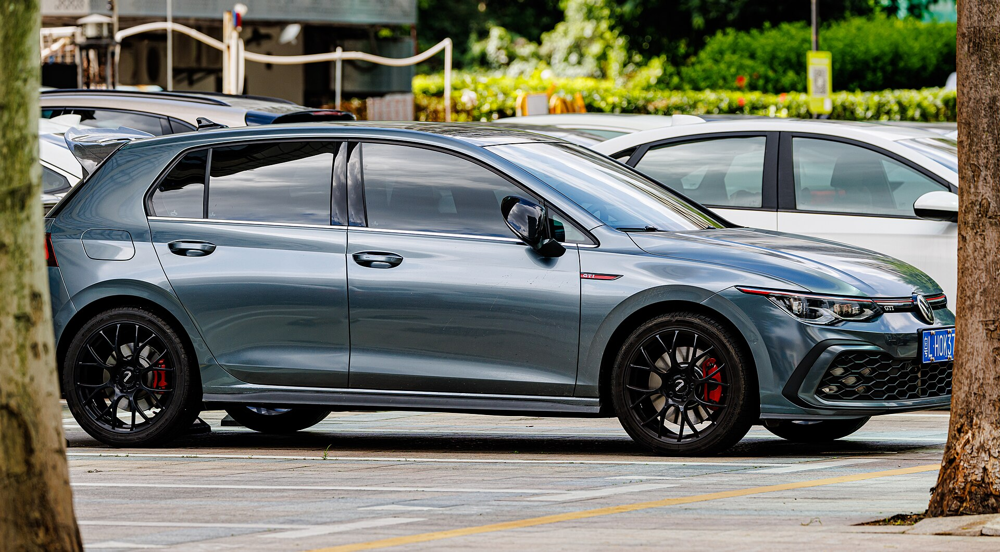
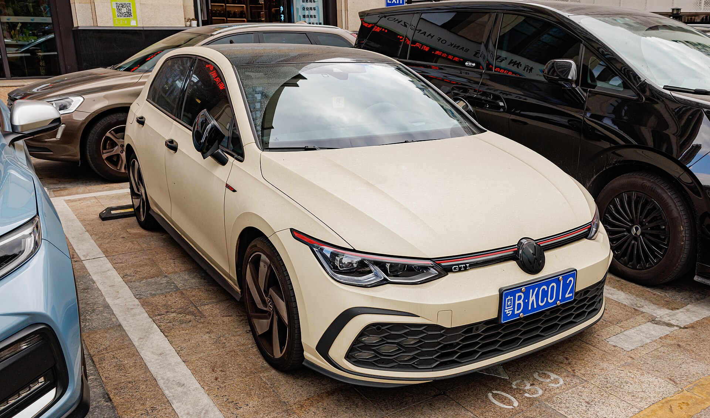
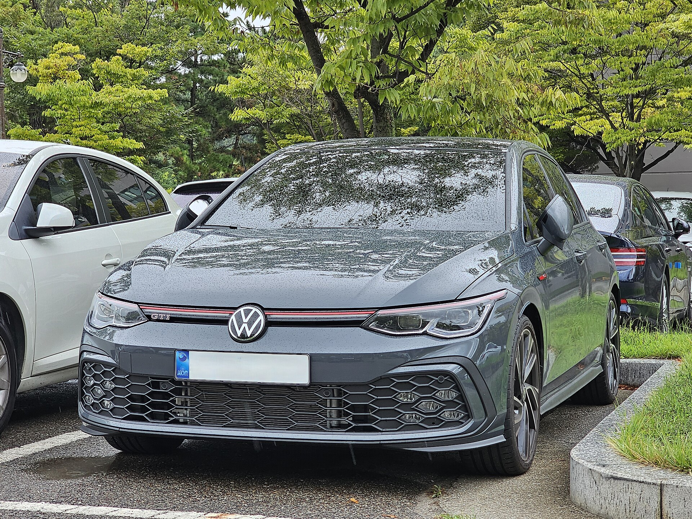
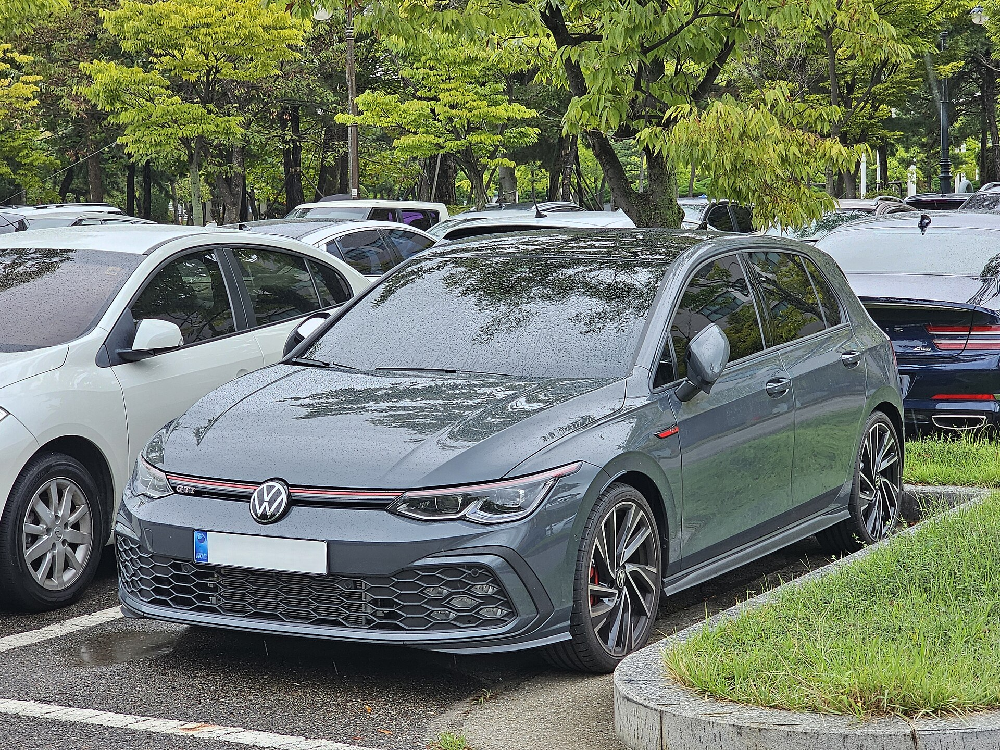
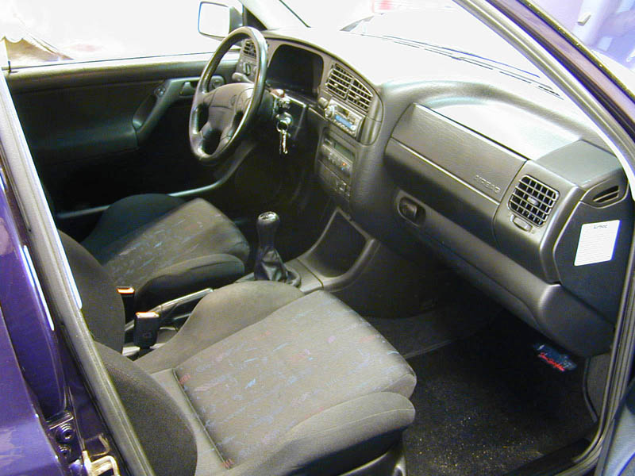
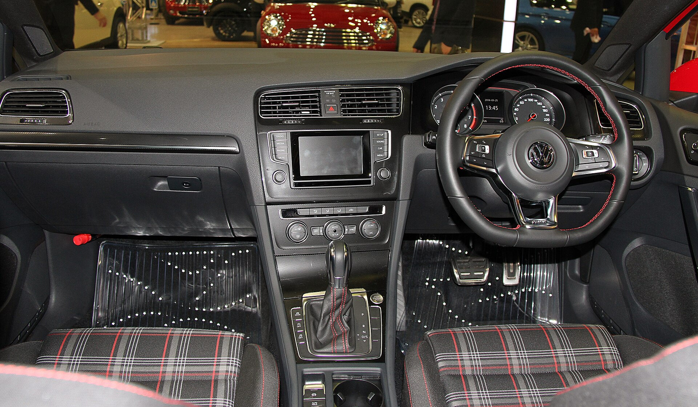
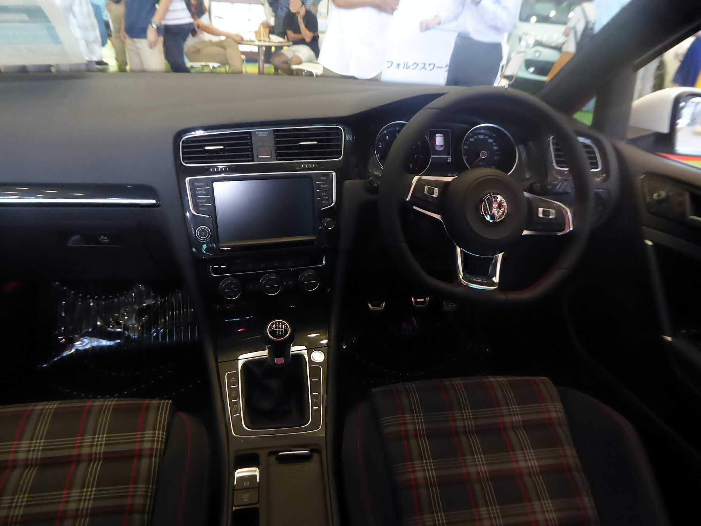

# Volkswagen Golf GTI 2025

*Hot hatch / sport compact | 5-door hatchback | Mk8 / Mk8.5 (2022-present in US, facelift 2025)*

**Price range (new, MSRP):** $32,500 - $40,000  
**Typical used:** $28,000 at 2-3 years, $21,500 at 5 years  
**Built in:** Germany (Wolfsburg)

## Photos

### Exterior

### Interior

Photo sources and licenses: [`photo-credits.json`](photo-credits.json)

## Why a buyer picks this car

- The original hot hatch: 5.6 s to 60 mph with 19.9 cu ft of trunk space and four real doors
- VAQ limited-slip differential puts the power down cleanly - it out-corners cars with far more horsepower
- DCC adaptive dampers give a 15-step spread from genuinely comfortable to track-firm
- Practicality that no sports car matches: 34.5 cu ft with the seats folded, and it fits a bike
- 27 mpg combined - you can commute in it daily without regret
- 2025 facelift fixed the two biggest Mk8 complaints: unlit touch sliders and a laggy infotainment system
- 2 yr / 20,000 mi included maintenance

## Where it falls short

- Manual transmission dropped for 2025 in the US - a real loss for purists shopping this car
- Mk8 interior uses touch-sensitive controls where the Mk7 had buttons; the facelift improved but did not eliminate this
- Premium fuel recommended
- Golf R costs more but adds AWD and 87 more horsepower - internal competition for the same buyer
- Rear seat is tight for three adults

**Ideal buyer:** Enthusiast who needs one car to do everything: fun on Sunday, commuting on Monday, and Home Depot on Saturday.

**Good fit for:** Enthusiast daily driver, Autocross and track days, Urban living with cargo needs, Downsizing from an SUV without losing utility, One-car household for a driver

## Powertrains

### 2.0L TSI EA888 evo4

| Field | Value |
|---|---|
| Engine | 2.0L turbocharged inline-4 |
| Displacement l | 2.0 |
| Hp | 241 |
| Torque lb ft | 273 |
| Transmission | 7-speed DSG dual-clutch (manual discontinued for 2025 in US) |
| Drivetrain | FWD with VAQ electronic limited-slip differential |
| Fuel | Premium recommended |
| Epa mpg | City: 24, Highway: 32, Combined: 27 |
| Zero to 60 s | 5.6 |

## Dimensions

| Field | Value |
|---|---|
| Length in | 168.8 |
| Width in | 70.4 |
| Height in | 57.6 |
| Wheelbase in | 103.6 |
| Curb weight lb | 3150 |
| Ground clearance in | 5.5 |
| Seating | 5 |

## Capacity

| Field | Value |
|---|---|
| Cargo cu ft | 19.9 |
| Max cargo cu ft | 34.5 |
| Towing lb | 0 |
| Fuel tank gal | 13.2 |
| Range mi combined | 355 |

## Safety

- **NHTSA overall:** 5
- **IIHS:** Good crashworthiness ratings
- **Driver assistance:**
  - Front Assist with pedestrian monitoring
  - Blind Spot Monitor with Rear Traffic Alert
  - Lane Assist
  - Available IQ.DRIVE Travel Assist semi-automated driving
  - Adaptive cruise control
  - Emergency Assist

## Warranty

| Field | Value |
|---|---|
| Basic | 4 yr / 50,000 mi |
| Powertrain | 4 yr / 50,000 mi |
| Roadside | 3 yr / 36,000 mi |
| Maintenance | 2 yr / 20,000 mi included (Carefree Maintenance) |

## Technology and comfort

| Field | Value |
|---|---|
| Infotainment in | 12.9 |
| Digital cluster in | 10.25 |
| Audio | Available 480-watt Harman Kardon |
| Connectivity | Wireless App-Connect with CarPlay and Android Auto, VW Car-Net remote, Over-the-air updates, Available head-up display, Wireless charging |

**Notable features:**

- VAQ electronically controlled limited-slip differential
- DCC adaptive damping with 15-step adjustment
- Drive mode selector including Individual
- Plaid or leather sport seats with GTI heritage pattern
- Golf ball shift knob heritage cue
- 2025 facelift restored illuminated physical touch sliders

## Trims

S, SE, Autobahn, 380 (2025 special)

## Colors and materials

**Exterior:** Pure White, Deep Black Pearl, Moonstone Grey, Kings Red Metallic, Atlantic Blue Metallic, Graphite Grey Metallic

**Interior:** Classic GTI plaid cloth (S/SE), Vienna leather (Autobahn), Available two-tone red stitching

## Ownership costs

| Field | Value |
|---|---|
| Service interval mi | 10000 |
| Typical insurance usd yr | 1950 |
| 5yr cost note | First two years of maintenance are included. Budget for tires - enthusiastic driving on summer tires is the main consumable. |
| Reliability note | The EA888 evo4 is the most refined version of a long-running engine family. DSG requires a fluid service around 40,000 miles - do not skip it. |

## Cross-shopped against

Honda Civic Si, Hyundai Elantra N, Toyota GR Corolla, Subaru WRX, Mini Cooper S, Volkswagen Golf R

## Handling objections

**"No manual anymore."**

> That is a fair complaint and I am not going to pretend otherwise. If a manual is non-negotiable, the Civic Si and GR Corolla still offer one. What the DSG gives you is a 5.6-second 0-60 and the ability to sit in traffic without a left leg workout.

**"The touch controls are frustrating."**

> They were - the 2025 facelift backlit the sliders and moved to a new infotainment generation with physical shortcut keys. Sit in a 2022 and a 2025 back to back; the difference is obvious.

**"A Civic Si is cheaper."**

> By about $4,000, and it is a great car. Drive both. The GTI has the limited-slip diff, adaptive dampers and a hatch that holds 34.5 cu ft. If you want the cheapest fun car, buy the Si. If you want the one that also does everything else, this is it.

**"German cars are expensive to maintain."**

> The first two years are included. After that, the EA888 is one of the most widely serviced engines in the world - independent VW shops are everywhere. The one thing you cannot skip is the DSG fluid service at 40,000 miles.

## Notes for the salesperson

- Sell it as the one-car solution: put a bike or a large box in the hatch during the walkaround.
- Set DCC to Comfort for the first half of the test drive and Sport for the second - the spread closes deals.
- Have the Golf R ready as an upsell for anyone who mentions all-wheel drive or winter.

## Sample payment

| Field | Value |
|---|---|
| Msrp usd | 35000 |
| Down usd | 3500 |
| Apr pct | 6.9 |
| Term months | 60 |
| Approx monthly usd | 622 |

*Illustrative only - not a quote.*

---

*Figures are approximate US-market values for demo purposes. Verify against the manufacturer window sticker before quoting a customer.*
